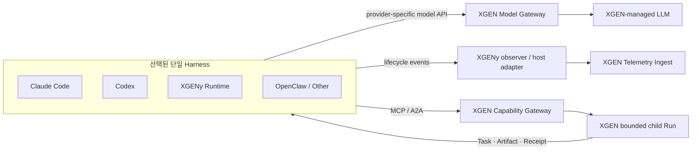

# ADR-0009: Single Orchestrator와 외부 Harness 통합

- 상태: Accepted
- 기준일: 2026-08-28
- 적용 범위: XGENy, XGEN, Claude Code, Codex, OpenClaw 및 기타 외부 agent harness

## 문맥

XGENy는 독립 로컬 agent harness여야 하지만, 사용자는 Claude Code나 Codex의 로컬 파일·shell·Git·browser 도구를 그대로 사용하면서 모델 호출과 감사는 XGEN을 통하고, 조직 DB·RAG·workflow 같은 XGEN 도구도 같은 작업에서 사용하기를 원한다.

XGENy runtime을 외부 harness 안에 다시 넣어 같은 목표를 계획·실행·재시도하게 만들면 다음 충돌이 생긴다.

- 두 WorkGraph가 같은 목표와 완료 상태를 서로 다르게 판단한다.
- 양쪽 permission broker가 같은 effect를 중복 승인하거나 서로 다른 resource로 해석한다.
- timeout 뒤 양쪽이 각각 retry해 중복 외부 effect를 만들 수 있다.
- memory와 context compaction의 권위가 분리된다.
- XGEN trace가 관찰 사실인지 실행 정본인지 구분되지 않는다.

반대로 XGEN을 LLM proxy로만 사용하면 model request, token, latency는 기록할 수 있지만 외부 harness가 로컬에서 수행한 파일 변경, command, MCP call, 사용자 승인과 검증 결과는 XGEN이 알 수 없다. 모델 추론, 실행 관측, 원격 capability를 하나의 경로로 취급해서는 안 된다.

## 결정

### 1. 한 Run에는 하나의 Orchestrator만 둔다

Run을 생성할 때 `orchestration_authority`를 고정한다. 그 authority만 다음을 수행한다.

- Parent WorkGraph 생성·수정
- 다음 Step 선택
- model turn과 tool loop 진행
- retry·fallback·cancel 결정
- Parent Run 완료 판정

authority 변경은 명시적 handoff event와 fencing epoch를 필요로 한다. XGENy, XGEN, 외부 harness가 같은 Run의 Parent WorkGraph를 동시에 수정하지 않는다.

`orchestration_authority`는 상위 의미 개념이며 현재 v0.1 `WorkGraph.authority` wire field를 이 ADR에서 변경하지 않는다. v0.1 canonical WorkGraph는 `local:*` 또는 `xgen:*`만 허용한다. 외부 harness Parent는 자신의 native plan/session을 소유하며 observer가 이를 mutable XGENy WorkGraph로 생성하지 않는다. 외부 host identity와 session/run correlation은 observed event metadata에 보존하고, 후속 schema revision은 fixture와 migration을 포함한 별도 PR에서 결정한다.

### 2. XGENy를 runtime mode와 observer mode로 분리한다

#### Runtime mode

XGENy가 Orchestrator다.

- XGENy WorkGraph와 durable Run store가 권위 상태다.
- XGENy가 local capability, MCP, Connector, XGEN capability를 routing한다.
- XGEN은 선택적 model provider, capability provider, read-only mirror다.

#### Observer mode

Claude Code, Codex, OpenClaw 등 외부 harness가 Orchestrator다.

- XGENy는 외부 lifecycle event를 canonical observed event로 정규화한다.
- 전송 실패 시 local outbox에 보관하고 idempotent하게 재전송할 수 있다.
- XGENy는 Parent WorkGraph를 생성·수정하지 않는다.
- XGENy는 model/tool 호출, retry, fallback, permission decision, memory/context injection을 수행하지 않는다.
- 외부 harness가 보고한 실행 상태를 XGENy의 검증된 `ExecutionReceipt`로 승격하지 않는다.

Observer는 로깅을 위해 실행 결과를 차단·변환하지 않는다. 향후 policy enforcement adapter가 필요하면 observer와 다른 명시적 mode·권한·계약으로 설계한다.

### 3. XGEN 연동을 세 plane으로 분리한다



#### Model plane

- Codex 계열에는 OpenAI Responses-compatible dialect를 제공한다.
- Claude Code에는 Anthropic Messages-compatible dialect를 제공한다.
- 다른 harness에는 지원하는 provider dialect별 adapter를 둔다.
- 하나의 lowest-common-denominator payload로 모든 provider 의미를 강제 통합하지 않는다.
- model catalog, credential, quota, usage, latency와 provider error를 XGEN에서 관리할 수 있다.

Claude Code 공식 gateway 경로는 Claude model을 전제로 한다. XGEN이 non-Claude model을 Anthropic endpoint로 흉내 내는 경로는 공식 지원으로 간주하지 않고 별도 실험·conformance 없이는 제품 기능으로 약속하지 않는다.

#### Telemetry plane

- append-only observed event ingest를 제공한다.
- telemetry 장애는 local tool 실행을 차단하지 않는다.
- XGEN Model Gateway가 유일한 inference path일 때 gateway 장애는 새 model turn을 실패시키지만, telemetry ingest 장애와 혼동하지 않는다.
- 기존 `agent_traces`, `execution_io`, UI trace는 canonical external event의 compatibility projection으로 유지한다.
- XGEN workflow/node 식별자를 외부 harness의 canonical Run ID로 사용하지 않는다.

#### Capability plane

- 작은 generic MCP surface로 capability를 검색·조회·호출한다.
- durable remote execution은 MCP Task 또는 A2A Task로 투영한다.
- XGEN workflow마다 무조건 고정 MCP tool 하나를 생성하지 않는다.
- 안정된 계약과 제한된 catalog를 가진 capability만 선택적으로 direct typed tool로 제공할 수 있다.

### 4. 로컬 도구와 XGEN 도구의 소유권을 분리한다

외부 harness mode에서 파일, shell, Git, local browser와 사용자가 연결한 local MCP는 해당 harness가 직접 실행한다. XGENy는 같은 local tool을 다시 감싸거나 shadow 실행하지 않는다.

조직 DB, RAG, server credential, XGEN workflow, remote sandbox, 배포와 조직 정책이 필요한 기능은 XGEN capability로 실행한다. 같은 의미의 local/remote instance가 모두 존재하면 Parent Orchestrator가 data locality, permission, effect risk와 verification을 기준으로 하나를 선택한다. effect가 시작된 뒤 placement를 바꾸어 fallback하지 않는다.

### 5. Parent Run과 bounded child Run을 분리한다

외부 harness가 XGEN capability를 호출할 때 XGEN은 별도 child Run을 소유할 수 있다. 이것은 동일 Run을 두 harness가 공동 orchestration하는 것이 아니다.

```text
External Parent Run (authority = codex/claude/openclaw)
  └─ bounded XGEN capability invocation
       └─ XGEN Child Run (authority = xgen)
            └─ Task status + ArtifactRef + ExecutionReceipt
```

필수 조건:

- child input/output/effect/timeout/cancel 계약이 명시적이다.
- `parent_run_id`와 별도 `child_run_id`를 사용한다.
- parent와 child의 revision, retry, idempotency namespace를 분리한다.
- XGEN은 Parent WorkGraph를 수정하거나 Parent 완료를 판정하지 않는다.
- child가 동일 Parent harness를 다시 호출해 orchestration cycle을 만들지 않는다.
- Parent는 child effect 시작 뒤 다른 placement에서 같은 capability를 자동 재실행하지 않는다.

### 6. 로그 완전성을 등급으로 표현한다

| 등급 | 수집 범위 | 할 수 있는 주장 |
|---|---|---|
| `L0 inference` | model, usage, latency, request/response digest | model 사용 감사 |
| `L1 lifecycle` | session/turn/tool start·end·error | 외부 harness 실행 흐름 관측 |
| `L2 evidence` | redacted input/output digest, artifact, verifier evidence | 결과와 근거 연결 |
| `L3 managed` | durable intent, authorization consumption, reconcile, verified receipt | XGENy/XGEN 관리 실행 의미 |

- Model Gateway만 연결된 Run은 L0 이상으로 표시하지 않는다.
- hook 또는 structured event stream이 없으면 local tool 실행을 추론해 채우지 않는다.
- 외부 event는 `observed` provenance를 유지한다.
- raw prompt, raw tool output과 artifact body는 기본 수집하지 않는다.
- full-content logging은 명시적 정책, redaction, encryption, retention과 접근 감사를 필요로 한다.
- hidden reasoning 또는 chain-of-thought를 수집 대상으로 삼지 않는다.

### 7. Harness adapter는 기능을 선언하고 conformance를 통과한다

“모든 harness 무수정 호환”을 주장하지 않는다. adapter는 최소 다음 capability를 선언한다.

```text
model_provider_override
structured_session_events
tool_lifecycle_events
permission_events
artifact_or_diff_evidence
mcp_client
durable_task_client
session_resume
```

지원하지 않는 event나 의미는 `unknown`으로 남긴다. text UI scraping을 정본 adapter로 사용하지 않는다.

초기 reference adapter 우선순위:

1. Codex: custom Responses provider + lifecycle hooks/JSONL event
2. Claude Code: Anthropic gateway + hooks/structured stream
3. generic MCP client harness
4. OpenClaw/A2A adapter

### 8. 인증과 data boundary

- 인증된 host/device/user context에서 short-lived credential을 발급한다.
- model, telemetry, capability scope를 분리한다.
- 모델이 생성한 user ID, run ID, scope, token은 권한 근거가 아니다.
- local data를 XGEN model/capability로 보낼 때 host의 egress 승인과 XGEN의 server-side authorization을 모두 적용한다.
- credential 원문을 event, receipt, prompt와 telemetry에 기록하지 않는다.
- telemetry upload는 stable event ID로 중복 제거한다.

## XGEN 현재 구조와의 관계

현재 XGEN의 provider factory와 trace collector는 workflow/node execution에 결합된 내부 구현이다. 이를 외부 public gateway contract로 직접 노출하지 않는다.

XGEN은 기존 실행 경로를 보존하면서 다음 새 표면을 additive하게 제공한다.

1. provider dialect별 Model Gateway
2. canonical External Run Telemetry Ingest
3. MCP/A2A Capability Gateway
4. canonical event에서 기존 `agent_traces`·`execution_io`로의 Compatibility Projection

XGENy core는 이 XGEN 구현이나 DB schema를 의존하지 않는다.

## 결과

### 기대 이점

- Claude Code와 Codex의 local tool UX와 sandbox를 그대로 사용한다.
- XGEN model, 조직 capability, 감사·usage를 선택적으로 결합한다.
- XGENy native mode의 독립성과 외부 harness 호환성을 동시에 유지한다.
- Parent/child authority가 분리되어 중복 retry와 WorkGraph 충돌을 줄인다.
- adapter별 로그 완전성을 과장하지 않는다.

### 비용과 위험

- provider dialect와 harness release 변화에 대한 conformance 유지가 필요하다.
- 외부 hook이 제공하지 않는 실행 의미는 완전히 관측할 수 없다.
- Model Gateway를 단일 inference path로 쓰면 XGEN 가용성이 model turn 가용성이 된다.
- 외부 harness와 XGEN의 권한 UI가 각각 필요해 중복 승인 UX가 생길 수 있다.
- raw telemetry 정책을 잘못 설정하면 source code·prompt·tool output이 과수집될 수 있다.

## 검증

- observer mode가 WorkGraph mutation, tool execution, retry를 호출하지 못하는 negative test
- external Parent correlation과 XGEN child Run ID·authority가 섞이면 fail-closed하는 contract test
- local tool은 host에서 한 번만 실행되고 observer는 event만 기록하는 E2E
- XGEN capability timeout 뒤 placement fallback 금지 test
- telemetry outage에서 local execution 지속과 outbox dedup test
- Model Gateway outage와 Telemetry outage의 오류 taxonomy 분리
- adapter capability manifest와 실제 event fixture conformance
- L0 Run을 L1~L3로 표시하지 못하는 validation
- credential·secret·raw reasoning redaction test
- XGEN/Connector 없이 XGENy native mode가 통과하는 standalone E2E

## 폐기안

- Claude Code/Codex 안에서 XGENy agent loop를 다시 실행
- XGENy와 외부 harness가 같은 Parent WorkGraph를 공동 수정
- Model Gateway 로그만으로 local tool 실행 전체를 감사했다고 주장
- 외부 lifecycle event를 검증된 ExecutionReceipt로 자동 승격
- XGEN 내부 trace DB schema를 외부 harness protocol로 사용
- workflow마다 MCP tool 하나씩 무제한 노출
- timeout 뒤 local/XGEN placement를 바꾸어 같은 effect 자동 재실행
- non-Claude model의 Claude Code gateway 호환을 검증 없이 공식 지원으로 표현

## 참고

- Claude Code LLM gateway: <https://code.claude.com/docs/en/llm-gateway>
- Claude Code MCP: <https://code.claude.com/docs/en/mcp>
- Claude Code hooks: <https://code.claude.com/docs/en/hooks>
- Codex advanced configuration: <https://learn.chatgpt.com/docs/config-file/config-advanced>
- Codex MCP: <https://learn.chatgpt.com/docs/extend/mcp>
- Codex hooks: <https://learn.chatgpt.com/docs/hooks>
