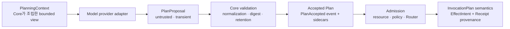

# ADR-0015: Durable Planner 계약과 bounded agent loop

- 상태: 제안 — durable planning 연구 gate 기본형 구현
- 기준일: 2026-08-30
- 적용 범위: internal planning contract, RunEvent/RunState, WorkGraph reducer, built-in RunStore, runtime context/tick 경계
- 공개 protocol v0.1 schema 변경: 없음
- local store schema: 5 → 6

## 문맥

ADR-0014는 immutable dependency DAG와 Receipt-gated frontier를 추가했다. 그러나 `StepPlanned`에는 objective와 dependency만 남아 있어 재시작 뒤 그 Step이 어떤 Capability와 입력으로 admission되어야 하는지 복원할 수 없었다. 모델 응답을 그대로 journal에 넣으면 raw argument, provider 응답과 보안 결정을 durable authority로 오인하게 되고, 여러 Step을 하나씩 append하면 crash 시 plan 일부만 남는다.

또한 public `InvocationPlan`은 단순한 모델 계획이 아니다. 이것은 concrete resource 해석, policy 판단과 Instance routing이 끝난 뒤의 실행 계약이다. 모델이 `selectedInstanceId`, `policyDecisionId`, fallback 또는 verification plan을 정하도록 허용하면 기존 Permission Broker와 Router 경계를 우회한다. 반대로 모델 계획과 실행 계획을 같은 `plan_id` 의미로 합치면 어떤 값이 제안이고 어떤 값이 Core가 승인한 사실인지 구분할 수 없다.

이 결정은 모델이 다음 행동을 제안할 수 있게 하되, 모델 응답·context와 WorkGraph·실행 권위를 분리한다. 현재 slice는 provider-neutral 계약, durable accepted plan, bounded coordination과 실패 방어를 세운다. 실제 모델 API와 제품 도구 실행을 연결했다고 주장하지 않는다.

## 결정

### 1. Proposal, Accepted Plan과 InvocationPlan을 분리한다

계획과 실행은 다음 세 단계다.



`PlanProposal`은 provider가 반환하는 비신뢰 후보이며 durable authority가 아니다. provider-specific request ID, raw response, usage, prompt formatting과 오류 body는 이 의미 계약에 포함하지 않는다. Proposal이 포함할 수 있는 실행 의도는 objective, dependency, exact Capability contract와 transient argument뿐이다.

Core는 Proposal을 검증하고 정규화한 뒤 `AcceptedPlanStep`과 `PlannedInvocationBinding`을 만든다. Step ID, definition digest, semantic action digest, plan-input digest, target platform과 execution profile은 Core가 선택하거나 재계산한다. 모델이 보낸 digest, Instance, trust, data boundary, credential, policy, approval, idempotency, fallback 또는 verification 주장은 신뢰하지 않는다.

`InvocationPlan`은 accepted Step이 dependency gate를 통과한 뒤 trusted admission이 concrete resource를 정규화하고, policy와 Router를 적용해 exact executable Instance를 선택한 결과다. 현재 구현은 별도의 full `InvocationPlan` document를 저장하지 않고 `EffectIntent`, authorization binding과 Receipt provenance의 deterministic plan ID로 필요한 실행 사실을 고정한다. 조회 가능한 full document는 후속 범위다.

Public `WorkGraph` snapshot도 Proposal로 사용하지 않는다. snapshot의 status, selected Instance와 execution 결과는 모델이 새로 써서는 안 되는 관찰·호환 정보다.

### 2. Planning turn binding은 Host가 소유한다

모델에게 Run ID, authority epoch, current journal head 또는 context digest를 다시 출력시키고 그것을 신뢰하지 않는다. Runtime이 verified current state에서 planning request를 만들고, 응답 수락 시 같은 head에 대해 compare-and-append한다.

Durable `ExpectedPlanningTurn`은 다음 accepted decision의 순번, `context_digest`와 Core가 계산한 `proposal_digest`를 기록한다. Plan proposal의 durable digest는 raw argument serialization이 아니라 stable proposal key/objective/dependency/Capability와 검증 뒤의 Definition/action/material digest를 정렬해 commit한다. Raw proposal은 transient size bound 계산에만 사용한다. 같은 canonical 실행 의미로 정규화되는 argument 표현은 raw spelling만으로 다른 durable plan identity를 만들지 않는다. 이 값은 `PlanAccepted`와 `CompletionCandidateRecorded`에 들어가며 모델이 권위를 획득하는 token이 아니다. journal event의 Run/authority/epoch와 store `ExpectedHead`가 실제 optimistic concurrency fence다.

Planning context를 만든 뒤 head가 바뀌면 이전 응답은 commit하지 않는다. provider 호출 중 recovery, verification, 사용자 입력 또는 다른 durable event가 생긴 경우에도 새 current state로 context와 frontier를 다시 계산해야 한다.

### 3. Accepted plan은 하나의 immutable graph delta다

`PlanAccepted` 하나가 한 model decision의 모든 새 Step을 담는다. 기존 Step을 교체하거나 dependency를 변경하지 않고 append만 한다. Proposal 내부 Step 순서와 관계없이 전체 후보 graph를 검증하므로 같은 batch 안의 forward dependency reference를 허용한다.

Reducer는 state clone에 전체 batch를 적용한 뒤 다음을 검사하고, 하나라도 실패하면 원래 projection을 그대로 둔다.

- Step은 1개 이상, 한 event에서 최대 32개다.
- 한 event의 dependency edge는 최대 128개다.
- objective는 1~5,000 bytes이고 control character를 포함하지 않는다.
- Step ID는 비어 있지 않고 기존 또는 같은 Proposal의 다른 ID와 중복되지 않는다.
- self, duplicate와 unknown dependency를 거부한다.
- 같은 Run의 기존 plan/intent 또는 같은 batch와 semantic action digest가 중복되지 않는다. effect/grant ID가 `(Run, action)`에서 유도되므로 실행 불가능한 중복 Step을 durable하게 만들지 않는다.
- 기존 failed, manual-required 또는 Receipt가 빠진 terminal branch와 그 전이적 blocked descendant에 새 Step을 연결하지 않는다.
- 기존 graph와 새 Step을 합친 전체 graph가 iterative DAG 검증을 통과해야 한다.
- Step의 `proposal_digest`는 turn의 accepted proposal digest와 같아야 한다.
- target은 현재 지원하는 concrete pair인 OS `linux|macos|windows`, architecture `x86_64|aarch64`만 허용한다.
- loop의 total planned-step budget과 accepted model-turn budget을 넘지 않는다.
- completion candidate가 이미 기록된 Run에는 plan을 더 추가하지 않는다.

Accepted Step에는 `PlannedInvocationBinding`이 반드시 들어간다. 기존 저수준 `StepPlanned` event는 과거 model-free 실험과 replay 호환을 위해 남지만 planned invocation이 없는 legacy Step이며 이 계약의 durable model plan으로 간주하지 않는다. 단, loop가 configured된 Run에서는 legacy event도 total-step budget과 completion seal을 우회할 수 없다.

`AgentLoop` plan validator는 materializer를 호출하기 전에 context visibility, 기존 terminal/blocked dependency와 proposal 내부 cycle을 검사한다. 각 제안 Capability의 exact ID/version은 같은 turn의 `PlanningContext.capabilities`에, `ExistingStep` dependency의 exact Step ID는 `PlanningContext.steps`에 실제 포함돼 있어야 한다. Full Registry에 존재하지만 byte packing에서 생략된 Capability를 추측하거나, current `RunState`에 존재하지만 생략된 Step을 추측해도 각각 `CapabilityUnavailable` 또는 `UnknownDependency`다. `omittedCapabilities`와 `omittedSteps`는 생략 개수일 뿐 hidden 항목을 주소화하는 권한이 아니다. 같은 Proposal 안의 `ProposedStep` key reference만 이 visibility gate와 별도로 전체 batch DAG 검증을 거쳐 허용한다.

Bounded context 본문은 journal에 저장하지 않으므로 reducer가 membership 목록을 replay해 다시 검사하지는 않는다. Provider output은 반드시 `AgentLoop` proposal 경계로 수락해야 하며 저수준 `PlanAccepted` append는 trusted Core 전용이다. Reducer는 context membership이 아니라 graph, turn/digest, planned binding과 budget처럼 durable event만으로 표현 가능한 불변식을 append 경계에서 다시 검사한다.

### 4. Raw argument 대신 reconstructable sidecar를 원자 저장한다

Raw model argument와 provider response envelope/body는 Run journal, projection, Receipt와 planned-invocation table에 저장하지 않는다. 다만 Core가 선택해 수락한 bounded objective와 dependency는 graph 사실로 journal에 저장된다. `PlanningContext`의 명시적 serialization과 provider adapter 내부 raw request/response까지 기술적으로 금지하는 것은 아니므로 `Debug` redaction을 logging/DLP 경계로 취급하지 않고, adapter는 raw request/response와 proposal을 journal 또는 일반 log에 쓰지 않아야 한다. Core는 transient argument를 Definition schema와 현재 planning profile로 검증하고, trusted plan-acceptance normalizer로 resource identity를 정규화한 뒤 다음 secret-free commitment를 만든다.

```text
PlannedInvocationBinding in journal/projection
  capability ID + contract version
  definition digest
  semantic action digest
  plan-input digest
  host-selected execution profile + target OS/architecture
  planned invocation spec digest
  plan-input sidecar record digest

PlannedInvocationMaterialRecord in local-store sidecar
  Run ID + Step ID + deterministic plan ID
  proposal/spec digest
  opaque ReconstructableMaterialReference
  record digest
```

Opaque reference는 identifier이지 path, URL, bearer token, raw argument 또는 credential이 아니다. 실제 recipe provider는 commit 전에 exact `(provider_id, reference_id, revision)`을 immutable하고 durable하게 만들고, 재구성한 canonical argument가 plan-input digest와 같은지 확인할 책임이 있다. Generic `PlanMaterializer` port는 reference와 고정 failure class만 돌려받으므로 외부 provider의 durability나 read-after-write를 스스로 증명하지는 않는다. Production materializer가 이 계약을 구현하고 fault test로 검증해야 한다. Digest는 commitment이지 암호화나 비밀화가 아니므로 raw credential을 argument나 reference에 넣는 설계를 허용하지 않는다.

수락된 Step의 ordinary admission도 sidecar reference를 자동으로 `ReconstructableReference` retention에 고정한다. Caller가 다른 reference나 `Ephemeral`로 바꿔도 pending authorization 재검사와 Memory/SQLite store의 최종 bundle gate가 exact accepted reference가 아닌 `InvocationMaterialRecord`를 거부한다. 따라서 전용 recovery API를 우회해도 재시작 가능성이 조용히 사라지거나 recipe가 교체되지 않는다.

Plan acceptance 시 사용하는 `ResourceResolver`는 외부 효과나 권한 변경이 없는 결정론적 canonicalization boundary로 제한한다. Capability selector의 canonical identity와 host containment를 계산할 수는 있지만 network 호출, credential dereference, filesystem write, 대상 resource content 실행·소비를 해서는 안 된다. 이 제한 때문에 dependency가 아직 해제되지 않은 future Step도 identity만 미리 고정할 수 있다. 실제 resource access와 effect는 dependency release 뒤 Admission/Executor에서만 일어난다.

Core는 semantic proposal digest와 final Step ID를 만든 뒤 같은 normalized argument를 final ID로 다시 canonicalize한다. Preflight와 final Definition/action/material digest 및 normalized argument가 exact match하지 않으면 materializer 호출 전에 거부한다. `ResourceResolver::resolve`에는 Run/Step/request ID가 전달되지 않으며 구현도 같은 입력에 같은 결과를 내야 한다. 이 재검사는 nondeterministic하거나 비멱등인 normalizer를 accepted plan으로 고정하지 않기 위한 fail-closed gate다.

현재 `local_sync_once_v1` planning profile은 local Sync 실행, once/idempotency-key 지원, Core가 취급할 수 있는 effect class와 critical action이 없는 Capability만 수락한다. Critical action이 선언된 Capability는 승인 UI가 없는 이 slice에서 plan acceptance하지 않는다. Reducer도 planned intent의 non-empty idempotency key, Local Receipt placement와 exact `{target_os}-{target_arch}` executor platform을 마지막으로 검사한다. Catalog context에 execution/effect metadata가 노출되는 것과 해당 Capability가 지금 실행 가능하다는 것은 같은 뜻이 아니다.

향후 canonicalization 자체가 remote lookup, credential 또는 effectful resource access를 요구한다면 현재 선행 action/input commitment를 그대로 확장하지 않는다. Proposal의 unresolved commitment와 admission 이후 resolved action commitment를 분리하는 2단계 binding을 새 ADR과 migration으로 정의해야 한다.

`RunStore::append_with_plan_inputs`만 `PlanAccepted`를 저장할 수 있다. event와 Step 수가 같은 complete sidecar set을 요구하고 missing, duplicate, orphan, cross-Run/Step reuse, spec/record digest mismatch를 fail-closed한다. Plain `append`로 `PlanAccepted`를 보내거나 다른 event에 plan sidecar를 붙이는 것도 거부한다.

Memory와 SQLite store는 event, 모든 `planned_invocations` row와 projection을 한 commit으로 반영한다. SQLite는 `BEGIN IMMEDIATE` transaction 안에서 event → index/sidecar → projection을 쓴다. transaction 전이나 중간에 실패하면 runnable Step 일부만 보이는 상태가 없어야 한다.

이 원자성은 local RunStore까지다. 외부 recipe provider에 대한 분산 transaction, orphan recipe garbage collection과 sealed secret storage는 아직 보장하지 않는다. 현재 계약은 reference 대상이 RunStore commit 전에 이미 immutable하고 durable하다는 전제를 둔다.

### 5. Reducer와 Admission이 같은 계획을 이중 검증한다

Admission은 actionable Step의 route와 current Definition digest를 recipe provider나 resource resolver 호출 전에 journal binding과 비교한다. 그 뒤 verified `PlannedInvocationMaterialRecord`를 store에서 읽고 host-owned recipe provider로 transient argument를 복원한다. 복원된 값에 같은 결정론적 canonicalization을 다시 적용한 digest, Capability contract, semantic action, execution profile과 target platform이 journal binding과 일치할 때만 Permission Broker와 Router로 전달한다.

Admission은 current Run/head와 Definition을 다시 확인하고 exact argument에서 policy resource와 final executable material을 유도한다. Router가 선택한 Instance, permission evidence와 final material은 모델 계획에 포함되지 않는다.

Reducer는 `EffectIntentCommitted`를 적용하기 전에 planned binding과 intent를 다시 비교한다. 최소한 Capability ID/version, Definition digest, semantic action digest, plan-input/material digest와 Receipt provenance plan ID가 모두 같아야 한다. 이 검사는 저수준 caller가 admission을 건너뛰어 같은 Step에 다른 Capability나 argument를 commit하는 것을 막고, 실패하면 authorization budget을 소비하지 않는다.

Admission의 빠른 검사는 불필요한 resolver·policy·Router 호출을 막고 reducer 검사는 모든 append caller에 대한 마지막 durable 불변식이다. 둘 중 하나로 다른 하나를 대체하지 않는다.

### 6. Context assembly는 deterministic하고 bounded한 read-only pager다

Runtime의 `PlanningContext` assembly 경계는 verified `RunState`, `WorkFrontier`와 Capability Registry에서 현재 model turn에 필요한 최소 view만 만든다. 별도의 public `ContextAssembler` 타입을 약속하는 이름이 아니며, WorkGraph나 store를 수정하거나 provider를 호출하지 않는다.

현재 허용 입력은 다음과 같다.

- exact Run ID, authority/epoch와 journal sequence/head에 결합된 goal
- total Step 수와 Receipt-bound completed Step 수
- stable Step ID 순서로 선택한 기존 Step의 full objective/dependency/status/attempt 수, optional accepted Capability와 Receipt dependency-release 여부
- 전체 Registry의 semantic catalog digest
- stable Capability ID/version 순서로 선택한 Definition digest, bounded summary, input/output schema, effect/resource/critical-action 정보와 execution/idempotency/timeout 정보
- 생략된 Step/Capability 수와 final context digest

현재 기본형은 위 graph/Capability 최소 필드만 조립한다. Artifact/Memory reference, raw Receipt evidence, tool output와 user conversation excerpt를 추가하려면 provenance, sensitivity와 deterministic priority를 별도 계약으로 확장해야 한다.

다음 값은 context에서 구조적으로 제외한다.

- credential 원문, bearer token, presigned URL과 provider secret
- raw planned/execution argument와 raw tool output
- byte budget을 무시한 전체 WorkGraph/Capability catalog와 전체 대화 replay
- mutable policy lease 내부 값과 DB/MinIO/Connector 저장 구현
- provider-specific prompt wrapper, hidden reasoning과 chain-of-thought

이 allowlist는 content DLP가 아니다. Goal, 기존 Step objective, Capability summary/schema처럼 허용된 내용에 사용자가 secret을 넣으면 Core가 이를 자동 탐지·삭제하지 않는다. 외부 provider를 연결하는 composition root는 이 입력을 secret-free로 제한하고 sensitivity/egress policy를 적용해야 한다.

선택과 정렬은 provider와 무관한 byte budget 안에서 결정론적으로 수행한다. 기존 Step과 Capability를 각각 stable order로 만들고 round-robin으로 whole item을 넣으며, 들어가지 않는 item은 일부 schema/objective를 잘라 모호하게 만들지 않고 생략한다. Capability summary 문자열만 별도 byte 상한으로 정리한다. 고정 header조차 budget을 넘으면 planner 호출 전에 fail-closed한다. `context_digest`는 domain-separated RFC 8785/SHA-256 commitment이며 실제 context 내용의 기밀화를 의미하지 않는다. Digest는 자기 자신을 포함하지 않는 canonical payload에 대해 계산한 host-owned companion 값이므로 adapter는 `PlanningContext::context_digest()`를 사용하고 payload serialization만 임의로 다시 hash하지 않는다. Provider tokenizer가 요구하는 더 작은 한도와 메시지 formatting은 adapter 책임이며 semantic context digest를 바꾸지 않는다.

이 bounded view는 단순 prompt 최적화가 아니라 proposal의 addressability boundary다. Planner는 해당 turn에 whole item으로 실제 공개된 Capability와 기존 Step만 참조할 수 있다. 생략 count, 외부 catalog 지식, 과거 turn 기억 또는 추측한 identifier로 hidden item을 우회할 수 없으며, Core는 store/Registry에 값이 실제 존재하더라도 current context membership이 없으면 plan materialization 전에 거부한다.

`max_context_bytes`는 최종 canonical payload의 byte 상한이다. 현재 assembler가 전체 Definition/schema와 Step summary 후보를 먼저 읽고 반복 canonicalization하는 CPU, peak memory 또는 registry scan 시간까지 제한하지는 않는다. 대규모 catalog를 실제 provider에 연결하기 전에 input catalog bound와 single-pass/streaming packing을 별도 성능 gate로 다뤄야 한다.

### 7. 한 tick은 frontier action 하나만 결정한다

`AgentLoop::tick`은 verified current state와 frontier에서 다음 continuation 하나만 처리한다. 첫 호출에서 durable budget을 구성하거나, 기존 frontier action 하나를 반환하거나, frontier가 planning 가능한 상태일 때 provider-neutral planner를 한 번 호출해 plan/completion candidate 하나를 commit한다. 직접 tool을 실행하거나 내부에서 무제한 `while` loop를 돌지 않는다.

우선순위는 ADR-0014의 frontier를 그대로 따른다.

```text
Executing recovery
→ EffectUnknown reconciliation
→ Reconciling continuation
→ Validating verification
→ IntentCommitted execution
→ dependency-released Planned admission
```

위 action이 하나라도 있으면 model planning보다 먼저 첫 action 하나만 선택한다. Caller는 그 action이 durable transition을 만들거나 명시적으로 중단된 뒤 다시 `tick`해야 한다. waiting/blocked 또는 진행할 수 없는 terminal 상태만 남으면 model 호출로 우회하지 않고 pause한다. Empty graph 또는 현재 graph가 모두 Receipt-bound complete인 경우에만 새 planning turn 후보를 만들 수 있다.

현재 outcome은 configured, action-required, plan-accepted, completion-candidate, quiescent와 planner/proposal/materializer failure를 구분한다. 이 coordinator의 결정은 dispatcher가 아니다. `Admit`, `DriveEffect`, `Verify`의 실제 수행, timeout, cancellation과 사용자 interaction은 각각의 기존/후속 runtime 경계가 담당한다.

### 8. Budget은 durable하되 provider-call reservation은 아직 없다

`AgentLoopConfigured`는 다음 non-zero upper bound를 Run에 한 번만 고정한다.

| budget | 현재 의미 |
|---|---|
| `max_model_turns` | durable하게 수락된 Plan/Completion decision 수 |
| `max_planned_steps` | Run에 존재할 수 있는 전체 planned Step 수 |
| `max_tool_calls` | durable Step attempt 합계로 제한하는 외부 effect-start 상한 |
| `max_context_bytes` | 한 planning context의 provider-neutral byte 상한 |

안전한 recovery, reconciliation과 Core verification은 model/tool budget이 소진돼도 가능해야 한다. Budget 소진을 이유로 미확정 effect를 방치하거나 성공으로 바꾸지 않는다.

현재 `accepted_model_turns`는 `PlanAccepted` 또는 `CompletionCandidateRecorded`가 commit될 때만 증가한다. Provider 요청을 보내기 전에 durable slot을 예약하는 event나 lease가 없으므로 timeout, invalid response, crash와 stale-head 재시도는 model API 호출 횟수로 계산되지 않는다. 따라서 지금의 `max_model_turns`를 비용·quota 또는 실제 호출 횟수 상한으로 설명하지 않는다. 실제 provider를 연결하기 전에 request reservation/settlement, lost-response recovery와 idempotent provider request ID를 별도 계약으로 추가해야 한다.

같은 이유로 token, 금전 비용, wall-clock deadline과 provider rate limit은 아직 durable budget이 아니다. 현재 tick은 durable attempt 합계가 `max_tool_calls`에 도달하면 `IntentCommitted`에서 새 effect를 시작하는 `DriveEffect`와 새 Plan acceptance를 차단한다. Admission과 Core verification, 이미 `Executing`, `EffectUnknown` 또는 `Reconciling`인 Step의 보수적 recovery는 계속 허용한다. 모든 Step이 Receipt-complete일 때 completion candidate를 제안할 기회까지 막지는 않으므로 model 호출 자체의 quota도 아니다. Dispatcher가 실제 effect start마다 attempt를 정확히 durable 기록한다는 end-to-end 보장은 실제 dispatcher slice의 회귀 gate가 필요하다.

### 9. Completion은 terminal 사실이 아니라 strict candidate다

모델의 “완료” 문자열만으로 Run을 종결하지 않는다. `CompletionCandidateRecorded`는 다음 조건을 모두 만족할 때만 기록한다.

- Agent loop가 구성돼 있다.
- 현재 graph가 비어 있지 않다.
- 모든 현재 Step이 Core Receipt ID/digest를 가진 `Completed`다.
- failed, manual, waiting, blocked 또는 actionable Step이 남아 있지 않다.
- exact next accepted turn이고 model-turn budget 안이다.
- candidate ID, context/proposal digest와 summary digest가 올바른 shape다.
- 이전 completion candidate가 없다.

Candidate는 “현재 증거를 바탕으로 목표가 충족됐다는 제안”만 보존한다. Run terminal event, goal verifier, user confirmation 또는 public WorkGraph `completed` projection이 아니다. Summary 본문이나 모델의 완료 주장은 Receipt를 대체하지 않는다. 별도 goal-completion 계약이 생기기 전에는 candidate 이후 자동 실행·추가 계획도 하지 않는다.

### 10. Schema 6은 plan-input 의미의 downgrade fence다

Schema 6은 secret-free `planned_invocations` table을 추가한다. Version 5 binary는 `PlanAccepted`와 planned binding을 모르므로 새 Step을 legacy `StepPlanned`처럼 처리하거나 event decode를 실패할 수 있다. 따라서 version 6 store를 과거 binary가 열어 의미를 조용히 무시하지 못하게 한다.

Version 5 → 6 migration은 transaction 안에서 다음 순서로 수행한다.

1. 빈 `planned_invocations` table 생성
2. 기존 event, projection, effect intent, authorization, invocation material과 Receipt 전체 감사
3. 기존 row/blob을 다시 쓰지 않고 `user_version = 6` publish

감사나 commit이 실패하면 version 5와 기존 data를 그대로 보존한다. Version 3/4 migration도 기존 Receipt migration 의미를 유지하면서 plan-input table과 전체 감사를 거쳐 6으로 수렴한다. Version 1/2와 7 이상은 mutation 없이 fail-closed한다.

Open/load audit는 모든 `PlanAccepted` Step에 정확히 하나의 sidecar가 있고, 모든 sidecar가 journal Step에 귀속되며 SQLite index column과 serialized record/digest가 같은지 확인한다.

### 11. XGEN 독립성과 외부 harness mode를 유지한다

이 계약에는 XGEN workflow/node/interaction ID, PostgreSQL row, MinIO bucket/key 또는 Connector 내부 타입을 넣지 않는다. XGEN을 model provider로 연결할 때도 optional adapter가 provider-neutral planning request/response를 번역할 뿐 XGENy Core가 XGEN package나 저장소에 의존하지 않는다. XGEN capability 실행은 planning과 분리된 Capability/child Run 경계로 들어온다.

XGENy가 `orchestration_authority`인 runtime mode에서만 이 loop가 WorkGraph를 계획·수정한다. Claude Code, Codex, OpenClaw 등 외부 harness가 Parent authority인 observer mode에서는 context assembly, planner, admission, dispatcher와 Parent WorkGraph mutation을 실행하지 않는다. 외부 harness의 local tool과 planning은 해당 harness가 소유하고, XGENy는 관찰 가능한 lifecycle을 telemetry로 정규화하거나 별도 XGEN bounded child capability를 제공할 뿐이다.

현재 slice에는 external-harness observer adapter나 mode dispatcher가 없으므로 이 분리는 composition-root 요구사항이며 실행 가능한 통합 보장이라고 주장하지 않는다. 실제 observer adapter를 추가하는 PR은 planner API 호출 0회와 Parent store mutation 0회를 contract test로 증명해야 한다.

이렇게 하면 XGEN의 기존 runtime과 Connector 경로를 고치지 않고도 같은 versioned contract/fixture로 호환성을 검증할 수 있다.

## 명시적 비목표

- OpenAI, Anthropic, Ollama, XGEN Model Gateway 등 실제 model provider와 network transport
- provider별 tokenizer, prompt template, structured-output dialect와 retry/backoff
- context assembly CPU/peak-memory/catalog-scan 상한과 streaming packer
- provider-call reservation/settlement, token·금전 비용·wall-clock quota
- tool dispatcher와 `Admit`/`DriveEffect`/`Verify` 자동 실행 loop
- 실제 filesystem/process/network/MCP/Connector/XGEN Capability adapter
- 사용자 승인 UI, waiting-input, authentication과 critical-action interaction
- raw argument/response 저장, sealed secret material store와 recipe garbage collection
- chain-of-thought, 전체 transcript 또는 provider raw error 보존
- Run terminal lifecycle와 goal completion verifier
- failure 뒤 replan, Step 삭제·교체, dependency rewiring, OR/conditional edge와 subgraph
- output-to-input expression, typed Artifact binding과 동적 downstream argument
- 병렬 worker, multi-agent scheduler, distributed lease와 authority handoff
- public `PlanProposal`, WorkGraph delta 또는 full `InvocationPlan` wire schema 추가
- XGEN/Connector/PostgreSQL/MinIO runtime 의존성

## 회귀 및 후속 integration gate

- single/diamond/out-of-order forward-reference PlanAccepted projection
- empty/oversized plan, self/duplicate/unknown/cyclic edge, 중복 semantic action과 직접·전이 blocked existing dependency 거부
- unsupported/non-concrete target, planned local/idempotency/platform downgrade와 configured legacy budget/completion-seal 우회 거부
- plan/turn digest, Step/Run/reference/spec/record binding mutation 거부
- raw spelling과 무관한 normalized semantic proposal digest, preflight/final normalization exact-match와 materializer 호출 전 실패
- completion candidate의 empty/incomplete/failed/manual/actionable graph 거부와 duplicate/turn-budget 차단
- planned Capability, Definition, action, material 또는 Receipt plan ID와 다른 EffectIntent 거부 및 authorization consumption 0회
- Definition/route drift의 recipe provider·resolver 호출 0회와 accepted recipe reference 교체/ephemeral downgrade 거부
- plain append, missing/extra/duplicate/orphan plan sidecar 거부
- Memory/SQLite plan-input parity와 SQLite close/reopen continuity
- event/sidecar/projection transaction fault의 none-or-all 결과
- schema 5 → 6 성공/감사 실패 원자성, table/version rollback과 기존 row/blob 보존, schema 3/4 수렴과 7 이상 거부
- deterministic context ordering/round-robin whole-item packing, byte budget, context digest와 secret sentinel 비노출
- omitted Capability/Step 추측 reference의 proposal 거부, materializer 호출 0회와 Run mutation 0회
- one-tick/one-frontier-action, recovery/verification 우선과 waiting/blocked model-call 0회
- invalid/stale provider response의 durable mutation 0회
- observer mode planner/provider/store mutation 0회와 XGEN 없는 local-only build/test
- workspace format, clippy, 전체 test, protocol check와 release build

## 결과

Accepted plan은 이제 모델 transcript가 아니라 hash-chained WorkGraph 사실이며, 각 Step의 future admission input은 raw payload 없이 exact digest와 reconstructable reference로 복원할 수 있다. Multi-step DAG와 sidecar는 한 transaction으로 저장되고, reducer와 admission이 계획과 실행의 일치를 각각 확인한다. Context와 tick은 bounded하고 한 번에 하나의 frontier action만 선택한다.

다만 이것은 실제 모델 호출이나 완전한 autonomous agent 제품이 아니다. Provider request reservation, actual provider/tokenizer/dispatcher, approval UX, 제품 Capability와 terminal goal verification은 이 경계 위에서 각각 별도 failure-first slice로 구현해야 한다.
