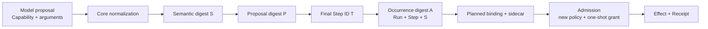

# ADR-0029: Core-derived action occurrence와 반복 coding loop

- 상태: 채택
- 기준일: 2026-09-01
- 적용 범위: AgentLoop proposal 검증, planned invocation identity, Admission, material recovery,
  WorkGraph execution profile
- 공개 protocol v0.1 schema 변경: 없음
- local store schema 변경: 없음(schema 8 유지)

## 문맥

실제 `Qwen3.8-27B` coding E2E는 workspace 검색과 읽기, 첫 patch, 실패한
`cargo test --offline`, 오류를 반영한 두 번째 patch까지 수행했다. 그러나 수정 뒤 정확히 같은
`cargo test --offline`을 재검증하려는 다음 proposal이 `DuplicateSemanticAction`으로 거부됐다.

기존 semantic action digest는 Capability, Definition, effect class, canonical argument/resource에
결합되고 Run과 Step에는 독립적이다. 반면 effect ID, one-shot grant ID와 idempotency key는
`(Run, semantic action)`에서 파생됐다. 따라서 한 Run에서 같은 파일을 다시 읽거나 같은 test/build를
다시 실행하면 이전 Step이 Receipt-completed여도 동일 권한 identity와 충돌했다. 이 규칙은 중복 효과를
막았지만, 관찰 → 수정 → 재관찰과 test 실패 → 수정 → 같은 test 재검증이라는 정상 coding loop도 막았다.

반복 실행을 허용하면서 다음 두 의미를 동시에 보존해야 한다.

1. 같은 canonical action인지 비교하는 **semantic identity**는 Run/Step과 독립적이어야 한다.
2. 실제로 새로 승인하고 실행할 **action occurrence**는 Core가 만든 정확한 Run/Step에 결합돼야 한다.

모델이 nonce, retry key 또는 임의 execution ID를 제공해 새 권한을 만들게 해서는 안 된다. 또한 이미
시작돼 결과가 불확정인 process를 새 Step으로 포장해 no-replay를 우회해서도 안 된다.

## 결정

### 1. Semantic identity와 authority occurrence를 분리한다

Core는 정규화된 호출에서 기존과 같은 semantic digest `S`를 계산한다.

```text
S = H(
  Capability ID/version,
  Definition digest,
  effect class,
  canonical arguments and resolved resources
)
```

`S`는 alias spelling, JSON key 순서, Run과 Step에 독립적이다. Proposal digest는 raw argument나
occurrence가 아니라 `S`와 material/Definition commitment를 포함한다. 이 단계의 domain은
`xgeny.plan-proposal.accepted/v3-action-occurrence`다.

```text
P = H(Run ID, context digest, sorted proposal facts including S)
T = H(Run ID, P, proposal key)                 # final Step ID
A = H("xgeny.planned-action-occurrence/v1", Run ID, T, S)
```

`A`가 새 planned Step의 durable `action_digest`다. 모델은 `P`, `T`, `A` 또는 nonce를 보내지 않는다.
Core가 proposal 검증과 final Step ID 파생을 마친 뒤 `A`를 계산한다. Preflight와 final Step ID로
canonicalization을 다시 수행해 Definition, normalized argument, `S`와 material digest가 모두 같을 때만
materialization한다.



### 2. 한 Proposal 안의 semantic duplicate는 계속 거부한다

동일 model decision 안에서 같은 `S`가 두 번 나오면 `DuplicateSemanticAction`으로 거부한다. Proposal
key나 objective만 바꿔 같은 action을 병렬 Step으로 늘리는 것은 정상 재관찰이 아니며, 승인 prompt
증폭과 불필요한 중복 실행을 만든다.

이전 Step이 Core Receipt와 함께 `Completed`된 뒤 새 planning turn이 열리면 같은 `S`를 다시 제안할 수
있다. 새 context/proposal이 새 `T`를 만들고, 따라서 새 `A`를 만든다. 이것이 다음 시나리오를 지원한다.

- 파일 읽기 → patch → 같은 파일 다시 읽기
- test 실패 → 코드 수정 → 같은 argv/cwd/env/timeout으로 test 재실행
- build 결과 확인 → 수정 → 같은 build 재검증

기존 Step 교체, dependency rewiring 또는 과거 Receipt 수정은 허용하지 않는다. 반복은 immutable graph에
새 Step을 append하는 방식뿐이다.

### 3. 각 occurrence는 새 권한이고, 한 occurrence의 replay 의미는 바뀌지 않는다

Admission은 new occurrence profile에서 reconstructed arguments로 `S`를 다시 계산하고 exact
`(Run ID, Step ID, S)`로 `A`를 재계산한다. Planned binding의 action digest와 다르면 resolver 이후
policy·execution authority를 만들지 않는다.

하나의 occurrence마다 다음 identity가 새로 발행된다.

```text
permission request ID  = exact Run/Step/request facts
one-shot grant ID      = H(Run ID, A)
effect identity        = H(Run ID, A)
idempotency key        = effect identity에서 파생(ReadOnly 제외)
Receipt invocation ID  = effect identity에서 파생
```

따라서 같은 semantic action을 반복해도 이전 승인이나 authorization budget을 재사용하지 않는다.
`process.execute`는 매 occurrence마다 별도 `--allow-execute` 판단을 통과해야 하며 filesystem read/write
승인과도 계속 분리된다.

Occurrence는 retry counter가 아니다. 한 Step이 `IntentCommitted`, `Executing`, `EffectUnknown`,
`Reconciling` 또는 `Validating`이면 frontier가 먼저 그 lifecycle을 처리하고 AgentLoop는 새 model turn을
열지 않는다. 특히 `Executing` restart는 같은 `A`를 유지한 채 Unknown/manual 또는 read-only query
reconciliation으로 가며, 새 occurrence를 자동 생성하거나 adapter를 blind replay하지 않는다. 새 `A`는
이전 Step이 Receipt-completed되고 모델이 다음 turn에서 다시 제안해 새 admission을 거친 경우에만 생긴다.

### 4. 새 profile을 compatibility fence로 사용한다

새 AgentLoop는 다음 profile만 생성한다.

| profile | effect 의미 | action identity |
|---|---|---|
| `LocalSyncOnceOccurrenceV1` | Idempotent/NonIdempotent local sync once | `A = H(Run, Step, S)` |
| `LocalSyncReadOnlyOccurrenceV1` | ReadOnly local sync | `A = H(Run, Step, S)` |

기존 persisted Run을 위한 다음 profile은 계속 읽고 실행한다.

| legacy profile | action identity |
|---|---|
| `LocalSyncOnceV1` | 기존 semantic digest `S` |
| `LocalSyncReadOnlyV1` | 기존 semantic digest `S` |

Admission과 material recovery는 Step의 durable profile을 먼저 확인한 뒤 같은 identity 규칙을 선택한다.
따라서 기존 schema 6~8 plan/input/intent bytes를 재작성하거나 action digest를 backfill하지 않는다.
Public CLI의 local route도 legacy once/read-only profile과 새 occurrence profile을 모두 허용하되 effect 종류가
다른 profile로의 downgrade는 거부한다. 따라서 RC2가 만든 미완료 Run은 현재 binary에서 그대로
admission/recovery할 수 있다.
Physical table/column이 추가되지 않으므로 schema 8을 유지한다. 새 enum을 모르는 이전 binary는 새 Run을
fail-closed하며, RC3 writer가 만든 Run을 이전 binary로 downgrade-resume할 수 있다고 주장하지 않는다.

### 5. Proposal commitment와 occurrence 사이의 순환을 만들지 않는다

Final Step ID는 proposal digest에서 파생되므로 occurrence `A`를 다시 proposal digest 입력에 넣으면
`P → T → A → P` 순환이 생긴다. 따라서 accepted proposal commitment는 semantic digest `S`를 기록하고,
Step의 planned invocation binding은 Core가 뒤에서 계산한 occurrence `A`를 기록한다. 둘은
Definition/material digest와 final 재정규화 gate로 연결된다.

저수준 `PlanAccepted` append는 계속 trusted Core/store 경계다. 임의 caller가 occurrence profile과 action
digest를 조립해도 Admission/material recovery가 raw argument에서 `S`와 `A`를 다시 계산해 일치하지 않으면
권한을 발행하지 않는다. Reducer는 planned binding, intent, authorization과 Receipt provenance의 exact
action identity를 마지막으로 다시 대조한다.

## 검토한 대안

### 기존 Run-wide semantic duplicate 금지 유지

중복 방어는 단순하지만 실제 coding loop가 같은 read/test/build를 재검증할 수 없다. 모델이 다른 timeout,
환경 변수나 무의미한 argument를 넣어 digest를 바꾸게 유도하면 오히려 semantic contract가 왜곡된다.

### 모델이 `executionKey`, nonce 또는 retry generation을 제출

모델이 새 권한 identity를 임의로 mint할 수 있고 같은 Proposal 안에서 nonce만 바꾼 중복 실행도 가능해진다.
승인과 no-replay 경계를 host가 소유한다는 원칙에 맞지 않는다.

### semantic digest 자체에 Run, turn 또는 Step을 포함

동일 작업 비교 능력을 잃고 기존 저장 Run과 external conformance 의미를 깨뜨린다. Step ID가 proposal
digest에서 파생되므로 proposal digest에 occurrence action을 넣는 순환도 생긴다.

### 별도 mutable generation counter 저장

Step ID가 이미 immutable occurrence key 역할을 한다. 별도 counter는 store migration, concurrent allocation
규칙과 rollback 의미를 추가하지만 더 강한 안전성을 주지 않는다.

## 검증

- 같은 Proposal 안의 canonical duplicate는 materializer 호출과 Run mutation 없이 거부
- Receipt-completed Step 뒤 같은 semantic action이 새 Step/action occurrence로 수락
- occurrence digest가 같은 Run/Step/semantic input에서는 결정론적이고 Run 또는 Step이 다르면 변경
- 반복 occurrence의 permission request, action, one-shot grant, effect, idempotency key와 Receipt invocation
  ID가 모두 다름
- legacy once/read-only profile wire value와 semantic-only admission/recovery 유지
- occurrence profile wire value와 profile/effect/idempotency reducer gate 고정
- occurrence planned input이 SQLite close/reopen 뒤 exact action/plan identity로 복구
- active/Unknown occurrence가 planner보다 우선되고 동일 intent의 execute가 재호출되지 않는 기존 no-replay
  suite 유지
- 실제 Qwen coding E2E에서 동일 `cargo test --offline`의 실패 결과를 수정에 사용하고 같은 명령의 두 번째
  occurrence가 성공한 뒤 build까지 완료
- Linux x86-64/ARM64, macOS Intel/Apple Silicon, Windows x86-64 전체 회귀

## 결과

XGENy는 semantic equality를 버리지 않으면서도 정상적인 관찰·수정·재검증 loop를 수행할 수 있다. 반복
action은 모델이 만든 nonce가 아니라 Core가 만든 immutable Step occurrence로 권한화되며, 각 반복은 새
승인과 one-shot budget을 소비한다. 이미 시작된 한 occurrence의 crash recovery는 기존 identity와
no-replay 규칙을 그대로 유지한다.
