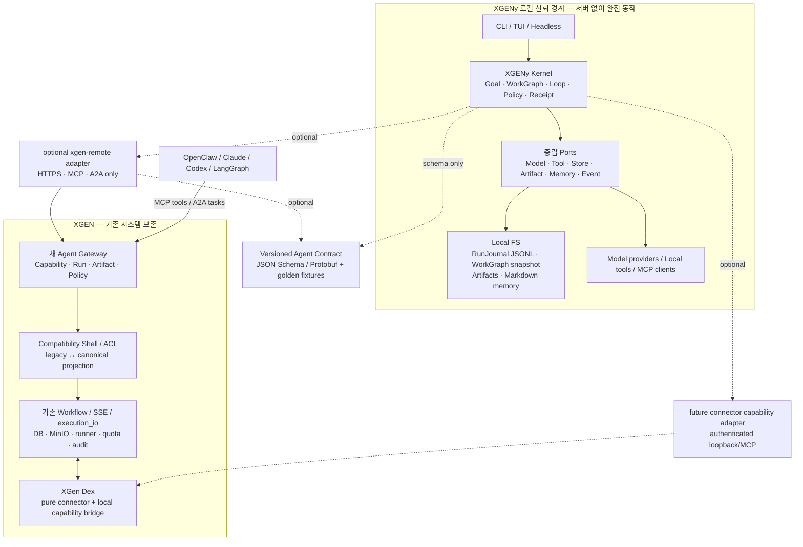

# XGENy 독립 코어와 XGEN 무중단 진화

- 기준일: 2026-08-27 (Asia/Seoul)
- 상태: 제품·프로토콜·마이그레이션 정본
- 적용 범위: XGENy CLI, XGEN Workflow, XGen Dex(`xgen-connector`), XGEN Agent Runtime, Memory, MCP, Sandbox, 외부 에이전트 연동
- 우선순위: 이 문서는 2026-08-26 초기 조사 메모보다 우선한다.

## 1. 한 문장 결론

> **XGENy는 XGEN 인프라 없이 완전 동작하는 독립 로컬 에이전트이며, XGEN은 XGENy의 미래형 의미 계약을 서버 측 호환 셸로 수용한다. 기존 XGEN 실행·데이터·권한·Connector 경로는 교체하지 않고 병행 보존한다.**

여기서 “독립”과 “호환”은 동시에 만족해야 한다.

- XGENy를 설치하거나 실행하는 데 XGEN, Connector, PostgreSQL, MinIO, Redis, Kubernetes, Python, Node.js 또는 별도 DB 서버가 필요하지 않다.
- XGENy 코어는 XGEN 저장소의 패키지나 서버 내부 타입을 import하지 않는다.
- 연동 시에도 XGENy가 DB나 MinIO에 직접 접속하지 않는다. HTTPS/MCP/A2A와 중립적인 참조만 사용한다.
- XGEN 서버는 기존 API를 유지하면서 새 계약을 별도 표면으로 제공한다.
- 현재 XGEN 웹, 배포 챗봇, Connector, 스케줄, 감사, 과금, 메모리 콘솔은 새 구조 때문에 깨지지 않는다.

## 2. 왜 이 경계가 필요한가

### 2.1 최신 구현에서 확인한 사실

2026-08-27 최신 기본 브랜치를 다시 확인한 결과, 과거의 “Connector 안에서 Agent-XGeny를 로컬 실행”하는 접근은 이미 폐기됐다.

| 저장소 | 확인 커밋 | 현재 사실 | 설계 의미 |
|---|---:|---|---|
| `xgen-connector` | `897b2cb` | v3 계열은 순수 접속기다. `5998ce1`에서 Python sidecar, 로컬 런타임, 서버 메모리 RPC 기반 로컬 실행 약 7천 줄을 삭제했다. | 삭제된 구조를 새 XGENy의 기반으로 복구하지 않는다. |
| `xgen-agent-runtime` | `4c7c179` | v4.1.0. `3f931eb`에서 `LocalHostServices`, sidecar, remote memory/store를 삭제하고 서버 runner 실행으로 일원화했다. | 21-stage 엔진의 의미·테스트는 참고하되 패키지 전체나 `host`를 로컬 코어로 의존하지 않는다. |
| `xgen-workflow` | `467887b` | `agents/geny`가 추천 실행 경로다. `ServerHostServices`가 설정 DB, workspace store, sandbox, cloud, jobs, self-evolution을 결선한다. 메모리 기본 백엔드는 `xgen-db`다. | 기존 Agent-XGeny는 XGEN 서버 제품 구현이지 독립 로컬 제품이 아니다. |
| `xgen-frontend` | `e43bb59` | `workflow_id`, `workflow_name`, `interaction_id`, 기존 SSE·로그·관리 API에 광범위하게 결합돼 있다. | 기존 식별자와 응답을 즉시 바꾸면 안 된다. |
| `xgen-agent-memory` | `c7abdba` | 단일 SQLite 파일, 서버·API 호출 없이 동작하며 DB는 재생성 가능한 검색 인덱스다. | 후속 로컬 인덱스 후보지만 초기 정본 저장소는 아니다. |
| `graph-tool-call` | `f8bec76` | 계약 보존 도구 그래프, prerequisite 확장, 근거 있는 선택, MCP gateway 축소를 제공한다. | Capability Compiler와 대규모 도구 선택의 핵심 자산이다. |
| `xgen-mcp-harness` | `140d28d` | OAuth/PKCE 원격 MCP 브리지지만 published workflow마다 도구를 만든다. | 인증·브리지 구현은 참고하고 도구 폭발 표면은 계승하지 않는다. |

추가로 최신 `xgen-connector` 트리에는 삭제된 로컬 실행을 설명하는 `docs/LOCAL_EXECUTION.md`와 `docs/PROTOCOL.md` 일부가 남아 있다. 따라서 문서만 보고 현재 실행 경로를 판단하면 안 된다. 아키텍처 검증은 코드·패키징·테스트·릴리스 산출물을 함께 본다.

### 2.2 과거 로컬 사이드카가 실패한 구조적 이유

과거 구현은 로컬에서 실행되지만 상태의 진실은 서버에 있었다.

- 서버가 에이전트 설정, 계정 자격증명, 이력, 메모리, RAG를 제공했다.
- 로컬 sidecar는 서버의 `local-turn-context`, `report-turn`, `geny-memory/rpc`에 의존했다.
- workspace는 서버 저장소와 동기화됐고 서버 기능 일부는 RPC로 되돌아갔다.
- 같은 이름의 에이전트가 서버와 PC에서 서로 다른 도구·파일시스템을 가졌다.
- 결과적으로 기능을 두 번 구현하고 두 실행 표면의 동등성을 계속 따라잡아야 했다.

새 XGENy가 이 구조를 다시 사용하면 오프라인 독립성, 설치 경량성, 일관된 기능 표면을 얻을 수 없다.

## 3. 최상위 불변 조건

### I-01. XGENy 코어의 빌드·실행 비의존성

`xgeny-domain`, `xgeny-runtime`, `xgeny-workgraph`, `xgeny-local-store`는 다음을 참조하지 않는다.

- XGEN Python/TypeScript SDK
- XGEN 데이터베이스 모델 또는 SQL 스키마
- MinIO/S3 전용 클라이언트
- Kubernetes/runner 내부 타입
- Connector Electron IPC 타입
- XGEN의 `workflow_id` 중심 그래프 노드 타입

### I-02. 로컬 완결성

네트워크가 없고 XGEN 계정이 없어도 다음이 동작해야 한다.

- 새 작업과 다중 턴 실행
- WorkGraph 생성·수정·복구
- 로컬 파일 읽기·검색·패치·쉘
- 세션 목록·재개·삭제
- 프로젝트/사용자 지침과 명시적 메모리
- 산출물과 실행 증거 보존

### I-03. 호환은 데이터베이스 공유가 아니라 프로토콜로 달성

XGENy는 XGEN의 DB·MinIO 위치를 알지 못한다. XGEN은 내부 객체를 다음 중립 객체로 투영한다.

- `CapabilityManifest`
- `Run` / `Task`
- `EventEnvelope`
- `ArtifactRef`
- `MemoryRecord`
- `PolicyLease`
- `ExecutionReceipt`

### I-04. 기존 XGEN 경로는 추가 방식으로 보존

다음 기존 계약을 새 API 도입과 동시에 삭제하거나 의미 변경하지 않는다.

- `workflow_id` / `workflow_name` / `interaction_id`
- `/api/agentflow/execute/based-id/stream`
- `/api/chat/io-logs`와 `execution_io` 기반 기록
- 기존 SSE `data`, `tool`, `node_status`, UI command, artifact, quota 이벤트
- Connector 인증·목록·채팅·reverse MCP·workspace 동기화
- 기존 `agents/geny`, 소프트 지원되는 `agents/xgen`, 배포·스케줄·Teams·voicebot 경로
- 소유권, 공유, 관리자 감사, 과금·쿼터, 배포 승인

### I-05. 한 Run에는 한 권위 작성자만 존재

동일 WorkGraph를 로컬과 서버가 동시에 수정하지 않는다. Run 생성 시 권위가 결정되고 명시적 handoff 전에는 바뀌지 않는다.

### I-06. 모델 컨텍스트와 작업 상태를 분리

- Model context = 일시적인 작업 메모리
- WorkGraph = 현재 목표·단계·의존성·검증 상태
- RunJournal = append-only 사실 원장
- ArtifactStore = 결과와 증거
- Memory = 원장에서 파생되거나 명시적으로 승인된 재사용 지식
- ContextAssembler = 현재 턴에 필요한 최소 상태를 구성하는 pager

요약문이나 전체 대화 재생은 WorkGraph의 대체물이 아니다.

### I-07. 보안 컨텍스트는 모델 인수에서 받지 않음

사용자·조직·워크플로·권한·승인 컨텍스트는 인증된 채널에서 유도한다. 모델이 만든 `user_id`, `workflow_id`, scope, token은 권한 근거가 아니다.

## 4. 목표 구조



핵심은 화살표 방향이다.

- XGENy Kernel에서 XGEN DB로 가는 화살표가 없다.
- XGENy Kernel에서 Connector Electron 코드로 가는 화살표가 없다.
- 공유되는 것은 버전 계약과 검증 fixture뿐이다.
- 기존 XGEN은 Compatibility Shell 뒤에서 그대로 동작한다.

## 5. 권장 Rust 워크스페이스 경계

XGENy 구현 언어는 Rust를 기본안으로 둔다. 단일 바이너리, OS별 배포, 낮은 시작 비용, 강한 타입의 이벤트·상태 기계에 유리하다.

```text
xgeny-cli/
  crates/
    xgeny-domain/          # Goal, Run, WorkGraph, Step, Artifact, Receipt; I/O 없음
    xgeny-workgraph/       # graph state machine, revision, authority, recovery
    xgeny-runtime/         # agent loop, context assembly, validation, cancellation
    xgeny-policy/          # allow/ask/deny, PolicyLease 교집합
    xgeny-local-store/     # JSONL, snapshots, Markdown, file artifacts
    xgeny-tools/           # read/search/patch/shell; workspace boundary
    xgeny-providers/       # model provider adapters
    xgeny-mcp/             # MCP client/server projection
    xgeny-xgen-remote/     # 선택형 XGEN HTTPS/A2A adapter
    xgeny-cli/             # TUI/headless/JSONL surface
  protocol/
    schema/                # canonical schema
    fixtures/              # language-neutral golden fixtures
    mappings/legacy-xgen/  # legacy mapping 규칙; XGENy runtime에는 미포함
```

의존 방향은 안쪽으로만 향한다.

```text
CLI/adapters/local-store -> runtime -> domain
XGEN remote adapter      -> protocol + domain
domain                   -> 아무 제품/전송/저장 구현에도 의존하지 않음
```

`xgeny-xgen-remote`는 Cargo default feature에 넣지 않는다. 독립 배포 CI는 `--no-default-features` 빌드와 네트워크 차단 E2E를 항상 통과해야 한다. 통합 배포 바이너리에 이 adapter를 포함하더라도 서버 설정이 없으면 초기화되지 않는다. 이 모듈도 XGEN 패키지가 아니라 공개 wire contract와 범용 HTTP/OAuth 라이브러리만 사용한다.

## 6. 저장·메모리·Artifact 경계

### 6.1 로컬 정본

```text
~/.xgeny/
  config.toml
  identity/
  projects/<project-id>/
    project.json
    runs/<run-id>/
      journal.jsonl       # 정본 append-only event log
      graph.json          # 빠른 복원용 snapshot; journal로 재구성 가능
      state.json          # cursor, authority, schema version
      artifacts/          # content-addressed local files
      receipts/           # 단계·Run 완료 증거
    memory/
      MEMORY.md
      topics/
    index/                # 선택적 임베디드 검색 인덱스; 삭제·재생성 가능
```

SQLite나 다른 임베디드 엔진을 나중에 사용해도 사용자가 설치하는 서비스가 아니다. 그러나 초기 원칙은 다음과 같다.

- RunJournal과 Markdown이 source of truth다.
- 검색 DB는 파생 인덱스다.
- DB 파일을 삭제해도 정본에서 재구축 가능해야 한다.
- XGEN의 `geny_memory_*` 테이블과 로컬 파일을 dual-write하지 않는다.

### 6.2 XGEN 메모리와의 관계

로컬 메모리와 조직 메모리는 같은 저장소가 아니다.

| scope | 권위 | 기본 동기화 | 용도 |
|---|---|---|---|
| `run` | Run authority | Run 선택 시 | 현재 작업의 사실과 결정 |
| `local-personal` | 로컬 사용자 | 안 함 | 개인 선호·지침 |
| `project` | 로컬 프로젝트 | 명시적 | 저장소별 지식 |
| `organization` | XGEN | 읽기 정책에 따라 | 조직 표준·검증된 지식 |
| `artifact-derived` | 원 Artifact | 참조/재생성 | 산출물에서 파생된 검색 지식 |

`local-personal/project`에서 `organization`으로의 승격은 자동 동기화가 아니다. provenance, 비밀·PII redaction, 정책 검사, 사용자 또는 관리자 승인을 거치는 별도 명령이다.

승격은 양방향 파일 동기화가 아니라 immutable copy다.

1. source record와 digest를 고정한다.
2. secret/PII detector와 조직 redaction policy를 적용한다.
3. 승격될 payload와 provenance를 사용자에게 보여 준다.
4. 승인 후 새 organization record를 만들고 원본 digest를 기록한다.
5. 서버가 로컬 Markdown을 덮어쓰지 않는다. 수정본을 되가져오려면 별도 import와 충돌 검토를 거친다.

### 6.3 Artifact 전송

XGENy는 MinIO bucket/key를 비즈니스 계약으로 사용하지 않는다.

```json
{
  "artifact_id": "art_...",
  "media_type": "application/pdf",
  "size": 12345,
  "sha256": "...",
  "name": "report.pdf",
  "location": {"kind": "remote", "uri": "https://...short-lived..."},
  "provenance": {"run_id": "run_...", "step_id": "step_..."}
}
```

XGEN이 MinIO를 사용하더라도 서버가 짧은 수명의 다운로드/업로드 URL 또는 스트림으로 변환한다. XGENy는 digest와 크기를 검증한다.

## 7. WorkGraph 권위와 네트워크 단절

### 7.1 Run 시작 위치별 권위

| 시작 주체 | WorkGraph 권위 | 상대편 역할 |
|---|---|---|
| XGENy 로컬 | XGENy | XGEN은 선택적 read-only mirror |
| XGEN | XGEN | XGENy는 edge executor와 로컬 실행 journal 소유자 |
| 외부 에이전트 → XGEN | XGEN | 외부에는 Task/Run 상태와 상호작용 표면 제공 |

### 7.2 충돌 방지

- Run 생성 시 `authority = local:<device-id>` 또는 `authority = xgen:<tenant>`를 고정한다.
- 그래프 mutation에는 `expected_revision`과 `idempotency_key`가 필요하다.
- authority handoff는 양쪽이 기록하는 별도 이벤트다.
- 같은 Run의 로컬·서버 dual-write는 금지한다.
- 미러 동기화는 append-only event 업로드와 cursor ack로 수행한다.

### 7.3 오프라인 규칙

- 로컬 권위 Run은 오프라인에서도 계속 실행하고 재연결 시 idempotent하게 미러링한다.
- 서버 권위 Run은 이미 승인된 in-flight step의 안전한 종료까지만 허용한다.
- 다음 정책 lease 또는 그래프 결정이 필요하면 `paused_offline`으로 멈춘다.
- 네트워크 단절을 성공으로 위장하거나 별도 로컬 Run으로 조용히 분기하지 않는다.

## 8. 정본 계약과 표준 프로토콜 투영

### 8.1 내부 최소 의미 모델

정본은 UI의 `ChatEvent`나 XGEN canvas node JSON이 아니다.

| 계약 | 목적 |
|---|---|
| `CapabilityManifest` | 무엇을 할 수 있고 어떤 입력·출력·정책·배치가 필요한지 |
| `RunRequest` / `RunState` | 장기 실행 lifecycle |
| `WorkGraph` / `WorkGraphDelta` | 목표, 단계, 의존성, 검증 상태 |
| `EventEnvelope` | 순서·재생·감사 가능한 사실 원장 |
| `InteractionRequest/Response` | 승인·질문·인증 요구 |
| `PolicyLease` | 제한 시간·scope를 가진 실행 권한 |
| `ToolInvocation` | 도구 호출과 결과 |
| `ArtifactRef` | 저장소 독립 산출물 참조 |
| `MemoryRecord` | scope·provenance·민감도 있는 지식 |
| `ExecutionReceipt` | 입력 digest, 정책, 실행 위치, 검증 결과, 산출물 digest |

`EventEnvelope` 필수 공통 필드:

```text
protocol_version, schema_version, event_id, run_id, sequence,
timestamp, actor, type, idempotency_key, causation_id, correlation_id
```

`thread_id`, `run_id`, `turn_id`, `step_id`는 분리한다. XGEN의 `interaction_id`는 대화/thread에 가깝고 한 번의 모델 실행인 Run과 동일하지 않다.

모든 `CapabilityManifest`와 `ToolInvocation`은 side effect를 다음 중 하나로 분류한다.

```text
read_only | idempotent | compensatable | non_idempotent | unknown
```

`unknown`은 `non_idempotent`와 동일하게 보수적으로 처리한다. effectful 호출은 실행 전에 idempotency key, 대상, 입력 digest, 실행 위치를 journal에 기록한다. `read_only`가 아니면 호출 시작 뒤 실행 위치 fallback을 금지한다. 단, 대상 시스템이 동일 idempotency key 조회를 지원해 미실행이 증명된 경우에만 재개할 수 있다. 파일 수정은 expected content digest를 이용한 compare-and-swap으로 충돌을 감지한다.

### 8.2 MCP

MCP는 대규모 능력 카탈로그의 검색·호출과 Claude/Codex/OpenClaw 호환 표면에 사용한다.

권장 XGEN 도구 표면:

```text
xgen.search_capabilities
xgen.get_capability
xgen.start_run
xgen.get_run
xgen.respond_interaction
xgen.cancel_run
xgen.get_artifact
```

published workflow마다 `run_<workflow>`를 만드는 방식은 카탈로그가 커질수록 피한다. `graph-tool-call`의 계약 그래프와 prerequisite closure를 Capability Compiler에 활용한다.

2026-07-28 MCP는 stateless core, request별 protocol version, `server/discover`, Tasks extension을 도입했다. 기존 XGEN MCP 구현은 이전 세대 SDK·세션 가정을 포함하므로 새 Gateway는 protocol revision을 협상하고 구버전 브리지를 별도로 유지해야 한다.

### 8.3 A2A

A2A의 Task, status, artifact, streaming, push notification, version header를 원격 agent-to-agent 실행에 사용한다. XGEN Native Protocol은 이 기능을 다시 발명하지 않는다.

XGEN 확장이 필요한 부분만 별도 URI로 선언한다.

- WorkGraph delta와 authority handoff
- PolicyLease와 조직 정책 증거
- ExecutionReceipt와 검증 상세
- 로컬 capability reverse tunnel

필수 확장을 이해하지 못한 client는 조용히 기능을 축소하지 않고 실행을 거부한다.

최소 wire error taxonomy는 다음을 예약한다.

```text
protocol_version_unsupported
required_extension_unsupported
authority_conflict
revision_conflict
policy_lease_expired
idempotency_conflict
artifact_integrity_failed
```

MCP/A2A binding은 각 표준의 오류 구조로 이를 투영하고 canonical code를 metadata에 보존한다.

## 9. XGEN Compatibility Shell

### 9.1 위치

호환 계층은 XGEN 서버 측에 둔다. XGENy 코어에 legacy XGEN 해석 로직을 넣지 않는다.

```text
new client / XGENy / OpenClaw
        -> Agent Gateway (canonical)
        -> Compatibility Shell
        -> existing workflow, execution_io, memory, MinIO, runner

existing web / Connector
        -> existing API (unchanged)
        -> existing workflow path
```

구형 XGEN에 새 Gateway를 즉시 넣기 어렵다면 별도 배포 가능한 bridge service를 XGEN 측에 둔다. 그래도 XGENy 내부로 legacy mapping을 옮기지 않는다.

### 9.2 주요 legacy mapping

| 기존 XGEN | 새 의미 | 주의점 |
|---|---|---|
| `workflow_id` | `LegacyRef`가 달린 `capability_id` | 같은 ID로 간주하지 않음 |
| `interaction_id` | `thread_id` | Run/turn과 분리 |
| agent SSE text | `output.delta` | UI projection은 유지 |
| `tool` SSE | `tool.started/completed/failed` | 원본 필드 보존 |
| `node_status` | `legacy.node.status` 또는 WorkGraph step projection | canvas node와 canonical step을 강제 동일시하지 않음 |
| `execution_io` | Run/turn receipt projection | 기존 감사·통계 쓰기 유지 |
| `geny_memory_*` | organization/server memory adapter | 로컬 메모리와 dual-write 금지 |
| MinIO object | `ArtifactRef` | signed URL/stream으로 숨김 |
| Connector `mcp_call` | authenticated local `ToolInvocation` | server-derived context 유지 |

### 9.3 Connector 원칙

최신 XGen Dex는 의도적으로 순수 접속기로 돌아갔다. 따라서 다음을 지킨다.

- XGENy 런타임을 Electron 앱 안에 다시 번들하지 않는다.
- 기존 Connector는 현재 XGEN API와 reverse MCP를 계속 사용한다.
- XGENy와 직접 연결이 필요하면 별도 프로세스 간 authenticated loopback/MCP adapter를 추가한다.
- Connector는 브라우저·device·local MCP capability를 제공할 수 있지만 WorkGraph나 메모리의 주인이 되지 않는다.
- 로컬 연결 토큰은 짧은 수명, 사용자 승인, workflow/run scope, loopback binding을 가져야 한다.

## 10. 기존 자산을 활용하는 방식

| 자산 | 직접 의존 | 활용 방식 |
|---|---:|---|
| `xgen-agent-runtime` | 아니오 | event taxonomy, provider conformance, tool permission, cancellation, compaction 실패 fixture를 이식 가능한 계약 테스트로 추출 |
| `xgen-harness-executor` | 아니오 | progressive disclosure, ToolSource, guard, session semantics 비교·fixture |
| `graph-tool-call` | 코어에서는 아니오 | 서버 Capability Compiler, 사전 컴파일 artifact, Rust selector의 golden oracle |
| `xgen-agent-memory` | MVP 아니오 | 후속 인덱스의 품질 baseline 또는 서버 측 조직 메모리 검색 |
| `xgen-mcp-harness` | 아니오 | OAuth/PKCE, stdio↔remote bridge 참고; workflow-per-tool 표면은 폐기 |
| `xgen-sandbox` | 아니오 | XGEN 측 remote execution placement를 중립 프로토콜로 호출 |
| `xgen-connector` | 아니오 | 기존 device bridge 유지; XGENy 직접 연결은 별도 프로토콜 |

코드를 공유하지 않더라도 의미와 회귀 fixture를 공유할 수 있다. 이 방식은 Rust 독립 배포와 XGEN 실행 동등성 검증을 함께 만족한다.

## 11. 무중단 마이그레이션 단계

### Phase 0 — 계약 동결과 기준선

- 현재 API, SSE, WebSocket, MCP, 식별자, 권한, quota, artifact, memory fixture를 보존한다.
- Connector v3와 아직 배포돼 있을 수 있는 v2 호출을 구분해 telemetry를 수집한다.
- Connector v2의 `local-turn-context`, `report-turn`, memory RPC는 지원 종료 정책이 별도 승인되기 전까지 제거하지 않는다. 이 문서는 제거를 승인하지 않는다.
- 현재 성공/실패 E2E를 golden baseline으로 저장한다.

### Phase 1 — 중립 스키마와 conformance

- `protocol/schema`와 fixture를 먼저 만든다.
- Rust/TypeScript/Python 생성 타입의 round-trip을 검증한다.
- unknown optional field, version mismatch, required extension 누락을 검증한다.
- 제품 실행 경로는 바꾸지 않는다.

### Phase 2 — XGEN Agent Gateway 추가

- 기존 route와 별도 prefix/service로 배포한다.
- 기존 workflow를 `CapabilityManifest`로 읽기 투영한다.
- 기존 실행을 canonical Run/Event로 변환해 보여 주되 기존 저장이 source of truth다.
- DB 스키마 변경 없이 시작할 수 있으면 읽기 projection부터 시작한다.

### Phase 3 — XGENy 독립 MVP

- XGEN 없는 깨끗한 OS에서 WorkGraph·journal·artifact·memory E2E를 통과한다.
- 같은 바이너리가 새 Agent Gateway와 연동한다.
- XGEN이 없을 때 core가 remote adapter 초기화 실패에 영향을 받지 않는지 검증한다.

### Phase 4 — Shadow와 비교

- 선택한 기존 XGEN workflow를 canonical event로 shadow projection한다.
- 결과 텍스트뿐 아니라 tool set, 권한 결정, artifact digest, usage, terminal state를 비교한다.
- shadow는 외부 side effect를 재실행하지 않는다.

### Phase 5 — 제한적 신규 Run

- tenant/workflow/capability feature flag로 opt-in한다.
- 새 RunJournal을 source로 하고 기존 `execution_io`에는 호환 projection을 기록한다.
- 자동 fallback은 첫 effectful invocation의 `started` 기록 전까지만 허용한다. 그 뒤에는 중복 실행 대신 중단·상태 조회·보상 또는 사용자 확인으로 복구한다.

### Phase 6 — Memory·Artifact·Connector 연동

- 명시적 memory promotion과 ArtifactRef transfer를 추가한다.
- Connector 직접 연결은 별도 capability adapter로 추가한다.
- 기존 Connector 실행 경로를 대체하지 않는다.

### Phase 7 — Legacy 축소

- 사용량 0, 지원 기간 경과, rollback 연습, 데이터 export가 확인된 계약만 폐기한다.
- deprecated 표면은 문서·telemetry·응답 header로 예고한다.

## 12. 검증 매트릭스

| 시나리오 | 필수 기대 결과 |
|---|---|
| XGENy standalone, 네트워크/DB/MinIO 없음 | 모든 기본 로컬 기능 PASS |
| XGENy + 새 XGEN | capability 검색, Run, event resume, artifact, policy PASS |
| XGENy + 구형 XGEN | 명확한 미지원 또는 XGEN 측 bridge 사용; core 내부 legacy fallback 없음 |
| 현재 web + 새 XGEN | 기존 채팅·history·canvas·관리 기능 무회귀 |
| Connector v3 + 새 XGEN | 현재 순수 접속기 동작과 reverse MCP 무회귀 |
| 지원 기간 내 Connector v2 + 새 XGEN | local-turn-context/report-turn 등 유지 또는 명시된 업그레이드 정책 |
| OpenClaw + XGEN MCP | 작은 generic tool surface, policy path, 장기 Run 조회 PASS |
| XGEN 서버 agent + Connector tool | server-derived identity, scope mismatch 차단 |
| 로컬 권위 Run 네트워크 단절 | 계속 실행, 재연결 idempotent mirror |
| 서버 권위 Run 네트워크 단절 | lease 경계에서 pause, 중복 side effect 없음 |
| PolicyLease 만료/clock skew | 로컬 monotonic deadline 이후 새 side effect 차단; 재인증 전 pause |
| non-idempotent tool 뒤 장애 | 다른 위치 자동 재실행 금지, receipt 기반 상태 확인/보상 |
| 이벤트 재연결 | sequence cursor로 누락·중복 없이 resume |
| 오래된 schema fixture | 호환 읽기 또는 명확한 migration 오류 |
| unknown required extension | fail closed |
| 업데이트/다운그레이드 | journal·memory·artifact 보존 |
| macOS/Linux/Windows 깨끗한 머신 | 별도 Python/Node/DB 설치 없이 실행 |

릴리스 차단 기준은 “새 테스트가 통과”가 아니라 “기존 baseline 실패 집합이 늘지 않고 새 경로의 독립 E2E가 통과”다.

## 13. 반드시 피할 설계

1. Connector에서 삭제한 Python sidecar를 새 이름으로 복구
2. XGENy가 `xgen-agent-runtime` 또는 `xgen-sdk` 전체를 필수 설치
3. XGENy가 XGEN DB 테이블이나 MinIO bucket을 직접 읽기
4. `workflow_id == capability_id`, `interaction_id == run_id`로 강제 통합
5. 로컬·서버 WorkGraph multi-master
6. local memory와 organization memory 자동 전체 동기화
7. 모델 인수의 사용자·workflow 식별자를 권한 근거로 신뢰
8. 기존 `/execute/based-id/stream` 응답을 새 이벤트 형식으로 즉시 변경
9. 동일 이름이면 서로 다른 실행 표면도 같은 capability라고 주장
10. side effect 후 다른 실행 위치에서 자동 재시도

## 14. 결정 원장

| ID | 결정 | 상태 |
|---|---|---|
| D-001 | XGENy는 별도 제품·Rust 로컬 runtime으로 개발 | 확정 |
| D-002 | XGENy 코어는 XGEN/Connector/DB/MinIO/K8s/Python에 의존하지 않음 | 확정 |
| D-003 | 서버 없는 로컬 실행은 필수, XGEN 호환 E2E도 MVP 필수 | 확정 |
| D-004 | WorkGraph·RunJournal·Artifact·Memory를 모델 context와 분리 | 확정 |
| D-005 | Run당 단일 authority, 명시적 handoff | 확정 |
| D-006 | XGEN은 서버 측 Compatibility Shell로 새 계약을 수용 | 확정 |
| D-007 | 기존 XGEN API와 Connector 경로는 additive migration으로 보존 | 확정 |
| D-008 | MCP는 capability/tool 표면, A2A는 remote task 표면, XGEN 확장은 차별 기능에 한정 | 확정 |
| D-009 | 로컬 JSONL·Markdown이 정본, 임베디드 DB는 재생성 가능한 인덱스 | MVP 확정 |
| D-010 | Connector에 XGENy runtime을 다시 내장하지 않음 | 확정 |
| D-011 | 기존 XGEN runtime 코드는 직접 의존하지 않고 의미·fixture·conformance 자산으로 활용 | 확정 |
| D-012 | OpenClaw 등 외부 에이전트는 XGEN generic MCP/A2A 표면을 사용 | 확정 |

### 폐기·수정된 과거 가정

- “XGENy가 기존 XGEN 에이전트 코어에 맞춰야 한다” → 폐기
- “기존 Python 코어를 추출해 XGENy가 직접 의존한다” → 폐기
- “XGEN 연동은 MVP 이후 선택 기능” → 수정: 실행 시 선택이지만 호환 E2E는 MVP 필수
- “Connector의 로컬 Agent-XGeny가 새 CLI 기반” → 폐기: 최신 Connector에서 제거된 XGEN 종속 구현
- “모든 published workflow를 MCP 도구 하나씩 노출” → 폐기

## 15. 아직 열려 있는 질문

다음은 구현 전에 spike 또는 별도 ADR이 필요하다.

1. canonical schema를 JSON Schema 중심으로 둘지 Protobuf 중심으로 둘지
2. A2A의 현재 버전과 MCP 2025/2026 dual-stack 지원 기간
3. 로컬 sandbox의 OS별 최소 안전선과 remote sandbox 승격 조건
4. WorkGraph step 모델과 `graph-tool-call` prerequisite graph의 정확한 결합 방식
5. RunJournal compaction과 snapshot 검증 알고리즘
6. XGEN server-side Compatibility Shell을 workflow 내부 모듈로 둘지 별도 gateway service로 둘지
7. Connector v2 지원 종료 기간과 telemetry 기준
8. 조직 memory promotion의 승인 주체와 retention 정책
9. PolicyLease의 offline grace와 clock skew 허용치
10. Rust provider 구현 범위와 기존 Python provider conformance fixture 자동 생성 방식

세부 허용치는 열려 있어도 안전 기본값은 확정한다. 서버의 절대 만료 시각을 로컬 monotonic deadline으로 변환하고, 허용 가능한 clock skew를 초과하면 더 일찍 만료된 것으로 처리한다. 만료 뒤에는 새 side effect를 시작하지 않는다.

이 질문들은 독립성·기존 경로 보존이라는 상위 결정은 바꾸지 않는다.

## 16. 참고

- XGEN Connector: <https://github.com/PlateerLab/xgen-connector>
- XGEN Agent Runtime: <https://github.com/PlateerLab/xgen-agent-runtime>
- XGEN Agent Memory: <https://github.com/PlateerLab/xgen-agent-memory>
- XGEN MCP Harness: <https://github.com/PlateerLab/xgen-mcp-harness>
- graph-tool-call: <https://github.com/SonAIengine/graph-tool-call>
- MCP 2026-07-28 release: <https://blog.modelcontextprotocol.io/posts/2026-07-28/>
- A2A specification: <https://a2a-protocol.org/dev/specification/>
- OpenClaw Gateway protocol: <https://docs.openclaw.ai/gateway/protocol>
