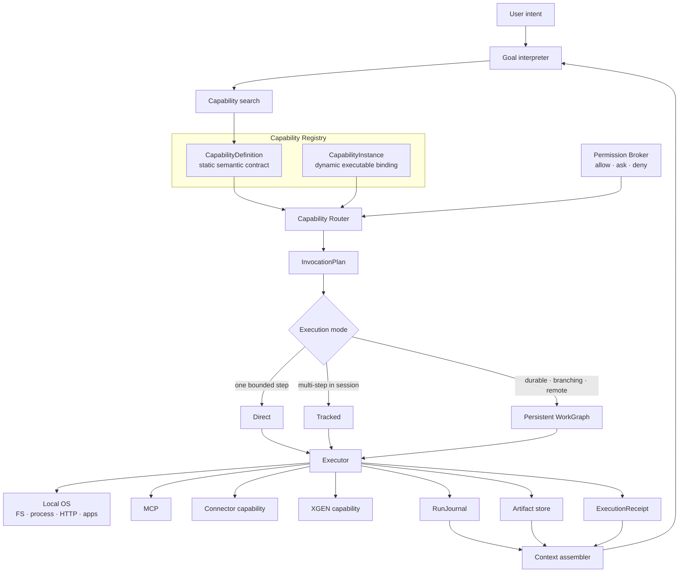

# XGENy Capability Runtime v0.1

- 기준일: 2026-08-28 (Asia/Seoul)
- 상태: MVP 구현 정본
- 상위 문서: `2026-08-27-xgeny-xgen-evolution.md`
- 적용 범위: Capability, 권한, routing, 실행 모드, WorkGraph, RunJournal, Receipt

## 1. 결론

XGENy는 모든 실행 기능을 하나의 거대한 도구 목록으로 다루지 않는다. 다음 네 계약을 분리한다.

1. `CapabilityDefinition`: 무엇을 할 수 있는가
2. `CapabilityInstance`: 지금 어디서 어떻게 실행할 수 있는가
3. `PermissionRequest` / `PolicyDecision`: 이 구체적 실행을 허용할 수 있는가
4. `InvocationPlan`: 허용된 후보 중 무엇을 어떤 검증 조건으로 실행할 것인가

모든 실행은 동일한 Run 엔진을 사용하며 `RunJournal`과 `ExecutionReceipt`를 남긴다. `Direct`, `Tracked`, `Persistent`는 별도 엔진이 아니라 그래프 복잡도와 지속성 수준이다.

## 2. 목표 구조



모델은 후보를 제안할 수 있지만 권한을 부여하거나 실행 사실을 확정하지 않는다. 런타임이 구체적 resource를 해석하고, 정책을 검사하고, 실행 결과를 검증한다.

## 3. 의미 경계

| 개념 | 책임 | 금지 사항 |
|---|---|---|
| Capability | 안정적인 실행 의미와 계약 | 특정 서버 상태·credential 포함 |
| CapabilityInstance | 실제 binding, placement, health, trust | Capability의 의미 재정의 |
| Tool | 프로토콜별 호출 표면 | 정본 도메인 모델 역할 |
| Skill | Capability를 조합하는 절차·지식 | 직접적인 권한 경계 역할 |
| WorkGraph | 한 Run의 목표·단계·의존성·검증 상태 | 전체 Capability catalog 저장 |
| Agent | Goal을 받아 자율 실행하는 주체 | 내부 계획이나 credential 공개 강제 |
| Artifact | immutable 산출물과 digest | MinIO bucket/key 같은 저장 구현 노출 |
| Receipt | 실행·정책·검증 증거 | 모델의 완료 주장만 기록 |

동일한 입력·출력·effect·검증 의미를 보장할 때만 여러 Instance가 같은 Capability ID를 공유한다. 의미가 다르면 이름이 비슷해도 별도 Capability로 정의한다. XGEN의 `workflow_id`는 legacy metadata이며 canonical Capability ID가 아니다.

## 4. Capability 계약

### 4.1 CapabilityDefinition

정적 Definition에는 다음만 둔다.

- 안정적인 `capabilityId`와 `contractVersion`
- 요약, 검색 keyword, 예시
- JSON Schema 2020-12 기반 input/output
- effect class와 입력에서 concrete resource를 추출하는 JSON Pointer
- 필수 prerequisite Capability
- sync/task, timeout, cancellation, idempotency 지원
- 결과 검증 전략

다음은 Definition에 넣지 않는다.

- 현재 health와 latency
- 로컬 설치 여부
- OAuth token, API key, password
- 특정 MCP session
- XGEN DB·MinIO 식별자
- 사용자별 permission grant

Capability ID는 `<namespace>/<name>` 형식을 사용한다. 계약이 호환되지 않게 바뀌면 `contractVersion` major를 올린다. wire `protocolVersion`과 저장 `schemaVersion`은 별도 관리한다.

### 4.2 CapabilityInstance

Instance는 Definition을 실행체에 결선한다.

```text
source: builtin | local_cli | mcp | connector | xgen
placement: local | device | remote
trust: untrusted | configured | verified | managed
data_boundary: local | device | organization | external
```

Instance에는 platform, availability, auth reference, task/cancel 지원, latency·cost hint를 둘 수 있다. `binding`은 adapter 설정의 secret-free reference만 포함하고 실제 endpoint·credential·동적 transport 상태는 adapter가 소유한다.

### 4.3 PATH와 shell

PATH에 존재하는 모든 executable을 자동으로 typed Capability로 노출하지 않는다. 자동 노출은 tool 폭발, 불명확한 effect, prompt injection, 권한 우회를 만든다.

- `process.execute`는 범용 escape hatch로 제공한다.
- 안정적인 CLI는 curated adapter로 별도 CapabilityDefinition을 제공할 수 있다.
- shell command의 실제 executable, cwd, argv, environment reference를 실행 직전에 다시 검사한다.
- 모델이 만든 environment 값에 credential을 직접 삽입하지 않는다.
- credential이 필요한 input은 문자열 secret이 아니라 `credentialRef`를 사용한다.

## 5. Capability discovery

모델 context에 전체 catalog를 주입하지 않는다.

1. 작은 catalog에서는 직접 typed schema를 binding한다.
2. 큰 catalog에서는 `capability.search`와 `capability.describe`만 우선 노출한다.
3. 검색된 상위 후보의 schema만 현재 Step context에 추가한다.
4. 최종 호출은 generic invoke가 아니라 선택된 typed Capability 계약으로 검증한다.

XGEN의 외부 MCP 표면은 catalog 폭발을 막기 위해 다음처럼 작게 유지한다.

```text
xgen.search_capabilities
xgen.get_capability
xgen.start_run
xgen.get_run
xgen.respond_interaction
xgen.cancel_run
xgen.get_artifact
```

`graph-tool-call`은 prerequisite closure와 선택 결과를 검증하는 compiler/golden oracle로 사용한다. Rust 코어는 해당 프로젝트를 runtime dependency로 참조하지 않는다.

## 6. Permission Broker

권한은 Capability 이름이 아니라 정규화된 concrete resource에 적용한다. 예를 들어 `/workspace/a/../../.ssh/config`는 정규화된 최종 경로로 판단한다.

기본 scope:

```text
filesystem.read
filesystem.write
process.execute
network.connect
browser.control
desktop.control
credential.use
device.access
external.write
remote.execute
```

유효 권한은 다음 허용 집합의 교집합이다.

```text
host/OS boundary
∩ user permission profile
∩ current run grant
∩ managed PolicyLease when present
```

명시적인 deny가 우선한다. 모델이 생성한 사용자 ID, workflow ID, scope, token은 권한 근거가 아니다.

권한 profile:

| profile | 기본 동작 |
|---|---|
| `ask` | effectful 실행마다 확인 |
| `trusted_workspace` | 지정 workspace와 허용된 network 범위 자동 실행 |
| `trusted_local` | 사용자 PC 범위에서 넓게 허용 |
| `full_local` | OS 사용자 권한 내 일반 실행 자동 허용 |
| `managed` | 로컬 grant와 조직 PolicyLease 교집합 |

다음 critical action은 `full_local`에서도 별도 Run-scoped 승인 없이는 자동 실행하지 않는다.

- trash를 우회하는 복구 불가능 삭제
- credential 원문 export
- 결제·구매
- 외부 메시지·게시·발행
- 운영 배포
- privilege escalation
- 부팅 자동 실행·영구 daemon 등록

MCP annotation은 trusted server의 risk hint로만 사용한다. host enforcement나 concrete resource 검사를 대체하지 않는다.

## 7. Router

Router는 두 단계로 동작한다.

### 7.1 Hard filter

다음 후보는 ranking 전에 제거한다.

- Capability ID·contract version·schema 불일치
- 현재 platform에서 실행 불가
- unavailable 또는 필요한 auth 부재
- trust와 data-boundary 요구 미달
- permission deny
- 필요한 task/cancel/idempotency 기능 부재
- required extension 미지원

### 7.2 Lexicographic ranking

통과한 후보는 단일 magic score가 아니라 다음 우선순위로 비교한다.

1. 의미·계약 적합성
2. 성공 가능성과 검증 강도
3. 추가 permission 요구량
4. reversibility와 effect 위험
5. data locality와 외부 반출량
6. 실행 단계 수
7. latency와 금전 비용
8. 사용자 선호

사용자가 특정 Instance를 pin해도 hard filter와 critical action gate는 우회할 수 없다. Router는 선택 이유와 탈락 이유를 InvocationPlan에 기록한다.

### 7.3 fallback

- `read_only` 또는 effect 시작 전 실패: 다음 후보로 fallback 가능
- effect 시작 후: 자동 placement fallback 금지
- 같은 idempotency key로 미실행이 증명된 경우: resume 가능
- 보상이 필요한 경우: 별도 compensating Step 생성

## 8. 실행 모드

모든 사용자 요청은 내부적으로 Run이다. 모드만 자동 선택한다.

| 모드 | 조건 | 내부 표현 |
|---|---|---|
| Direct | 한 개의 bounded Step, 분기 없음, 즉시 검증 | 1-Step WorkGraph |
| Tracked | 여러 Step, 현재 세션에서 완료 가능 | persisted journal + graph |
| Persistent | 장기·분기·재개·원격 Task·승인 대기·critical action | durable WorkGraph |

모델은 모드를 제안할 수 있지만 runtime risk rule보다 낮게 downgrade할 수 없다. runtime은 언제든 더 강한 모드로 escalate할 수 있다.

Persistent 강제 조건:

- process 종료 이후에도 재개해야 함
- branching/dependency가 존재함
- MCP/A2A durable Task handle 사용
- 사용자 입력·인증·승인을 기다림
- non-idempotent 또는 critical action 포함
- 원격 authority 또는 PolicyLease 사용

## 9. WorkGraph와 RunJournal

최소 Step 상태:

```text
pending
ready
running
waiting_input
validating
completed
failed
blocked
cancelled
```

외부 effect 복구에는 다음 보수 상태가 추가로 필요하다. 정확한 wire 변경은 ADR-0008의 연구 gate 뒤에 확정한다.

```text
effect_unknown
reconciling
compensation_required
manual_required
```

RunJournal은 특정 파일 형식의 이름이 아니라 committed `RunEvent` history라는 논리적 append-only 정본이다. graph snapshot과 JSONL export는 파생 projection이다. 물리 저장 후보는 ADR-0008에서 hardened JSONL과 per-Run embedded SQLite를 fault-injection으로 비교한다.

- event는 `runId + sequence`로 정렬한다.
- 각 event는 이전 event digest를 포함한다.
- digest는 RFC 8785 JSON canonicalization 후 SHA-256을 사용한다.
- snapshot은 마지막 반영 sequence와 event digest를 기록한다.
- snapshot 검증 실패 시 journal replay로 복구한다.
- compaction은 immutable segment archive이며 receipt와 artifact를 삭제하지 않는다.
- unknown core field는 거부한다. URI-keyed optional extension은 보존하고 unknown required extension은 fail closed한다.

## 10. ExecutionReceipt

Receipt에는 최소 다음을 기록한다.

- run, step, invocation, plan ID
- Capability ID, contract version, Instance ID
- redacted input summary와 normalized input digest
- PolicyDecision 또는 PolicyLease digest
- executor와 placement
- effect 시작 여부와 idempotency key
- 시작·종료 시각과 terminal status
- output와 Artifact digest
- verification strategy, evidence, result
- 이전 Receipt digest와 현재 Receipt digest

MVP는 content digest와 hash chain까지만 구현한다. hash chain은 누락·변조 탐지 수단이며 actor 인증, transaction 원자성 또는 외부 effect의 exactly-once를 보장하지 않는다. 전자서명은 추후 DSSE/in-toto envelope adapter로 추가한다. 민감한 argument나 credential은 Receipt·telemetry에 기록하지 않는다.

InvocationPlan의 raw argument는 실행 중에만 존재하며 canonical JSON 기준 최대 1 MiB로 제한한다. Journal에는 raw argument 대신 digest와 redacted summary만 기록한다. Capability의 내장 input/output schema도 별도 JSON Schema 2020-12 meta-schema 검증을 통과해야 한다.

## 11. 프로토콜 투영

### MCP

- CapabilityDefinition ↔ Tool schema
- CapabilityInstance의 task 지원 ↔ MCP Tasks extension
- MCP Task handle은 remote sub-execution이며 XGENy WorkGraph authority가 아니다.
- MCP annotation은 untrusted hint이며 PolicyDecision을 만들지 않는다.
- XGENy MCP client는 2025-11-25와 2026-07-28 연동 fixture를 갖는다.
- 새 XGEN Gateway는 2026-07-28을 기본으로 하고 legacy bridge를 별도 유지한다.

### A2A

- remote Agent identity/capability ↔ Agent Card/Agent Skill
- XGENy Run view ↔ A2A Task
- ArtifactRef ↔ A2A Artifact
- WorkGraph 내부 Step과 정책 상세는 기본 A2A 표면에 노출하지 않는다.
- WorkGraph delta, PolicyLease, Receipt는 필요한 경우 명시적 XGEN extension URI로 제공한다.

## 12. MVP Capability pack

### Core OS pack

```text
filesystem: list · stat · read · search · write_atomic · patch · move · trash
process: discover · execute · stream · cancel
network: http_request
desktop: open · reveal · clipboard
artifact: put · get · verify
```

### Adapter pack

```text
MCP client
Connector capability adapter
XGEN remote adapter
```

### First-party optional pack

```text
coding: git · test · lint · build
web: search · fetch · browser
documents: convert · extract · summarize
data: JSON · CSV · table analysis
```

Coding은 기본 acceptance scenario이지만 core domain identity가 아니다. GUI vision automation, multi-agent scheduler, 조직 memory 자동 동기화, signed Receipt는 MVP 이후로 둔다.

## 13. 구현 순서

1. JSON Schema와 golden fixture
2. Rust domain type과 schema conformance
3. model-free durable store + pure reducer + effect simulator vertical slice
4. transaction/effect 경계 fault-injection과 3개 OS 저장 후보 평가
5. Registry와 fake Instance
6. Permission Broker와 concrete resource resolver
7. Router와 deterministic golden test
8. Direct executor, Journal, Receipt
9. Tracked/Persistent WorkGraph와 crash recovery
10. model provider와 ContextAssembler
11. core OS Capability pack
12. MCP adapter
13. read-only·Artifact 생성형 XGEN capability live E2E
14. OS별 package/install E2E

서버에 effect를 만드는 XGEN workflow는 idempotency, reconcile, Receipt 검증 뒤에 연결한다. 첫 vertical slice의 상세 실험 순서와 통계 기준은 `docs/research/2026-08-28-runtime-evaluation-protocol.md`를 따른다.

## 14. 릴리스 차단 검증

| 영역 | 필수 검증 |
|---|---|
| schema | valid fixture PASS, invalid fixture FAIL, unknown optional extension 보존 |
| permission | path traversal, symlink escape, credential redaction, critical action 차단 |
| router | unavailable/auth/policy 후보 제거, 동일 입력 deterministic 선택 |
| effect | 시작 전 fallback, lost ack는 effect_unknown, sink 증거 없는 blind retry 금지 |
| journal | 모든 transaction·effect 경계 강제 종료 후 replay 결과 동일 |
| receipt | digest tamper 검출, success의 모든 필수 verification evidence PASS |
| context | 모델 length를 넘는 Run에서 active frontier로 재개 |
| standalone | XGEN·외부 DB service·MinIO·Python·Node 없이 core E2E |
| integration | MCP dual fixture와 XGEN live E2E |
| OS | macOS/Linux/Windows 깨끗한 환경 설치·실행 |

## 15. MVP 이후 항목

- OS별 강한 sandbox와 remote sandbox placement
- browser vision/computer-use automation
- A2A server/client 전체 conformance
- Receipt DSSE 서명과 조직 attestation policy
- embedded search index와 vector retrieval
- organization memory promotion workflow
- multi-agent scheduling

이 항목들은 v0.1 계약을 확장하지만 core 의미를 바꾸지 않아야 한다.
