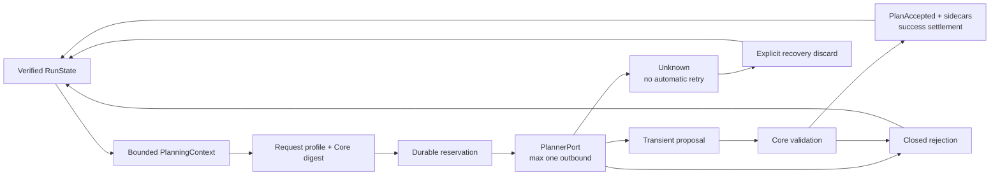

# Durable model-call lifecycle 개발 가이드

- 기준일: 2026-08-30
- 상태: reservation/recovery 기본형 + 첫 OpenAI-compatible leaf adapter
- 공개 protocol v0.1 schema 변경: 없음
- local store schema: 6
- 정본 결정: [ADR-0016](../adr/0016-durable-model-call-lifecycle.md)

## 현재 가능한 것

Bounded `AgentLoop`가 provider-neutral planner port를 호출하기 전에 한 model-call slot을 Run journal에 예약한다. Reservation, closed settlement와 Unknown 상태는 Memory 또는 embedded SQLite에서 replay되며 process 재시작 뒤에도 자동 중복 호출을 막는다.

현재 구현의 보장은 **실제 provider 청구 횟수**가 아니라 보수적인 possible-send 상한이다. Reservation commit 직후 network send 전에 crash할 수 있으므로 예약 수가 실제 outbound/청구 수보다 클 수 있다. 반대로 adapter가 reservation 하나당 outbound request를 최대 한 번만 보내고 hidden retry를 하지 않으면 lifecycle configuration 이후 실제 outbound 수가 그 구간의 durable reservation 수를 넘지는 않는다. Legacy Run의 configuration 이전 호출은 아래 upgrade 경계처럼 이 상한에 포함되지 않는다.

`xgeny-provider-openai`가 immutable model/tokenizer/template profile, strict structured proposal과 retry/redirect 없는 HTTP POST를 이 port에 연결한다. Fake/injected port의 lifecycle·store 회귀와 loopback HTTP contract는 기본 CI에서 함께 실행한다. 실제 tool dispatcher와 사용자용 CLI composition root는 아직 없다.



## Durable 구성과 상태

### Accepted-turn budget

기존 `AgentLoopBudget`은 다음 의미를 유지한다.

```rust
AgentLoopBudget {
    max_model_turns,   // accepted Plan/Completion decision
    max_planned_steps,
    max_tool_calls,
    max_context_bytes,
}
```

`max_model_turns`는 provider call 횟수가 아니다. Invalid response, Core rejection 또는 Unknown call은 accepted turn을 올리지 않는다.

### Possible-send budget

별도 `ModelCallBudget`은 durable reservation 상한을 고정한다. 0은 허용하지 않으며 lifecycle configuration은 한 Run에 한 번만 가능하다. Runtime의 configuration과 journal projection이 다르면 provider를 호출하지 않고 fail-closed한다.

`AgentLoop::new(agent_loop_budget)`는 호환 기본값으로 `max_model_calls = max_model_turns`를 사용한다. 별도 상한이 필요하면 `AgentLoop::with_model_call_budget(agent_loop_budget, model_call_budget)`을 사용한다. 첫 coordination은 기존 `AgentLoopConfigured`, 다음 coordination은 `ModelCallLifecycleConfigured`를 각각 commit한 뒤 새 head에서 진행한다.

Reservation이 commit되면 다음 사실은 되돌리지 않는다.

- reserved/possible-send counter 1 증가
- monotonic call index 소비
- 해당 call identity와 request/base-head binding 고정

Closed rejection, Unknown, explicit discard 또는 accepted settlement 뒤에도 이 slot은 복구되지 않는다. 따라서 retries가 accepted-turn budget을 우회하지 못한다.

과거 schema 6 Run에 lifecycle을 처음 configure할 때는 기존 `accepted_model_turns`를 reserved/settled historical floor로 가져온다. `ModelCallBudget`은 이 floor보다 작을 수 없다. 과거 accepted Plan을 “reservation이 없었던 무료 call”로 간주해 새 budget을 다시 제공하지 않기 위한 보수적 upgrade 의미다.

단, 이 floor로 lifecycle 이전의 invalid response, timeout, provider failure, crash와 기타 미수락 호출을 알아낼 수는 없다. 그런 호출에는 reservation event가 없기 때문이다. Possible-send 상한은 `ModelCallLifecycleConfigured` 이후 생긴 reservation부터 적용되며, 기존 Run의 시작부터 발생한 outbound 또는 billed call 전체에 대한 exact count/upper bound가 아니다. 과거 구간까지 강한 상한이 필요한 운영 환경은 legacy Run을 이어서 추정하지 말고 lifecycle이 처음부터 configured된 새 Run에서 시작해야 한다.

### Projection

`RunState.agent_loop`는 기존 accepted-turn 상태와 model-call lifecycle의 bounded current view를 제공한다. Journal이 전체 이력의 권위이고 projection은 다음 coordination 사실만 보존한다.

- configured model-call budget
- accepted-turn, reserved-call, settled-call과 unknown-call counter
- `reserved_calls + 1`로 유도하는 다음 monotonic call index
- 현재 unresolved call과 lifecycle status

모든 과거 call을 unbounded map으로 복제하지 않는다. Duplicate와 stale 여부는 deterministic call identity, monotonic index, active binding과 reducer 순번으로 검사한다.

Reducer는 `accepted_model_turns <= settled_calls <= reserved_calls`와 `unknown_calls <= reserved_calls`를 항상 검사한다. `unknown_calls`는 Unknown을 거친 누적 횟수이므로 그 call을 나중에 abandon해도 감소하지 않고, abandon은 `settled_calls`만 증가시킨다.

## Request profile과 deterministic identity

Model-call을 예약하려면 adapter/composition root가 bounded request profile commitment를 제공해야 한다. `xgeny-provider-openai`를 포함한 모든 실제 adapter는 최소한 다음 request 의미가 바뀔 때 digest도 바뀌어야 한다.

- provider/model identity
- system/developer prompt template와 revision
- sampling, seed, maximum output과 tool/structured-output option
- output JSON schema 또는 provider dialect revision
- tokenizer/message-format profile처럼 semantic request를 바꾸는 설정

Core는 원문 profile을 journal에 저장하지 않고 `request_profile_digest`를 받는다. Verified Run/context와 이 digest로 `request_digest` 및 model call ID를 계산한다.

현재 `planner_id`는 1~256 bytes의 ASCII `[A-Za-z0-9._-]`만 허용한다. Core-generated call ID는 `model-call-{64 lower-case SHA-256 hex}` shape다. Provider/XGEN correlation ID를 이 필드에 넣거나 provider 응답으로 덮어쓰지 않는다.

`planner_id` 검사는 length/alphabet만 확인하고 secret 여부는 탐지하지 않는다. 허용 alphabet으로 표현된 credential도 syntactically valid일 수 있으므로 trusted composition root가 non-secret stable registry identifier만 공급해야 한다. URL/path, API key/token, raw prompt/response/error와 사용자 데이터를 identifier에 넣지 않는다.

| field | Core가 확인하는 것 | trusted host가 보장할 것 |
|---|---|---|
| `planner_id` | 1~256 bytes, ASCII `[A-Za-z0-9._-]` | registry에서 선택한 stable non-secret identifier |
| `request_profile_digest` | canonical lower-case SHA-256 wire shape | versioned non-secret profile descriptor와 승인된 commitment input |
| `request_digest`/call ID | Core-owned deterministic derivation과 current-state binding | raw/secret 값을 별도 ID나 ad-hoc digest로 우회 주입하지 않음 |

어느 validator도 credential/token-like content를 휴리스틱으로 탐지하지 않는다. Raw prompt/response/provider error/credential을 identifier나 digest field에 직접 넣거나 단독 hash를 비밀 대용으로 저장하는 것은 caller contract 위반이다.

```text
reservation identity
  = Run ID
  + authority epoch
  + planner identity
  + call index
  + next accepted turn
  + base journal sequence/head digest
  + context digest
  + Core request digest(planner identity, request profile digest, context digest)
```

모든 digest는 well-formed lower-case SHA-256 commitment여야 한다. 기존 `context_digest`는 allowlisted bounded planning context를 commit하지만 그 내용을 기밀화하지 않는다. `request_profile_digest`에 raw prompt, credential, 사용자별 민감값이나 low-entropy secret을 직접 넣거나 그 단독 hash를 비밀 대용으로 저장하지 않는다.

## 한 call의 실행 순서

### 1. Frontier와 budget 선행 검사

`AgentLoop`는 기존과 같이 recovery, reconciliation, verification, committed effect와 admission action을 model planning보다 먼저 반환한다. Waiting/blocked/manual/failed 상태에서 model call로 우회하지 않는다.

Planning이 가능한 경우에도 다음 조건에서 port를 호출하지 않는다.

- accepted-turn 또는 model-call reservation budget 소진
- unresolved Reserved/Unknown call 존재
- runtime model-call configuration과 durable configuration 불일치
- context byte budget 초과
- syntactically invalid planner identifier 또는 malformed request-profile digest
- reservation compare-and-append 실패

### 2. Context와 request commitment 생성

Verified current state에서 `PlanningContext`를 만든다. Context는 reservation **전** base head를 포함한다. Runtime은 request profile commitment와 결합해 Core-owned request digest와 deterministic call ID를 만든다.

### 3. Reservation commit

Reservation event를 current `ExpectedHead`에 plain append한다. Commit이 성공한 뒤에만 planner port를 호출한다. SQLite에서는 event와 projection이 기존 `BEGIN IMMEDIATE` transaction으로 함께 commit된다.

Reservation commit failure, stale head 또는 reducer rejection은 planner 호출 0회를 보장해야 한다.

### 4. Planner port를 최대 한 번 호출

정상 control flow는 reservation commit 뒤 port method를 한 번 호출한다. Commit 직후 crash할 수 있으므로 lifecycle 보장은 reservation당 port invocation 최대 한 번이며, port method 한 번은 outbound provider request 최대 한 번을 의미한다.

현재 `PlannerPort`는 `planner_id()`, `request_profile_digest()`와 `plan(&PlannerCallRequest)`를 제공한다. `PlannerCallRequest`는 Core-owned call ID/request digest와 bounded `PlanningContext`만 노출하고 serializable durable envelope가 아니다. Raw provider request/response는 port 밖으로 반환하지 않는다.

```text
one durable reservation
  -> one PlannerPort invocation
  -> zero or one outbound provider request
```

Port 안에서 retry, fallback model, secondary endpoint 또는 response-repair provider를 자동 호출하지 않는다. 그런 정책이 필요하면 각각 새 reservation을 소비하는 상위 orchestration으로 명시해야 한다.

### 5. 결과 정산

| transient 결과 | durable 처리 | accepted turn |
|---|---|---:|
| valid Plan + Core/materialization 성공 | `PlanAccepted`와 모든 input sidecar가 success settlement | +1 |
| valid Completion + Core gate 성공 | `CompletionCandidateRecorded`가 success settlement | +1 |
| `PlannerPortFailure::ProviderLimit` | closed `ProviderLimit` settlement | 변화 없음 |
| `PlannerPortFailure::ProviderRejected` | closed `ProviderRejected` settlement | 변화 없음 |
| invalid response/decode | closed rejection settlement | 변화 없음 |
| proposal/context/graph/Core validation 실패 | closed rejection settlement | 변화 없음 |
| materializer failure | closed rejection settlement | 변화 없음 |
| timeout/ambiguous unavailable | Unknown | 변화 없음 |
| crash/lost acknowledgement | replay 결과에 따라 unresolved 또는 already settled | 중복 증가 없음 |

Success를 별도 settlement event로 먼저 기록하지 않는다. `ExpectedPlanningTurn`의 optional model-call binding이 exact active reservation을 가리키며, lifecycle이 configured된 Run에서는 missing binding을 reducer가 거부한다. Legacy optional shape는 기존 schema 6 replay만을 위한 호환성이다.

현재 durable closed taxonomy는 다음으로 고정한다.

- Unknown: `Timeout`, `TransportUnavailable`, `Interrupted`
- Rejected: `PlannerInvalidResponse`, `ProviderLimit`, `ProposalRejected`, `MaterializationFailed`, `StaleHead`
- Abandoned: `RecoveryDiscarded`

새 provider error string을 그대로 저장하거나 임의 reason을 추가하지 않는다.

## Failure와 restart 처리

### Reserved 또는 Unknown으로 재개

Restart 뒤 unresolved call이 있으면 새 planner call을 시작하지 않는다.

```text
load_current()
  -> unresolved model call 발견
  -> model call recovery required 반환
  -> provider call 0회
  -> operator/composition root가 explicit discard 또는 미래 reconciliation 선택
```

Explicit discard는 previous request가 전송되지 않았다는 증명이 아니다. 해당 request의 늦은 응답을 앞으로 적용하지 않겠다는 결정이며 possible-send slot은 이미 소비된 상태로 남는다. Discard가 commit된 뒤 남은 budget으로 새 context와 새 reservation을 만들 수 있다.

현재 public recovery entry point는 `AgentLoop::abandon_model_call(..., call_id)`다. Exact active call만 `ModelCallSettlement::Abandoned { reason: ModelCallAbandonmentReason::RecoveryDiscarded }`를 담은 `ModelCallSettled` event로 닫고 `ModelCallAbandoned` tick을 반환한다. 자동 timeout worker나 implicit retry가 이 API를 대신 호출해서는 안 된다.

### Timeout과 unavailable

기존 port failure 이름만 보고 전송 여부를 추정하지 않는다. Timeout과 delivery가 불명확한 unavailable은 Unknown이다. Provider adapter가 request가 전송되기 전에 실패했음을 future contract로 증명하더라도 이번 기본형의 보수적 상한을 약화하지 않는다.

### Commit acknowledgement 유실

Caller가 commit 결과를 받지 못했다고 event를 재전송하지 않는다. Store를 다시 열고 replay한 current state를 기준으로 한다.

- reservation이 보이면 같은 call을 다시 보내지 않는다.
- accepted Plan/Completion이 보이면 다음 frontier로 진행한다.
- reservation만 남고 Plan이 없으면 unresolved recovery로 간다.

### Stale response

Response는 reservation 당시 base context와 lifecycle head에만 적용할 수 있다. 다른 event가 head를 전진시키면 old response를 새 `ExpectedHead`로 rebase하지 않는다.

Model-call uncertainty는 WorkGraph safety transition을 전역 freeze하지 않는다. `Executing`/`EffectUnknown`/`Reconciling` recovery, Core verification과 manual safety event는 계속 append할 수 있다. 그 결과 original model response는 stale해지며 Core는 응답 내용을 새 head에 적용하는 대신 bounded `StaleHead` rejection으로 call을 정산한다. 그 뒤 새 context와 reservation을 만들어야 한다.

## Store 의미

### Memory

Memory store는 reducer가 candidate를 모두 검증한 뒤 event, projection과 verified index를 갱신한다. 정상 `Result` 경로의 논리적 none-or-all과 replay parity를 검증하지만 process crash persistence는 제공하지 않는다.

### SQLite schema 6

Model-call table, column 또는 sidecar를 추가하지 않는다.

```text
run_events.event_json
  -> reservation / closed settlement / Unknown / recovery

run_projection.state_json
  -> counters + current unresolved lifecycle view

planned_invocations
  -> accepted Plan의 기존 reconstructable input sidecar만 저장
```

Plain lifecycle event는 event와 projection을 기존 transaction으로 commit한다. Accepted Plan은 기존 `append_with_plan_inputs`가 event, 모든 planned input row와 projection을 원자 commit한다. 따라서 success settlement와 runnable Step 일부가 분리되지 않는다.

현재 durable event 이름은 다음과 같다.

```text
ModelCallLifecycleConfigured
ModelCallReserved
ModelCallBecameUnknown
ModelCallSettled
  -> Rejected | Abandoned

PlanAccepted / CompletionCandidateRecorded
  -> exact active model call의 accepted settlement
```

Schema version은 6을 유지한다. 물리 schema 의미가 바뀌지 않고 과거 schema 6 blob을 다시 쓰지 않는다. 과거 binary는 새 lifecycle event/projection을 이해하지 못하면 decode/replay에서 fail-closed해야 하며 새 의미를 legacy Plan으로 무시해서는 안 된다. 새 binary는 과거 값에 없던 optional field를 serialization에서 새로 방출해 과거 event digest를 바꾸면 안 된다.

SQLite verified cache는 기존 `data_version + durable journal head` identity를 사용한다. 다른 connection이 event/projection을 바꾸면 cold full audit로 전환하며 warm normal append는 historical event/sidecar를 다시 scan하지 않는다. Model-call lifecycle의 순번과 stale binding은 runtime preflight만이 아니라 WorkGraph reducer replay에서도 검사해야 한다.

## Raw data와 logging 경계

Durable model-call event/projection에 허용되는 값은 bounded identifier, counter, closed enum과 well-formed commitment뿐이다.

저장·export·일반 log 금지:

- raw prompt/request/response/stream chunk
- provider envelope와 raw error body
- chain-of-thought와 hidden reasoning
- API key, token, cookie, authorization header와 presigned URL
- raw proposal argument, tool result와 전체 transcript

`Debug` redaction은 명시적 serialization이나 adapter logging을 막는 DLP가 아니다. 실제 adapter의 HTTP trace, retry library와 observability exporter도 raw body를 기본 비활성화하고 sentinel tests로 검증해야 한다.

## XGEN과 adapter 연결

Lifecycle Core에는 XGEN/Connector/PostgreSQL/MinIO type이나 client가 없다. 미래 adapter는 다음 경계만 구현한다.

```text
provider-neutral reserved request
  -> local/OpenAI-compatible/XGEN request dialect
  -> at most one outbound call
  -> provider-neutral transient proposal or closed failure
```

XGEN Model Gateway를 붙여도 model call ID와 Core request digest의 권위는 XGENy에 남는다. XGEN의 request/interaction ID가 필요하면 adapter-private correlation 또는 versioned optional metadata로 다루고 Core identity를 대체하지 않는다. XGEN/Connector 없이 동일 lifecycle/store test가 통과해야 한다.

Claude Code, Codex 또는 OpenClaw가 Parent orchestrator인 observer mode에서는 XGENy `AgentLoop` 자체를 호출하지 않으므로 model-call reservation도 만들지 않는다. Parent harness planning을 관찰하는 것과 XGENy runtime-mode provider call을 혼합하지 않는다.

## Failure-first 검증

```text
xgeny-workgraph
  deterministic call/request identity and monotonic call index
  lifecycle configuration, call budget and counter separation
  exact active call success/rejection/unknown/discard transitions
  missing/wrong/duplicate/stale call binding mutation zero
  legacy schema-6 Plan replay but configured bypass rejection
  historical accepted floor, below-floor budget rejection, pre-lifecycle failure non-synthesis
  safety effect lifecycle allowed while model response becomes stale

xgeny-local-store
  model-call-specific Memory/SQLite Unknown reopen parity
  model-call-specific reservation/Unknown Event + Projection fault rollback
  model-call-specific active reservation + PlanAccepted sidecar fault rollback
  shared process-exit/two-handle/cache-invalidation regressions remain green
  shared warm append historical scan zero and cold replay event-once
  migration to current schema version 7 and all pre-existing row/blob preservation

xgeny-runtime
  reservation commit before planner invocation
  one reservation -> PlannerPort at most once
  budget/config/unresolved state -> planner call zero
  accepted/rejected/unknown outcome classification
  timeout/unavailable/restart -> no automatic retry
  explicit discard before next reservation
  SQLite reopen simulation after committed Plan or interrupted reservation -> planner call zero
  CommitAckLossStore reservation-ack loss -> provider call zero and reopen recovery
  CommitAckLossStore accepted-Plan-ack loss -> reopen accepted and provider recall zero
  stale response cannot be rebased to new head
  raw request/response/error/credential sentinel non-disclosure
```

위 shared store 항목은 기존 transaction/cache 계약의 재사용 회귀다. 이번 slice는 runtime test double인 `CommitAckLossStore`로 model-call reservation/accepted-Plan acknowledgement 유실을 전용 simulation하지만, model-call 전용 process-kill, two-handle 또는 external-cache injector를 새로 제공하지는 않는다. Restart 의미는 SQLite close/reopen 및 stale-head simulation과 Core replay 불변식을 함께 대조한다.

Merge 전 전체 gate:

```bash
cargo fmt --all -- --check
cargo clippy --workspace --all-targets -- -D warnings
cargo test --workspace --locked
cargo run --locked --quiet -p xgeny-cli -- protocol check
cargo build --workspace --release --locked
```

## 아직 할 수 없는 것

- XGEN Model Gateway와 다중 provider routing
- 사용자용 provider 설정·credential 입력과 `xgeny run` composition root
- tool dispatcher와 자동 continuation loop
- retry/backoff/fallback model과 provider-side hidden retry 검증
- provider request-status, idempotency와 billing reconciliation
- 정확한 outbound/청구/token/금액/rate-limit/wall-clock accounting
- raw transcript 저장이나 process crash 뒤 response body 복원
- parallel model calls, distributed lease와 multi-orchestrator scheduling
- completion candidate의 terminal goal verification

계획 수락, context와 WorkGraph 계약은 [Durable Planner와 bounded AgentLoop](durable-planner-loop.md), lifecycle 설계는 [ADR-0016](../adr/0016-durable-model-call-lifecycle.md), 실제 HTTP 경계는 [ADR-0017](../adr/0017-openai-compatible-provider-adapter.md)을 따른다.
