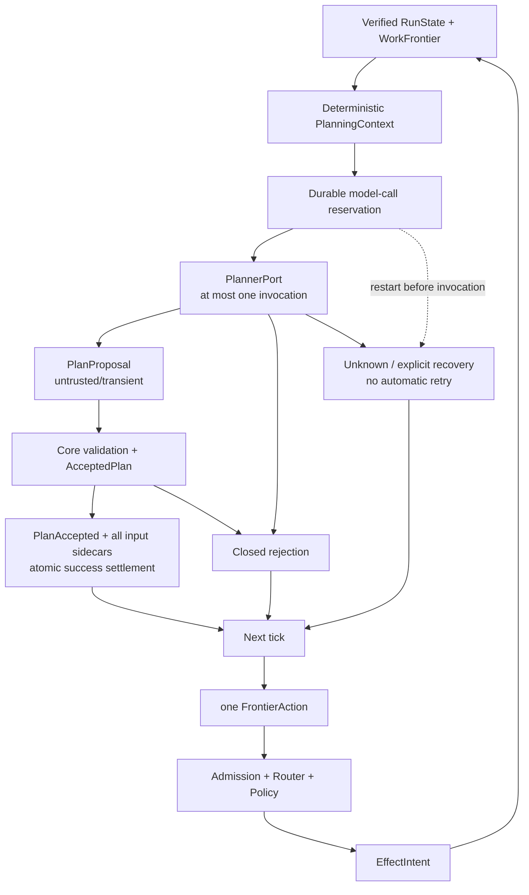

# Durable Planner와 bounded agent loop

- 기준일: 2026-08-30
- 상태: provider-neutral durable planning + 첫 OpenAI-compatible adapter
- 공개 protocol v0.1 schema 변경: 없음
- local store schema: 8

## 현재 가능한 것

한 Run의 model-owned 작업 부분에 host-selected budget을 고정하고, 한 planning decision이 만든 여러 Step과 각 Step의 secret-free reconstructable input reference를 Memory 또는 embedded SQLite에 원자 저장할 수 있다. Embedded SQLite에서는 process 재시작 뒤에도 accepted Capability/input commitment와 dependency DAG를 검증해 같은 frontier를 복원한다.

현재 구현은 provider-neutral planner port를 호출하기 전에 durable possible-send slot을 예약하고 accepted/rejected/Unknown 상태를 재시작 뒤 복원한다. Fake port와 별도 `xgeny-provider-openai` leaf adapter가 같은 경계를 사용하며, 후자는 OpenAI-compatible model API의 strict structured proposal을 Core validation까지 연결한다. Tool은 자동 실행하지 않으며 dispatcher와 사용자 interaction이 붙기 전까지 이것을 완전한 autonomous CLI로 설명하지 않는다.



## 세 계약의 역할

| 단계 | 소유자 | durable 여부 | 포함할 수 있는 값 | 포함하면 안 되는 값 |
|---|---|---:|---|---|
| `PlanProposal` | model/provider | 아니오 | objective, dependency, Capability 후보, transient argument | grant, policy decision, selected Instance, execution 사실 |
| Accepted plan | XGENy Core | 예 | Step ID, normalized objective/dependency, Definition/action/input digest, execution profile | raw argument, raw response, credential |
| `InvocationPlan` 의미 | Admission/Router/Core | effect intent에 commitment 저장 | resolved resource, selected Instance, policy/authorization, verification provenance | 모델이 만든 보안 결정 |

현재 public `InvocationPlanBody`에는 selected Instance, policy decision, candidates, fallback과 verification plan이 필요하다. 따라서 provider output을 이 타입으로 deserialize하지 않는다. 현재 slice는 full `InvocationPlan` document를 저장하지 않으며 `EffectIntent`와 Receipt provenance에 deterministic execution-plan commitment만 둔다.

## Durable event와 projection

계획 수락과 completion에 관한 durable event는 세 가지다. ADR-0016의 model-call lifecycle event는 provider 호출 전에 reservation을 만들고 closed rejection, Unknown과 explicit recovery를 별도로 기록한다.

```text
AgentLoopConfigured
  └─ non-zero Run budget 고정

PlanAccepted
  ├─ ExpectedPlanningTurn
  └─ AcceptedPlanStep[]
       ├─ objective + dependsOn
       └─ PlannedInvocationBinding

CompletionCandidateRecorded
  ├─ exact active modelCallId의 성공 settlement
  └─ Receipt-completed graph에 대한 비종결 완료 후보
```

`PlanAccepted`의 `ExpectedPlanningTurn`도 lifecycle이 configured된 Run에서는 exact active `modelCallId`를 요구하고 성공 settlement를 겸한다. 별도 success event와 Plan을 두 단계로 기록하지 않으므로 crash 사이에 settled-without-Plan 상태가 생기지 않는다.

`RunState.agent_loop`는 configured budget, accepted model decision 수, model-call lifecycle의 bounded counter/current state와 optional completion candidate를 보존한다. `StepState.planned_invocation`은 `PlanAccepted`로 만든 Step에만 존재한다. 기존 `StepPlanned`는 legacy/model-free 경로라 이 필드가 `None`이다. Model-call field의 optional legacy shape는 schema 6 과거 journal replay를 위한 것이며, lifecycle configuration 이후 missing call ID append를 허용하는 우회로가 아니다.

`PlanAccepted` reducer는 Step vector 순서와 무관하게 전체 ID 집합을 먼저 확인하므로 같은 proposal 내부 forward dependency를 표현할 수 있다. Candidate projection에 모든 새 Step을 넣은 뒤 기존 `derive_frontier()`로 union graph를 검증하며, 오류 시 이전 state는 바뀌지 않는다.

현재 hard limit:

| 항목 | 상한 |
|---|---:|
| 한 `PlanAccepted`의 Step | 32 |
| 한 `PlanAccepted`의 dependency edge | 128 |
| accepted objective | 5,000 bytes |

Self/duplicate/unknown dependency, cycle, 기존 terminally blocked dependency와 그 전이적 blocked descendant,
같은 Proposal batch의 중복 semantic action, total planned-step budget 초과는 거부한다. Receipt-completed
Step 뒤 다음 planning turn에서는 같은 semantic action을 다시 제안할 수 있다. Core가 새 final Step ID와
`H(Run, Step, semantic action)` occurrence를 만들기 때문에 같은 파일 재관찰과 동일 test/build 재검증이
새 approval/effect identity로 진행된다. Model nonce나 proposal key만 다른 같은-batch duplicate는 허용하지
않는다. Dependency release는 계속 `Completed + complete Core Receipt ID/digest`만 인정한다. Unknown,
Executing, Validating 같은 unresolved lifecycle은 frontier가 먼저 처리하므로 새 occurrence로 no-replay를
우회할 수 없다. Loop가 configured된 Run의 legacy `StepPlanned`도 같은 total-step budget과
completion-candidate seal을 지킨다.

Runtime은 이 구조 검사를 recipe materialization 전에 수행하고 reducer는 durable graph 불변식을 append 시 다시 검증한다. 또한 제안 Capability의 exact ID/version은 current `PlanningContext.capabilities()`에, `ExistingStep` dependency ID는 current `PlanningContext.steps()`에 실제 존재해야 한다. Full Registry/RunState에는 있지만 context byte packing에서 생략된 항목을 추측해도 각각 `CapabilityUnavailable`/`UnknownDependency`로 거부한다. 따라서 invalid 또는 hidden-reference graph가 외부 materializer를 호출하지 않는다.

## Planned invocation과 raw input 경계

Transient argument는 plan을 수락하기 전에 exact CapabilityDefinition의 schema와 size limit으로 검증하고 trusted planning normalizer로 canonical resource identity를 만든 뒤 digest를 계산해야 한다. Raw provider envelope/body와 argument는 RunStore에 남기지 않지만, 수락된 bounded objective/dependency는 journal의 graph 사실로 남는다. Raw proposal canonical bytes는 256 KiB size gate에만 쓰고, durable `proposal_digest`는 sorted proposal key/objective/dependency/Capability와 validated Definition/action/material digest의 accepted semantics로 계산한다. Accepted Step에는 argument 원문 대신 다음 binding만 남는다.

```text
capability_id / contract_version
definition_digest
action_digest = Core-derived Run/Step occurrence
plan_input_digest
execution_profile = local_sync_once_occurrence_v1 | local_sync_read_only_occurrence_v1
target_os = linux | macos | windows
target_arch = x86_64 | aarch64
spec_digest
plan_input_record_digest
```

`PlannedInvocationMaterialRecord`는 local store sidecar다. 여기에도 raw argument는 없고 Run/Step/plan/proposal/spec와 host-selected `ReconstructableMaterialReference`만 있다. Reference component는 bounded identifier이며 path, URL과 token syntax를 허용하지 않는다. `Debug`는 opaque reference ID를 redaction한다. Digest는 commitment이지 암호화가 아니므로 raw credential이나 low-entropy secret을 argument/reference에 직접 넣지 않는다.

Ordinary `InvocationAdmission::prepare`로 planned Step을 준비해도 accepted sidecar의 exact reference가 자동으로 final retention에 고정된다. Pending 값의 reference 교체 시도는 authorization에서 다시 거부하고, Memory/SQLite append는 마지막 방어선으로 accepted plan input과 다른 `InvocationMaterialRecord` retention을 원자 commit하지 않는다.

Production recipe provider/materializer의 계약은 다음 순서다.

```text
1. transient model argument schema/size 검증
2. side-effect-free ResourceResolver로 canonical identity/containment 정규화
3. exact semantic action/planInputDigest 계산
4. host가 immutable recipe를 durable하게 보존
5. reference read-after-write로 재구성해 digest 재검증
6. semantic proposal digest와 final Step ID 계산
7. Core가 Run/Step/semantic action occurrence를 계산
8. PlannedInvocationBinding + sidecar 생성
9. PlanAccepted bundle commit
```

4와 7 사이 crash는 외부 provider에 orphan recipe를 남길 수 있지만 Run에는 partial plan을 남기지 않는다. Orphan GC와 external recipe provider transaction은 아직 구현 범위가 아니다. Generic `PlanMaterializer` port는 외부 저장소의 durability나 5번의 read-after-write를 직접 증명하지 않으므로 production implementation과 fault test가 이 계약을 책임진다. Recipe가 durable하지 않은 상태에서 Persistent plan을 commit하면 안 된다.

Planning normalizer의 `ResourceResolver`는 deterministic canonicalization 전용이다. Network 호출, credential dereference, filesystem write, 대상 resource content 읽기·실행과 권한 변경을 금지한다. 따라서 future dependency가 아직 풀리지 않았어도 실행 접근 없이 identity만 고정할 수 있다. Admission은 dependency가 Receipt로 해제된 뒤 recipe를 복원하고 같은 정규화를 다시 수행해 precomputed action/input digest와 비교한다.

Plan acceptance도 preflight identity로 한 번 정규화한 뒤 semantic proposal digest와 final Step ID를 만들고,
final ID로 같은 normalized argument를 다시 정규화한다. Normalized argument, Definition/semantic
action/material digest가 exact match해야만 `H(Run ID, final Step ID, semantic action)` occurrence를 만들고
materializer로 넘어간다. Proposal digest는 semantic action을 commit하고 planned binding은 occurrence를
commit해 Step-ID 파생 순환을 피한다. 공개 `ResourceResolver::resolve` 입력은 scope/resource뿐이고 구현은
deterministic/idempotent해야 한다. 이 계약을 어기는 resolver는 `InvocationInvalid`로 fail-closed한다.

새 plan의 `local_sync_once_occurrence_v1`은 Sync, once/idempotency-key 지원, `Idempotent` 또는
`NonIdempotent`, critical action 없음 조건을 요구한다. `local_sync_read_only_occurrence_v1`은 Sync
`ReadOnly`, idempotency-key feature 비요구, critical action 없음을 요구한다. Definition이 key 지원도
선언할 수는 있지만 read-only route는 그 feature를 요구하지 않고 intent에도 key를 발행하지 않는다.
Reducer는 전자에 non-empty key를, 후자에 key 없음을 요구하고 두 profile 모두 Local Receipt placement와
exact target executor platform을 검사한다. 기존 저장 Run의 `local_sync_once_v1`과
`local_sync_read_only_v1`은 semantic-only action identity로 계속 admission/recovery한다. Built-in
runtime/store 경계가 별도로 ReadOnly intent와 Core Receipt v2 provenance의 결합을 검사한다. Catalog에
보이는 async/unsupported effect/critical-action Capability는 metadata로 모델이 피할 수 있지만, 제안되면
`CapabilityUnsupported`다. Approval UI가 생기기 전까지 critical action을 자동 계획하지 않는다.

Remote lookup이나 credential이 없으면 identity를 만들 수 없는 Capability는 현재 profile에서 plan acceptance할 수 없다. 이런 Capability는 추후 unresolved proposal commitment와 admission-time resolved commitment를 나누는 2단계 binding 계약이 생기기 전까지 fail-closed한다.

## SQLite schema 6 planner table과 current schema 8

Schema 6은 다음 table을 추가한다.

```text
planned_invocations
  step_id          PRIMARY KEY
  event_sequence   -> run_events.sequence
  plan_id          UNIQUE
  record_digest    UNIQUE
  record_json
```

`append_with_plan_inputs(expectedHead, PlanAccepted, inputs)`는 다음을 미리 검증한다.

- Step과 sidecar 수가 같다.
- 모든 accepted Step에 정확히 하나의 sidecar가 있다.
- extra/duplicate sidecar가 없다.
- Run, Step, plan, proposal, spec와 record digest가 일치한다.
- 과거에 같은 Step input이 commit되지 않았다.

SQLite transaction은 event, effect/authorization index, planned input rows, invocation material, Receipt와 projection 순서의 공통 append path를 사용한다. 이번 event에 해당하지 않는 index는 no-op이다. Event/PlannedInvocation/Projection 단계 fault에서 transaction rollback 후 기존 head와 projection만 보여야 한다.

Open과 `load()`는 journal replay만 맞는지 검사하고 끝내지 않는다. `PlanAccepted` anchor와 sidecar 전체를 대조하고 missing/orphan/index-column/serialized-record/digest 차이를 corruption으로 닫는다. `load_planned_invocation(step_id)`도 verified current generation과 point record를 다시 결합한다.

Version 5 → 6 migration은 역사적으로 이 빈 table을 추가했다. Schema 7은 기존 durable bytes를 다시 쓰지 않고 `tool_outputs` table을 추가했고, current schema 8은 같은 방식으로 `completion_outputs` table을 추가한다. Schema 3/4/5/6/7 migration은 해당 legacy topology의 event/projection/effect/authorization/material/Receipt/plan/tool-output row를 full audit한 뒤 8로 수렴한다. 감사가 실패하면 새 table과 `user_version` 변경을 같은 transaction에서 모두 rollback한다. Version 1/2와 9 이상은 지원하지 않는다.

## Admission 이중 binding

Accepted Step의 `Admit` action은 caller가 임의 `RouteRequest`와 argument를 다시 만드는 경로가 아니다. 다음 검증 순서를 사용한다.

```text
verified current Step + planned binding
  -> planned route + current Definition digest 확인
  -> verified sidecar load
  -> host recipe reconstruction
  -> planInputDigest/Capability/profile/platform 확인
  -> resource normalization
  -> Permission Broker
  -> deterministic Router
  -> EffectIntent + authorization
  -> reducer planned-binding 재검증
  -> intent + invocation material atomic commit
```

Admission은 dependency, planned route와 current Definition digest를 recipe provider와 resolver 전에 확인하고,
current head와 Definition을 policy/routing 뒤 다시 확인한다. New occurrence profile은 reconstructed argument로
semantic action을 다시 계산한 뒤 durable Run/Step과 결합한 occurrence가 planned binding과 같은지
검사한다. Reducer는 intent commit 직전에 Capability ID/version, Definition digest, occurrence action,
material digest, Receipt provenance plan ID, local placement, exact executor platform과 profile별
idempotency-key 의미를 비교한다. Mismatch는 authorization consumption 이전에 실패해야 한다. Legacy
profile은 기존 semantic-only action identity를 유지한다. Legacy `StepPlanned` 직접 Admission은 ReadOnly를
지원하지 않고 resolver 전에 명시적으로 거부한다.

이중 gate 때문에 runtime API의 빠른 검증이 빠지더라도 저수준 append가 durable 불변식을 우회할 수 없고, reducer gate만 믿느라 불필요한 resolver나 policy 호출이 발생하는 것도 막는다.

## Deterministic context assembly

Runtime의 `PlanningContext` assembly 경계는 store와 planner 사이의 read-only pager다. 입력은 verified current state, derived frontier와 Capability Registry이며 출력은 byte-bounded provider-neutral context다. 현재 public `ContextAssembler` 타입이 따로 있는 것은 아니다.

현재 기본형 context는 다음 값을 구성한다.

1. exact Run ID, authority/epoch, journal sequence/head와 goal
2. total Step 수와 Receipt-bound completed Step 수
3. stable Step ID 순서로 선택한 기존 Step의 full objective/dependency/status/attempt 수, optional accepted Capability와 Receipt dependency-release 여부
4. 전체 semantic Capability catalog digest
5. stable Capability ID/version 순서로 선택한 Definition digest, bounded summary, input/output JSON Schema, effect class/resource selector/critical action, execution style/idempotency/timeout
6. omitted Step/Capability 수와 final context digest

Step과 Capability item은 각각 stable key로 정렬하고 round-robin으로 하나씩 넣는다. 각 schema와 Step summary는 whole item이며, 추가했을 때 budget을 넘는 item은 일부만 자르지 않고 생략한 뒤 다음 stable item을 시도한다. Capability summary 문자열만 512-byte 상한으로 정리한다. 고정 header만으로 budget을 넘으면 planner를 호출하지 않고 `ContextBudgetExceeded`로 pause한다. Provider-specific tokenizer 결과로 Core context 순서를 바꾸지 않으며 adapter는 Core byte budget보다 작은 token limit을 추가할 수 있다.

### Context visibility gate

Bounded context는 planner가 이번 turn에 주소화할 수 있는 범위이기도 하다.

```text
ProposedPlanStep.capability
  -> exact (capability_id, contract_version)가 context.capabilities에 있어야 함

PlanDependency::ExistingStep
  -> exact step_id가 context.steps에 있어야 함

PlanDependency::ProposedStep
  -> 같은 Proposal의 key 집합과 전체 DAG 검증으로만 해석
```

`omittedCapabilities`와 `omittedSteps`는 count만 제공하며 hidden identifier lookup 권한을 주지 않는다. 모델이 외부 지식, 과거 turn 또는 추측으로 Registry의 omitted Capability나 RunState의 omitted Step ID를 맞혀도 current context membership이 없으면 거부한다. 이 검사는 accepted semantics 계산과 `PlanMaterializer` 호출보다 앞서며 rejection은 Run journal/projection을 바꾸지 않는다. Hidden item을 사용하려면 향후 명시적 deterministic paging 계약으로 새 context에 실제 공개해야 한다.

Context membership 목록 자체는 durable event에 저장하지 않으므로 reducer가 이 visibility gate를 replay하지는 않는다. Provider의 `PlanProposal`은 반드시 `AgentLoop::tick`을 통해 수락하고, public 저수준 `PlanAccepted` append는 trusted Core/test 경계로만 취급한다. Reducer는 graph, turn/digest, planned binding과 budget처럼 journal만으로 검증 가능한 불변식을 별도로 유지한다.

`context_digest`는 profile, Run/head binding, 선택된 item과 omission 결과를 domain-separated RFC 8785/SHA-256로 commit한다. SHA-256은 기밀화가 아니다. `PlanningContext` serialization은 digest input payload를 내보내고 digest 자신을 self-include하지 않으므로 adapter는 `context_digest()` companion 값을 사용해야 한다. Credential, raw invocation argument, presigned URL, hidden reasoning과 전체 transcript는 구조적 context allowlist에 포함하지 않는다. ADR-0020의 v2 profile은 예외적으로 passed Core Receipt와 exact durable record에 결합된 bounded tool output만 별도 mandatory `toolOutputs` section에 넣는다.

ADR-0024 이후 composition root는 bounded `planningConstraints`를 optional provider-bound field로 넣을 수
있다. Empty collection은 직렬화하지 않아 기존 v2 payload를 보존하고, non-empty collection은 context와
request digest에 포함된다. 이 값은 planner 후보를 좁히는 정보일 뿐 authority grant가 아니므로 실제
adapter/policy/admission 경계를 대체하지 않는다. 재시작 안정성이 필요한 host는 constraint를 자신의
durable, integrity-checked configuration에서 동일하게 재구성해야 한다.

이 allowlist는 content DLP가 아니다. 허용 필드인 goal, 기존 Step objective, Capability summary/schema 안에 secret이 있으면 Core가 자동 탐지·삭제하지 않는다. 실제 외부 provider adapter를 붙이는 composition root가 secret-free 입력과 sensitivity/egress policy를 보장해야 한다.

Model-call identifier도 같은 경계다. `planner_id` validator는 길이와 ASCII `[A-Za-z0-9._-]`만 검사하고 secret/token-like content는 판별하지 않는다. Trusted composition root가 registry의 stable non-secret ID를 공급해야 하며 raw prompt/response/error/credential을 identifier 또는 ad-hoc digest field로 우회 저장하면 안 된다. `request_profile_digest`의 SHA-256 shape 검증 역시 입력 provenance나 confidentiality 검증이 아니다.

`max_context_bytes`와 별도로 production hard gate가 context 512 KiB, Definition/Step 수, per-item/aggregate canonical bytes와 JSON depth/node/text를 제한한다. 더 큰 기존 host budget은 effective payload budget만 512 KiB로 clamp하므로 fitting Run을 upgrade 뒤 무조건 멈추지 않는다. Item canonical size를 한 번 계산한 보수적 incremental packing 뒤 final exact size를 다시 검사하므로 과거의 반복 전체 canonicalization 경로를 사용하지 않는다. Catalog/source/item hard gate를 넘으면 `ContextInputLimitExceeded`로 reservation 전에 pause한다. 이 경계는 context assembler를 제한하며 그 전에 실행되는 WorkGraph frontier derivation 전체의 CPU·memory bound까지 새로 보장하지 않는다. 이 allowlist와 size gate도 content DLP는 아니므로 composition root의 egress policy 책임은 유지된다.

PlanningContext v3는 `load_planning_snapshot(expectedHead, maxOutputBytes)`가 같은 generation에서 검증한 `Completed` output 전체를 passed Receipt journal 순서로 먼저 넣고, Step summary는 plan journal 순서로 넣는다. `Validating` output과 outputless legacy completion은 넣지 않는다. Eligible output 일부를 생략·요약·truncate하지 않으며 mandatory base가 budget을 넘으면 reservation과 provider 호출 전에 `ContextBudgetExceeded`로 멈춘다. Raw output은 실제 provider payload에는 포함되므로 composition root가 별도 sensitivity/egress policy를 적용해야 한다. 두 order vector가 projected Step/output의 exact permutation이 아니면 provider reservation 전에 fail-closed한다.

Artifact/Memory reference, raw Receipt verification evidence와 사용자 conversation excerpt는 아직 context에 넣지 않는다. 이를 추가할 때는 provenance/sensitivity, stable priority와 section별 budget을 먼저 정의해야 한다.

## One-frontier-action tick

`AgentLoop` coordinator는 durable planning budget과 별도 model-call budget/request profile을 함께 검사한다. 한 coordination cycle은 다음 순서로만 판단한다.

```text
load_current()
  -> derive_frontier()
  -> next_action()이 있으면 정확히 하나 반환
  -> unresolved model call이 있으면 provider를 호출하지 않고 recovery 요구
  -> completion candidate가 있으면 pause
  -> waiting/blocked가 있으면 pause
  -> accepted-turn/model-call/planned-step budget 검사
  -> empty 또는 모든 Step Receipt-complete면 planning turn 필요
  -> bounded context/request identity 생성
  -> reservation을 먼저 commit
  -> exact reservation으로 PlannerPort를 최대 한 번 호출
  -> accepted | closed rejection | Unknown 정산
  -> 그 밖의 non-progress terminal 상태는 pause
```

기존 frontier의 action priority는 다음과 같다.

```text
Executing recovery
> EffectUnknown reconciliation
> Reconciling continuation
> Validating verification
> IntentCommitted execution
> Planned admission
```

Model planning은 위 action을 추월하지 않는다. 특히 unknown effect나 검증 대기 상태에서 새 Step을 만들지 않는다. Caller는 한 action이 durable commit 또는 명시적 pause로 끝난 뒤 새 head에서 다시 tick한다.

반대로 model call이 Reserved/Unknown이라는 이유로 effect lifecycle을 전역 freeze하지 않는다. 이미 시작된 effect의 recovery/reconciliation, Core verification과 manual safety transition은 계속 진행할 수 있다. 이 event가 head를 전진시키면 기존 model response는 새 head로 rebase하지 않고 `StaleHead` rejection으로 call만 정산한다.

Tick 결과는 실행 command가 아니라 coordination decision이다. 현재 slice에는 tool dispatcher, async task runner, timeout/backoff, approval UI와 provider network 호출이 없다.

현재 outcome은 다음을 구분한다.

| outcome | 의미 |
|---|---|
| `Configured` | `AgentLoopConfigured`를 commit했으므로 새 head에서 다시 판단 |
| `ModelCallLifecycleConfigured` | model-call budget과 historical floor를 commit했으므로 새 head에서 다시 판단 |
| `ActionRequired` | 기존 frontier의 첫 action 하나를 caller가 수행해야 함 |
| `PlanAccepted` | exact active call의 성공 settlement와 모든 input sidecar가 commit됨 |
| `CompletionCandidate` | exact active call로 새 candidate를 commit했거나 기존 candidate가 있어 pause |
| `Quiescent` | waiting/blocked/non-progress 상태로 model 호출 없이 pause |
| `PlannerUnavailable` | timeout/unavailable은 Unknown, invalid/provider limit은 closed rejection으로 먼저 commit한 뒤 pause |
| `ProposalRejected` | Core rejection을 closed `ProposalRejected` settlement로 commit, Plan/sidecar는 만들지 않음 |
| `MaterializerUnavailable` | materializer 실패를 closed `MaterializationFailed` settlement로 commit, Plan은 만들지 않음 |
| `ModelCallRecoveryRequired` | restart 또는 이미 Unknown인 call을 자동 재호출하지 않고 explicit recovery까지 pause |
| `ModelCallRejected` | concurrent head advance로 response를 적용하지 않고 `StaleHead`로 정산 |
| `ModelCallAbandoned` | `abandon_model_call`이 exact unresolved call을 explicit discard로 정산 |

Reservation은 별도 tick으로 노출되지 않는다. Planning tick 내부에서 먼저 `ModelCallReserved`를 commit하고, 그 commit이 성공한 경우에만 `PlannerPort`를 한 번 호출한 뒤 위 결과 중 하나로 돌아온다.

## Planning budget과 model-call budget

```rust
AgentLoopBudget {
    max_model_turns,
    max_planned_steps,
    max_tool_calls,
    max_context_bytes,
}
```

모든 값은 0보다 커야 하고 `AgentLoopConfigured`로 한 번만 저장한다.

- `max_model_turns`는 **수락돼 commit된** Plan/Completion decision을 센다.
- `max_planned_steps`는 기존 Step을 포함한 Run 전체 상한이다.
- `max_context_bytes`는 context assembly가 planner 호출 전에 canonical bytes로 검사한다.
- `max_tool_calls`는 durable `StepState.attempts` 합계로 `IntentCommitted`에서 새 effect를 시작하는 `DriveEffect`와 새 Plan acceptance를 차단한다. Admission, 이미 시작된 recovery/reconciliation과 Core verification은 막지 않는다.

별도 `ModelCallBudget`은 possible-send reservation 상한을 고정한다. Reservation은 provider 호출 전에 commit되며 closed rejection, Unknown과 explicit discard 뒤에도 slot을 돌려주지 않는다.

```text
accepted_model_turns
  = commit된 Plan/Completion decision 수

reserved/possible-send model calls
  = provider 호출 전에 영구 소비한 reservation 수

historical accepted floor + post-configuration outbound calls
  <= durable reserved_calls
  <= configured model-call budget
```

마지막 부등식은 port invocation 하나가 outbound request를 최대 한 번만 보내고 hidden retry를 하지 않는다는 adapter 계약에 의존한다. Reservation 직후 send 전에 crash할 수 있으므로 reserved counter는 실제 outbound 또는 provider 청구 건수의 정확한 계측값이 아니다. Provider 내부 retry·과금 정책도 Core가 증명하지 않는다. Token, 금액, wall-clock deadline과 rate limit 역시 아직 durable budget이 아니다.

Legacy schema 6 Run의 historical floor는 lifecycle 이전 accepted decision만 복원한다. 이전 invalid/timeout/failure 호출은 알 수 없으므로 위 possible-send 상한은 `ModelCallLifecycleConfigured` 이후 reservation부터 적용되며, Run 전체 과거 outbound/청구 수의 exact count나 upper bound가 아니다.

Timeout, ambiguous unavailable, process crash와 lost acknowledgement는 Unknown 또는 unresolved reservation으로 남고 자동 재호출하지 않는다. Explicit recovery discard 뒤에만 새 reservation을 만들 수 있으며 기존 slot은 계속 소비된 상태다. 자세한 상태·실패 표는 [Durable model-call lifecycle](durable-model-call-lifecycle.md)을 따른다.

Tool budget이 소진돼도 Receipt-complete graph에 completion candidate를 제안할 accepted turn은 남을 수 있으므로 `max_tool_calls`은 model-call quota가 아니다. Tick의 durable-attempt gate는 구현 범위지만 실제 dispatcher가 effect start마다 attempt를 정확히 기록한다는 end-to-end 보장은 dispatcher slice의 failure test가 완료돼야 한다.

## Strict completion candidate

Graph가 모두 끝났다는 것과 사용자 goal이 충족됐다는 것은 다르다. Model은 다음 Step을 더 제안하거나 completion candidate를 제안할 수 있지만 Core가 바로 Run completed로 바꾸지 않는다.

`CompletionCandidateRecorded`는 다음 조건에서만 가능하다.

- current graph가 비어 있지 않다.
- 모든 Step이 Receipt-bound `Completed`다.
- exact next accepted turn이고 budget 안이다.
- candidate/context/proposal/summary digest가 유효하다.
- 새 candidate는 model call/context/proposal에 결합된 bounded `CompletionOutputRecord`와 event를 원자 commit한다.
- 이전 candidate가 없다.

Exact UTF-8 summary는 schema 8 local sidecar에만 남고 journal/projection에는 record digest만 남는다. Process restart와 commit acknowledgement 유실 뒤에는 모델을 다시 부르지 않고 sidecar를 검증해 같은 bytes를 반환한다. Schema 7 legacy candidate에는 summary를 발명하지 않고 `None`을 반환한다. Candidate가 생기면 현재 기본형은 추가 plan을 받지 않고 pause한다. 별도 goal verifier나 사용자 확인이 candidate의 evidence를 검증한 뒤 terminal lifecycle을 결정해야 하지만, 그 event와 state machine은 아직 없다.

## XGEN과 외부 harness

Core planning/model-call 타입과 store에는 XGEN, Connector, PostgreSQL, MinIO identifier나 client가 없다. 향후 XGEN Model Gateway adapter는 같은 provider-neutral reserved request를 XGEN dialect로 보내고 reservation 하나당 outbound request를 최대 한 번만 수행한 뒤 Proposal을 Core 계약으로 변환한다. XGEN request/interaction ID는 adapter correlation이지 XGENy call identity의 권위가 아니다. 조직 DB/RAG/workflow는 XGEN Capability로 호출되며 local Parent WorkGraph와 별도 bounded child Run을 가진다.

Claude Code, Codex, OpenClaw가 Parent orchestrator인 observer mode에서는 이 agent loop를 호출하지 않는다.

```text
external harness owns planning/local tools
  -> XGENy observer: observed telemetry only
  -> optional XGEN capability: separate child Run
```

Observer는 context assembly, model provider, admission, dispatcher 또는 Parent WorkGraph mutation을 수행하지 않고 외부 실행 주장을 Core Receipt로 승격하지 않는다. 현재 repository에는 이 observer adapter/mode dispatcher가 없으므로 아직 runtime으로 검증된 기능은 아니다. 첫 external-harness adapter가 들어올 때 planner/provider 호출 0회와 Parent store mutation 0회를 공통 contract test로 고정해야 한다.

## 검증

핵심 failure-first suite는 다음 영역을 포함해야 한다.

```text
xgeny-workgraph
  accepted multi-step DAG / forward reference / cycle atomic rejection
  turn, plan, input, capability와 completion invariant
  planned binding과 EffectIntent mismatch before authorization consumption
  model-call reservation/rejection/unknown/discard lifecycle and budget counters
  configured lifecycle missing/wrong/stale modelCallId rejection

xgeny-local-store
  Memory/SQLite plan bundle parity and reopen
  missing/extra/orphan/tampered sidecar audit
  Event/PlannedInvocation/Projection fault rollback
  schema 3/4/5/6/7 -> 8 preservation and failed migration rollback
  completion Event/sidecar/Projection fault and child-process rollback
  schema 7 legacy completion no-backfill plus schema 8 exact output replay
  model-call-specific Unknown reopen parity
  model-call-specific reservation/Unknown event-projection and active-Plan sidecar fault rollback
  shared process-exit/two-handle/cache regressions remain green
  schema 7 tool-output bytes preservation plus schema 8 completion-output addition

xgeny-runtime
  deterministic context/order/round-robin whole-item packing/byte budget/redaction
  omitted Capability/Step guess rejection before materialization
  one-tick/one-action and recovery-first ordering
  reservation commit before PlannerPort invocation and at-most-one call
  timeout/unavailable/restart no automatic retry and explicit discard recovery
  SQLite reopen simulation after committed Plan or interrupted reservation calls planner zero times
  CommitAckLossStore simulates reservation/accepted-Plan commit acknowledgement loss
  normalized semantic proposal digest and preflight/final normalization exact match
  stale planning response new-head rebase zero
  planned-input reconstruction and admission double binding
  raw prompt/response/error/credential durable/log exposure zero
  completion commit-ack loss and process restart provider recall zero
  observer-mode provider/store mutation zero
```

Shared store의 process-exit/two-handle/cache 항목은 기존 transaction/cache 회귀를 재사용한다. 이번 model-call slice는 runtime `CommitAckLossStore`로 reservation과 accepted-Plan commit acknowledgement loss를 전용 simulation한다. Model-call 전용 process-kill/two-handle/cache injector는 추가하지 않았으며 restart와 stale response는 runtime reopen/race simulation으로 보완한다.

현재 저장소에서 merge 전에 실행할 전체 gate:

```bash
cargo fmt --all -- --check
cargo clippy --workspace --all-targets -- -D warnings
cargo test --workspace --locked
cargo run --locked --quiet -p xgeny-cli -- protocol check
cargo build --locked --release -p xgeny-cli
```

Public protocol schema를 바꾸지 않았으므로 기존 protocol fixture count가 유지돼야 한다. Internal event/store 의미가 바뀌었으므로 WorkGraph/store/restart regression이 이번 slice의 핵심 release gate다.

## 아직 할 수 없는 것

- XGEN Model Gateway, 다른 provider dialect와 다중 provider routing
- 사용자용 provider 설정·credential 입력과 `xgeny run` composition root
- provider request-status/idempotency를 조회해 Unknown을 자동 reconciliation하기
- 실제 outbound/청구/token/금액/rate-limit/wall-clock을 정확히 정산하기
- exact tokenizer 실행 기반 token budget과 alias 가능한 response-model identity
- whole-tick frontier CPU/memory bound, section별 context budget과 streaming packer
- tick 결과를 자동 실행하는 dispatcher와 취소/backoff/fallback
- provider 서버 내부 retry·과금 정책 검증
- 사용자 승인, 질문, 인증과 critical-action UI
- 제품 filesystem/process/network/MCP/Connector/XGEN adapter
- raw prompt/response/error, transcript와 chain-of-thought 저장
- raw/secret argument sealed storage와 external recipe garbage collection
- Artifact output을 downstream argument에 동적으로 binding하기
- failed/manual branch의 자동 replan과 graph rewiring
- completion candidate를 검증해 Run을 terminal completed로 전이하기
- public `PlanProposal`, WorkGraph delta와 full `InvocationPlan` document 조회

계획·context·WorkGraph 설계는 [ADR-0015](../adr/0015-durable-planner-contract-and-bounded-agent-loop.md), provider 호출 전 reservation과 불확정 복구는 [ADR-0016](../adr/0016-durable-model-call-lifecycle.md), 첫 실제 HTTP adapter는 [ADR-0017](../adr/0017-openai-compatible-provider-adapter.md)을 따른다.
