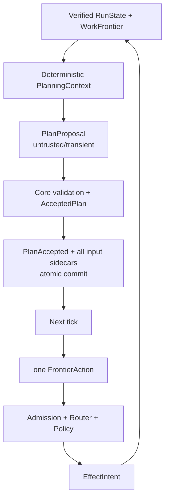

# Durable Planner와 bounded agent loop

- 기준일: 2026-08-30
- 상태: provider-free durable planning 연구 gate 기본형
- 공개 protocol v0.1 schema 변경: 없음
- local store schema: 6

## 현재 가능한 것

한 Run의 model-owned 작업 부분에 host-selected budget을 고정하고, 한 planning decision이 만든 여러 Step과 각 Step의 secret-free reconstructable input reference를 Memory 또는 embedded SQLite에 원자 저장할 수 있다. Embedded SQLite에서는 process 재시작 뒤에도 accepted Capability/input commitment와 dependency DAG를 검증해 같은 frontier를 복원한다.

현재 구현은 injected provider-neutral planner fake/port를 한 tick에 한 번 호출할 수 있지만 실제 model API에는 연결하지 않고 tool을 자동 실행하지 않는다. Runtime coordinator가 제공하는 것은 bounded context/decision과 한 번에 하나의 continuation 경계다. Product model adapter, dispatcher와 사용자 interaction이 붙기 전까지 이것을 완전한 autonomous CLI로 설명하지 않는다.



## 세 계약의 역할

| 단계 | 소유자 | durable 여부 | 포함할 수 있는 값 | 포함하면 안 되는 값 |
|---|---|---:|---|---|
| `PlanProposal` | model/provider | 아니오 | objective, dependency, Capability 후보, transient argument | grant, policy decision, selected Instance, execution 사실 |
| Accepted plan | XGENy Core | 예 | Step ID, normalized objective/dependency, Definition/action/input digest, execution profile | raw argument, raw response, credential |
| `InvocationPlan` 의미 | Admission/Router/Core | effect intent에 commitment 저장 | resolved resource, selected Instance, policy/authorization, verification provenance | 모델이 만든 보안 결정 |

현재 public `InvocationPlanBody`에는 selected Instance, policy decision, candidates, fallback과 verification plan이 필요하다. 따라서 provider output을 이 타입으로 deserialize하지 않는다. 현재 slice는 full `InvocationPlan` document를 저장하지 않으며 `EffectIntent`와 Receipt provenance에 deterministic execution-plan commitment만 둔다.

## Durable event와 projection

Agent loop 관련 durable event는 세 가지다.

```text
AgentLoopConfigured
  └─ non-zero Run budget 고정

PlanAccepted
  ├─ ExpectedPlanningTurn
  └─ AcceptedPlanStep[]
       ├─ objective + dependsOn
       └─ PlannedInvocationBinding

CompletionCandidateRecorded
  └─ Receipt-completed graph에 대한 비종결 완료 후보
```

`RunState.agent_loop`는 configured budget, accepted model decision 수와 optional completion candidate를 보존한다. `StepState.planned_invocation`은 `PlanAccepted`로 만든 Step에만 존재한다. 기존 `StepPlanned`는 legacy/model-free 경로라 이 필드가 `None`이다.

`PlanAccepted` reducer는 Step vector 순서와 무관하게 전체 ID 집합을 먼저 확인하므로 같은 proposal 내부 forward dependency를 표현할 수 있다. Candidate projection에 모든 새 Step을 넣은 뒤 기존 `derive_frontier()`로 union graph를 검증하며, 오류 시 이전 state는 바뀌지 않는다.

현재 hard limit:

| 항목 | 상한 |
|---|---:|
| 한 `PlanAccepted`의 Step | 32 |
| 한 `PlanAccepted`의 dependency edge | 128 |
| accepted objective | 5,000 bytes |

Self/duplicate/unknown dependency, cycle, 기존 terminally blocked dependency와 그 전이적 blocked descendant, 같은 Run/batch의 중복 semantic action, total planned-step budget 초과는 거부한다. Semantic action으로 effect/grant ID를 유도하므로 중복 Step을 수락하면 나중에 실행할 수 없기 때문이다. Dependency release는 계속 `Completed + complete Core Receipt ID/digest`만 인정한다. Loop가 configured된 Run의 legacy `StepPlanned`도 같은 total-step budget과 completion-candidate seal을 지킨다.

Runtime은 이 구조 검사를 recipe materialization 전에 수행하고 reducer는 durable graph 불변식을 append 시 다시 검증한다. 또한 제안 Capability의 exact ID/version은 current `PlanningContext.capabilities()`에, `ExistingStep` dependency ID는 current `PlanningContext.steps()`에 실제 존재해야 한다. Full Registry/RunState에는 있지만 context byte packing에서 생략된 항목을 추측해도 각각 `CapabilityUnavailable`/`UnknownDependency`로 거부한다. 따라서 invalid 또는 hidden-reference graph가 외부 materializer를 호출하지 않는다.

## Planned invocation과 raw input 경계

Transient argument는 plan을 수락하기 전에 exact CapabilityDefinition의 schema와 size limit으로 검증하고 trusted planning normalizer로 canonical resource identity를 만든 뒤 digest를 계산해야 한다. Raw provider envelope/body와 argument는 RunStore에 남기지 않지만, 수락된 bounded objective/dependency는 journal의 graph 사실로 남는다. Raw proposal canonical bytes는 256 KiB size gate에만 쓰고, durable `proposal_digest`는 sorted proposal key/objective/dependency/Capability와 validated Definition/action/material digest의 accepted semantics로 계산한다. Accepted Step에는 argument 원문 대신 다음 binding만 남는다.

```text
capability_id / contract_version
definition_digest
action_digest
plan_input_digest
execution_profile = local_sync_once_v1
target_os = linux | macos | windows
target_arch = x86_64 | aarch64
spec_digest
plan_input_record_digest
```

`PlannedInvocationMaterialRecord`는 local store sidecar다. 여기에도 raw argument는 없고 Run/Step/plan/proposal/spec와 host-selected `ReconstructableMaterialReference`만 있다. Reference component는 bounded identifier이며 path, URL과 token syntax를 허용하지 않는다. `Debug`는 opaque reference ID를 redaction한다. Digest는 commitment이지 암호화가 아니므로 raw credential이나 low-entropy secret을 argument/reference에 직접 넣지 않는다.

Ordinary `InvocationAdmission::prepare`로 planned Step을 준비해도 accepted sidecar의 exact reference가 자동으로 final retention에 고정된다. Pending 값의 reference 교체 시도는 authorization에서 다시 거부하고, Memory/SQLite append는 마지막 방어선으로 accepted plan input과 다른 `InvocationMaterialRecord` retention을 원자 commit하지 않는다.

Production recipe provider/materializer의 계약은 다음 순서다.

```text
1. transient model argument schema/size 검증
2. side-effect-free ResourceResolver로 canonical identity/containment 정규화
3. exact semantic action/planInputDigest 계산
4. host가 immutable recipe를 durable하게 보존
5. reference read-after-write로 재구성해 digest 재검증
6. PlannedInvocationBinding + sidecar 생성
7. PlanAccepted bundle commit
```

4와 7 사이 crash는 외부 provider에 orphan recipe를 남길 수 있지만 Run에는 partial plan을 남기지 않는다. Orphan GC와 external recipe provider transaction은 아직 구현 범위가 아니다. Generic `PlanMaterializer` port는 외부 저장소의 durability나 5번의 read-after-write를 직접 증명하지 않으므로 production implementation과 fault test가 이 계약을 책임진다. Recipe가 durable하지 않은 상태에서 Persistent plan을 commit하면 안 된다.

Planning normalizer의 `ResourceResolver`는 deterministic canonicalization 전용이다. Network 호출, credential dereference, filesystem write, 대상 resource content 읽기·실행과 권한 변경을 금지한다. 따라서 future dependency가 아직 풀리지 않았어도 실행 접근 없이 identity만 고정할 수 있다. Admission은 dependency가 Receipt로 해제된 뒤 recipe를 복원하고 같은 정규화를 다시 수행해 precomputed action/input digest와 비교한다.

Plan acceptance도 preflight identity로 한 번 정규화한 뒤 semantic proposal digest와 final Step ID를 만들고, final ID로 같은 normalized argument를 다시 정규화한다. Normalized argument, Definition/action/material digest가 exact match해야만 materializer로 넘어간다. 공개 `ResourceResolver::resolve` 입력은 scope/resource뿐이고 구현은 deterministic/idempotent해야 한다. 이 계약을 어기는 resolver는 `InvocationInvalid`로 fail-closed한다.

현재 `local_sync_once_v1`은 Sync, once/idempotency-key 지원, 지원되는 effect class, critical action 없음 조건을 만족하는 Capability만 plan acceptance한다. Reducer도 final planned intent에 non-empty idempotency key, Local Receipt placement와 exact target executor platform이 있는지 검사한다. Catalog에 보이는 async/unsupported effect/critical-action Capability는 metadata로 모델이 피할 수 있지만, 제안되면 `CapabilityUnsupported`다. Approval UI가 생기기 전까지 critical action을 자동 계획하지 않는다.

Remote lookup이나 credential이 없으면 identity를 만들 수 없는 Capability는 현재 profile에서 plan acceptance할 수 없다. 이런 Capability는 추후 unresolved proposal commitment와 admission-time resolved commitment를 나누는 2단계 binding 계약이 생기기 전까지 fail-closed한다.

## SQLite schema 6

Schema 6은 다음 table을 추가한다.

```text
planned_invocations
  step_id          PRIMARY KEY
  event_sequence   -> run_events.sequence
  plan_id          UNIQUE
  record_digest    UNIQUE
  record_json
```

`append_with_plan_inputs(expectedHead, PlanAccepted, inputs)`는 다음을 미리 검증한다.

- Step과 sidecar 수가 같다.
- 모든 accepted Step에 정확히 하나의 sidecar가 있다.
- extra/duplicate sidecar가 없다.
- Run, Step, plan, proposal, spec와 record digest가 일치한다.
- 과거에 같은 Step input이 commit되지 않았다.

SQLite transaction은 event, effect/authorization index, planned input rows, invocation material, Receipt와 projection 순서의 공통 append path를 사용한다. 이번 event에 해당하지 않는 index는 no-op이다. Event/PlannedInvocation/Projection 단계 fault에서 transaction rollback 후 기존 head와 projection만 보여야 한다.

Open과 `load()`는 journal replay만 맞는지 검사하고 끝내지 않는다. `PlanAccepted` anchor와 sidecar 전체를 대조하고 missing/orphan/index-column/serialized-record/digest 차이를 corruption으로 닫는다. `load_planned_invocation(step_id)`도 verified current generation과 point record를 다시 결합한다.

Version 5 → 6 migration은 빈 table을 추가하고 전체 기존 data를 감사한 뒤 `user_version`만 변경한다. 기존 event/projection/effect/authorization/material/Receipt row와 blob은 다시 쓰지 않는다. 감사가 실패하면 새 table과 `user_version` 변경을 같은 transaction에서 모두 rollback해 version 5를 보존한다. Version 1/2와 7 이상은 지원하지 않는다.

## Admission 이중 binding

Accepted Step의 `Admit` action은 caller가 임의 `RouteRequest`와 argument를 다시 만드는 경로가 아니다. 다음 검증 순서를 사용한다.

```text
verified current Step + planned binding
  -> planned route + current Definition digest 확인
  -> verified sidecar load
  -> host recipe reconstruction
  -> planInputDigest/Capability/profile/platform 확인
  -> resource normalization
  -> Permission Broker
  -> deterministic Router
  -> EffectIntent + authorization
  -> reducer planned-binding 재검증
  -> intent + invocation material atomic commit
```

Admission은 dependency, planned route와 current Definition digest를 recipe provider와 resolver 전에 확인하고, current head와 Definition을 policy/routing 뒤 다시 확인한다. Reducer는 intent commit 직전에 Capability ID/version, Definition digest, semantic action, material digest, Receipt provenance plan ID, local placement, exact executor platform과 idempotency key를 Step의 planned binding/profile과 비교한다. Mismatch는 authorization consumption 이전에 실패해야 한다.

이중 gate 때문에 runtime API의 빠른 검증이 빠지더라도 저수준 append가 durable 불변식을 우회할 수 없고, reducer gate만 믿느라 불필요한 resolver나 policy 호출이 발생하는 것도 막는다.

## Deterministic context assembly

Runtime의 `PlanningContext` assembly 경계는 store와 planner 사이의 read-only pager다. 입력은 verified current state, derived frontier와 Capability Registry이며 출력은 byte-bounded provider-neutral context다. 현재 public `ContextAssembler` 타입이 따로 있는 것은 아니다.

현재 기본형 context는 다음 값을 구성한다.

1. exact Run ID, authority/epoch, journal sequence/head와 goal
2. total Step 수와 Receipt-bound completed Step 수
3. stable Step ID 순서로 선택한 기존 Step의 full objective/dependency/status/attempt 수, optional accepted Capability와 Receipt dependency-release 여부
4. 전체 semantic Capability catalog digest
5. stable Capability ID/version 순서로 선택한 Definition digest, bounded summary, input/output JSON Schema, effect class/resource selector/critical action, execution style/idempotency/timeout
6. omitted Step/Capability 수와 final context digest

Step과 Capability item은 각각 stable key로 정렬하고 round-robin으로 하나씩 넣는다. 각 schema와 Step summary는 whole item이며, 추가했을 때 budget을 넘는 item은 일부만 자르지 않고 생략한 뒤 다음 stable item을 시도한다. Capability summary 문자열만 512-byte 상한으로 정리한다. 고정 header만으로 budget을 넘으면 planner를 호출하지 않고 `ContextBudgetExceeded`로 pause한다. Provider-specific tokenizer 결과로 Core context 순서를 바꾸지 않으며 adapter는 Core byte budget보다 작은 token limit을 추가할 수 있다.

### Context visibility gate

Bounded context는 planner가 이번 turn에 주소화할 수 있는 범위이기도 하다.

```text
ProposedPlanStep.capability
  -> exact (capability_id, contract_version)가 context.capabilities에 있어야 함

PlanDependency::ExistingStep
  -> exact step_id가 context.steps에 있어야 함

PlanDependency::ProposedStep
  -> 같은 Proposal의 key 집합과 전체 DAG 검증으로만 해석
```

`omittedCapabilities`와 `omittedSteps`는 count만 제공하며 hidden identifier lookup 권한을 주지 않는다. 모델이 외부 지식, 과거 turn 또는 추측으로 Registry의 omitted Capability나 RunState의 omitted Step ID를 맞혀도 current context membership이 없으면 거부한다. 이 검사는 accepted semantics 계산과 `PlanMaterializer` 호출보다 앞서며 rejection은 Run journal/projection을 바꾸지 않는다. Hidden item을 사용하려면 향후 명시적 deterministic paging 계약으로 새 context에 실제 공개해야 한다.

Context membership 목록 자체는 durable event에 저장하지 않으므로 reducer가 이 visibility gate를 replay하지는 않는다. Provider의 `PlanProposal`은 반드시 `AgentLoop::tick`을 통해 수락하고, public 저수준 `PlanAccepted` append는 trusted Core/test 경계로만 취급한다. Reducer는 graph, turn/digest, planned binding과 budget처럼 journal만으로 검증 가능한 불변식을 별도로 유지한다.

`context_digest`는 profile, Run/head binding, 선택된 item과 omission 결과를 domain-separated RFC 8785/SHA-256로 commit한다. SHA-256은 기밀화가 아니다. `PlanningContext` serialization은 digest input payload를 내보내고 digest 자신을 self-include하지 않으므로 adapter는 `context_digest()` companion 값을 사용해야 한다. Credential, raw argument/tool output, presigned URL, hidden reasoning과 전체 transcript는 구조적 context allowlist에 포함하지 않는다.

이 allowlist는 content DLP가 아니다. 허용 필드인 goal, 기존 Step objective, Capability summary/schema 안에 secret이 있으면 Core가 자동 탐지·삭제하지 않는다. 실제 외부 provider adapter를 붙이는 composition root가 secret-free 입력과 sensitivity/egress policy를 보장해야 한다.

`max_context_bytes`는 최종 serialized payload만 제한한다. 전체 catalog/schema와 Step 후보를 모으는 CPU·peak memory·scan 시간은 아직 별도 상한이 없고, `Debug` redaction도 `PlanningContext`의 명시적 serialization이나 adapter logging을 차단하지 않는다. Production adapter 전에 catalog input bound/streaming packer와 raw proposal/request/response log 금지 검증이 필요하다.

Artifact/Memory reference, raw Receipt evidence/tool output와 사용자 conversation excerpt는 아직 context에 넣지 않는다. 이를 추가할 때는 provenance/sensitivity, stable priority와 section별 budget을 먼저 정의해야 한다.

## One-frontier-action tick

`AgentLoop::new(AgentLoopBudget)`로 coordinator를 만들고 `tick(store, events, lease, registry, resolver, planner, materializer)`를 호출한다. 한 tick은 다음 순서로만 판단한다.

```text
load_current()
  -> derive_frontier()
  -> next_action()이 있으면 정확히 하나 반환
  -> completion candidate가 있으면 pause
  -> waiting/blocked가 있으면 pause
  -> empty 또는 모든 Step Receipt-complete면 planning turn 필요
  -> 그 밖의 non-progress terminal 상태는 pause
```

기존 frontier의 action priority는 다음과 같다.

```text
Executing recovery
> EffectUnknown reconciliation
> Reconciling continuation
> Validating verification
> IntentCommitted execution
> Planned admission
```

Model planning은 위 action을 추월하지 않는다. 특히 unknown effect나 검증 대기 상태에서 새 Step을 만들지 않는다. Caller는 한 action이 durable commit 또는 명시적 pause로 끝난 뒤 새 head에서 다시 tick한다.

Tick 결과는 실행 command가 아니라 coordination decision이다. 현재 slice에는 tool dispatcher, async task runner, timeout/backoff, approval UI와 provider network 호출이 없다.

현재 outcome은 다음을 구분한다.

| outcome | 의미 |
|---|---|
| `Configured` | budget 설정 event 하나를 commit했으므로 새 head에서 다시 tick |
| `ActionRequired` | 기존 frontier의 첫 action 하나를 caller가 수행해야 함 |
| `PlanAccepted` | Proposal 하나와 모든 input sidecar가 commit됨 |
| `CompletionCandidate` | 새 candidate를 commit했거나 기존 candidate가 있어 pause |
| `Quiescent` | waiting/blocked/non-progress 상태로 model 호출 없이 pause |
| `PlannerUnavailable` | planner가 고정 failure를 반환해 mutation 없이 pause |
| `ProposalRejected` | proposal validation/normalization 실패, plan mutation 없음 |
| `MaterializerUnavailable` | durable recipe를 만들 수 없어 plan mutation 없음 |

## Budget과 현재 한계

```rust
AgentLoopBudget {
    max_model_turns,
    max_planned_steps,
    max_tool_calls,
    max_context_bytes,
}
```

모든 값은 0보다 커야 하고 `AgentLoopConfigured`로 한 번만 저장한다.

- `max_model_turns`는 **수락돼 commit된** Plan/Completion decision을 센다.
- `max_planned_steps`는 기존 Step을 포함한 Run 전체 상한이다.
- `max_context_bytes`는 context assembly가 planner 호출 전에 canonical bytes로 검사한다.
- `max_tool_calls`는 durable `StepState.attempts` 합계로 `IntentCommitted`에서 새 effect를 시작하는 `DriveEffect`와 새 Plan acceptance를 차단한다. Admission, 이미 시작된 recovery/reconciliation과 Core verification은 막지 않는다.

중요한 현재 한계는 provider-call reservation이 없다는 점이다. 요청 전에 model-turn slot을 durable하게 소비하지 않으므로 timeout, invalid JSON, stale response, process crash 또는 lost response 뒤 재호출은 `accepted_model_turns`에 잡히지 않는다. 실제 provider를 붙이기 전에 아래 계약이 필요하다.

```text
ModelTurnReserved(request_id, expected_head, context_digest)
  -> provider call
  -> accepted | rejected | expired settlement
  -> restart 시 unresolved reservation 조회/정리
```

이 계약 전에는 `max_model_turns`를 provider quota, 비용 또는 호출 횟수 제한이라고 부르면 안 된다. Token, 비용, wall-clock deadline과 rate-limit budget도 아직 없다. Tool budget이 소진돼도 Receipt-complete graph에 completion candidate를 제안할 model turn은 허용하므로 `max_tool_calls` 역시 model-call quota가 아니다. Tick의 durable-attempt gate는 구현 범위지만 실제 dispatcher가 effect start마다 attempt를 정확히 기록한다는 end-to-end 보장은 dispatcher slice의 failure test가 완료돼야 한다.

## Strict completion candidate

Graph가 모두 끝났다는 것과 사용자 goal이 충족됐다는 것은 다르다. Model은 다음 Step을 더 제안하거나 completion candidate를 제안할 수 있지만 Core가 바로 Run completed로 바꾸지 않는다.

`CompletionCandidateRecorded`는 다음 조건에서만 가능하다.

- current graph가 비어 있지 않다.
- 모든 Step이 Receipt-bound `Completed`다.
- exact next accepted turn이고 budget 안이다.
- candidate/context/proposal/summary digest가 유효하다.
- 이전 candidate가 없다.

Candidate가 생기면 현재 기본형은 추가 plan을 받지 않고 pause한다. 별도 goal verifier나 사용자 확인이 candidate의 evidence를 검증한 뒤 terminal lifecycle을 결정해야 하지만, 그 event와 state machine은 아직 없다.

## XGEN과 외부 harness

Core planning 타입과 store에는 XGEN, Connector, PostgreSQL, MinIO identifier나 client가 없다. 향후 XGEN Model Gateway adapter는 같은 provider-neutral planning request를 XGEN dialect로 보내고 Proposal을 Core 계약으로 변환한다. 조직 DB/RAG/workflow는 XGEN Capability로 호출되며 local Parent WorkGraph와 별도 bounded child Run을 가진다.

Claude Code, Codex, OpenClaw가 Parent orchestrator인 observer mode에서는 이 agent loop를 호출하지 않는다.

```text
external harness owns planning/local tools
  -> XGENy observer: observed telemetry only
  -> optional XGEN capability: separate child Run
```

Observer는 context assembly, model provider, admission, dispatcher 또는 Parent WorkGraph mutation을 수행하지 않고 외부 실행 주장을 Core Receipt로 승격하지 않는다. 현재 repository에는 이 observer adapter/mode dispatcher가 없으므로 아직 runtime으로 검증된 기능은 아니다. 첫 external-harness adapter가 들어올 때 planner/provider 호출 0회와 Parent store mutation 0회를 공통 contract test로 고정해야 한다.

## 검증

핵심 failure-first suite는 다음 영역을 포함해야 한다.

```text
xgeny-workgraph
  accepted multi-step DAG / forward reference / cycle atomic rejection
  turn, plan, input, capability와 completion invariant
  planned binding과 EffectIntent mismatch before authorization consumption

xgeny-local-store
  Memory/SQLite plan bundle parity and reopen
  missing/extra/orphan/tampered sidecar audit
  Event/PlannedInvocation/Projection fault rollback
  schema 5 -> 6 preservation and failed migration rollback

xgeny-runtime
  deterministic context/order/round-robin whole-item packing/byte budget/redaction
  omitted Capability/Step guess rejection before materialization
  one-tick/one-action and recovery-first ordering
  normalized semantic proposal digest and preflight/final normalization exact match
  stale planning response mutation zero
  planned-input reconstruction and admission double binding
  observer-mode provider/store mutation zero
```

현재 저장소에서 merge 전에 실행할 전체 gate:

```bash
cargo fmt --all -- --check
cargo clippy --workspace --all-targets -- -D warnings
cargo test --workspace --locked
cargo run --locked --quiet -p xgeny-cli -- protocol check
cargo build --locked --release -p xgeny-cli
```

Public protocol schema를 바꾸지 않았으므로 기존 protocol fixture count가 유지돼야 한다. Internal event/store 의미가 바뀌었으므로 WorkGraph/store/restart regression이 이번 slice의 핵심 release gate다.

## 아직 할 수 없는 것

- 실제 모델 provider를 호출해 Proposal을 받기
- provider 요청을 durable하게 예약하고 token/비용을 정산하기
- provider별 tokenizer와 prompt/structured-output adapter
- context assembly CPU/peak-memory/catalog-scan 상한과 streaming packer
- tick 결과를 자동 실행하는 dispatcher와 취소/timeout/backoff
- 사용자 승인, 질문, 인증과 critical-action UI
- 제품 filesystem/process/network/MCP/Connector/XGEN adapter
- raw/secret argument sealed storage와 external recipe garbage collection
- Artifact output을 downstream argument에 동적으로 binding하기
- failed/manual branch의 자동 replan과 graph rewiring
- completion candidate를 검증해 Run을 terminal completed로 전이하기
- public `PlanProposal`, WorkGraph delta와 full `InvocationPlan` document 조회

설계 근거와 비보장은 [ADR-0015](../adr/0015-durable-planner-contract-and-bounded-agent-loop.md)를 따른다.
