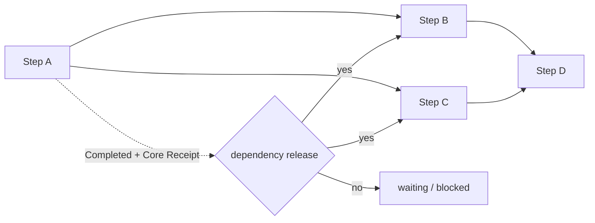

# Persistent WorkGraph와 재개 frontier

- 기준일: 2026-08-30
- 상태: model-free Tracked/Persistent 연구 gate용 내부 구현
- 공개 protocol v0.1 schema 변경: 없음
- local store schema: 6 (dependency fence는 schema 5에서 도입)

## 현재 가능한 것

한 Run 안에 immutable dependency DAG를 계획하고 Memory 또는 embedded SQLite에 저장한 뒤, process 재시작 후에도 같은 실행 가능·대기·차단 frontier를 계산할 수 있다. Downstream Step은 선행 Step이 `Completed`인 것만으로 열리지 않고 Core가 원자 저장한 Execution Receipt ID와 digest까지 있어야 열린다.



Durable state와 파생 state의 경계는 다음과 같다.

| 종류 | 값 | 저장 여부 |
|---|---|---|
| 정본 | `StepPlanned.depends_on`, lifecycle event, Receipt sidecar | 저장 |
| projection | `RunState.steps[*].depends_on`과 current status | journal에서 재구성해 저장 |
| coordination view | actionable, waiting, blocked, terminal 분류 | 저장하지 않고 매번 파생 |

## 계획 불변식

Internal event stream에서는 dependency가 이미 계획된 Step만 가리켜야 한다. Self edge, duplicate edge와 unknown edge는 `StepPlanned` 적용 전에 거부된다. Dependency는 Step 생성 뒤 바뀌지 않는다.

```rust
RunEventBody::StepPlanned {
    step_id: "test".to_owned(),
    objective: "run tests".to_owned(),
    depends_on: vec!["build".to_owned()],
}
```

저수준 reducer도 같은 규칙을 검사한다. Public `WorkGraph` document는 배열 순서와 무관한 static DAG로 검증하며 unknown/self/duplicate/cycle과 dependency가 끝나기 전의 `Ready`·`Running`·`WaitingInput`·`Validating`·성공 `Completed` 상태를 거부한다. Failed/Blocked/Cancelled는 dependency가 풀리지 않은 가지를 표현할 수 있다.

## Dependency release

해제 조건은 아래 함수 하나의 의미로 고정한다.

```text
status == Completed
AND execution_receipt_id is non-empty
AND execution_receipt_digest is lowercase sha256:<64 hex>
```

| 선행 Step | downstream 결과 |
|---|---|
| 진행 중 | `waiting` |
| `Completed` + Core Receipt | dependency 해제 |
| legacy `Completed` + Receipt 없음 | `blocked(ReceiptMissing)` |
| `Failed` | `blocked(Failed)` |
| `ManualRequired` | `blocked(ManualRequired)` |
| 이미 막힌 Step | `blocked(DependencyBlocked)` |

Admission은 resolver를 호출하기 전에 이 조건을 확인하고, reducer는 intent commit 때 다시 확인한다. 빠른 사전 검사는 불필요한 resource 접근을 막고 reducer 검사는 모든 caller에 대한 최종 상태 불변식을 지킨다.

이 함수 자체는 projection shape만 확인한다. 실제 실행 권위로 사용할 때는 built-in Memory/SQLite store가 journal replay와 complete Receipt sidecar/chain까지 검증해 반환한 current state여야 한다. Public WorkGraph v0.1은 Receipt binding을 표현하지 못하므로 현재 observation/호환 surface이고, 그것만 받아 local effect를 해제하지 않는다. Third-party `RunStore`도 같은 verified-current 계약을 구현해야 한다.

## 재개 순서

`WorkGraphCoordinator::inspect(store)`는 `load_current()`만 요청해 `WorkFrontier`를 반환하며 도구를 실행하지 않는다. Built-in store의 warm verified generation에서는 history를 재물질화하지 않는다. Cold open, 외부 generation 변경 또는 third-party default 구현은 full audit을 수행할 수 있다.

```text
load_current()
    -> validate DAG
    -> classify dependency outcomes
    -> stable actionable/waiting/blocked view
    -> choose next_action()
    -> existing Core operation commits one transition
    -> inspect again
```

Action 순서는 `Executing recovery → EffectUnknown → Reconciling → Validating → IntentCommitted → Planned admission`이다. 동일 lifecycle에서는 Step ID로 정렬한다. 한 번에 하나를 commit하고 다시 계산하는 것이 현재 single-orchestrator 계약이다.

`all_steps_receipt_completed()`는 현재 graph의 모든 Step이 Receipt-bound completion인지 확인할 뿐 사용자 goal이나 Run의 완료를 선언하지 않는다.

## SQLite schema 5 dependency fence와 current schema 8

새 table이나 column은 없다. Dependency는 event와 projection JSON에 이미 포함된다. Schema bump는 schema 4 binary가 새 dependency를 모른 채 child를 독립 실행하는 downgrade를 막기 위한 의미 fence다.

Schema 5는 이 dependency 의미를 도입한 역사적 fence다. ADR-0015의 schema 6은 `planned_invocations` table을, ADR-0019의 schema 7은 event-anchored `tool_outputs` table을, ADR-0021의 current schema 8은 `completion_outputs` table을 추가한다. Schema 3/4/5/6/7은 같은 `BEGIN IMMEDIATE` 안에서 해당 legacy topology를 전부 감사하고 기존 durable blob을 다시 쓰지 않은 채 8로 수렴한다. 감사나 commit이 실패하면 원래 version과 모든 row가 그대로 남는다.

## 검증 명령

핵심 failure-first suite는 다음과 같다.

```bash
cargo test -p xgeny-workgraph --test persistent_frontier --locked
cargo test -p xgeny-runtime --test persistent_workgraph --locked
cargo test -p xgeny-runtime --test invocation_admission --locked
cargo test -p xgeny-local-store --locked
```

Merge 전에는 전체 gate를 실행한다.

```bash
cargo fmt --all -- --check
cargo clippy --workspace --all-targets -- -D warnings
cargo test --workspace --locked
cargo run --locked --quiet -p xgeny-cli -- protocol check
cargo build --locked --release -p xgeny-cli
```

테스트는 diamond release, 독립 branch, transitive failure/manual, partial·malformed legacy Receipt identity, reducer/admission 우회와 unknown dependency의 panic-free rejection, 10,000-Step non-recursive traversal, Memory/SQLite parity, reopen continuity, Receipt transaction fault/process-exit rollback, schema 3/4/5 → 6 성공·실패 원자성과 mixed-version 수렴을 포함한다.

## 아직 할 수 없는 것

- `Planned` Step의 objective만 보고 Capability/arguments를 자동 생성하거나 복원
- 모델을 호출해 graph를 확장하고 context를 압축하는 autonomous loop
- 병렬 worker scheduling, waiting-input, retry timer와 approval UX
- public WorkGraph delta, XGEN/Connector/MCP adapter 또는 authority handoff
- graph 전체 Receipt completion을 사용자 목표 완료로 승격

설계 근거와 비보장은 [ADR-0014](../adr/0014-persistent-workgraph-frontier-and-resume.md)를 따른다.
