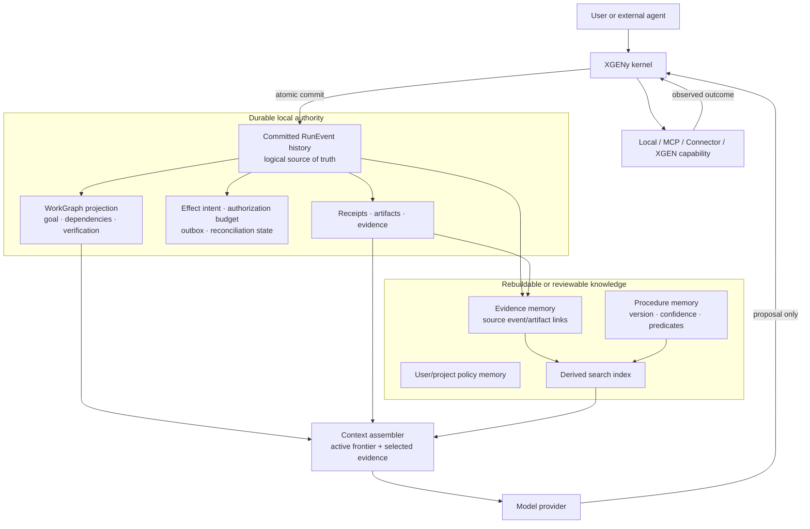
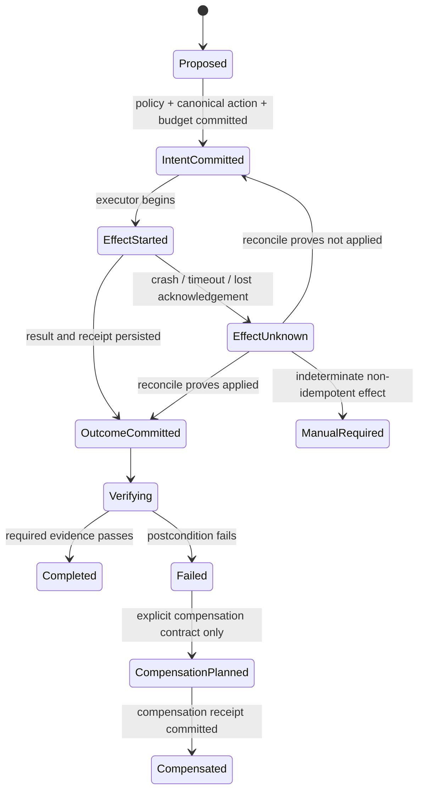
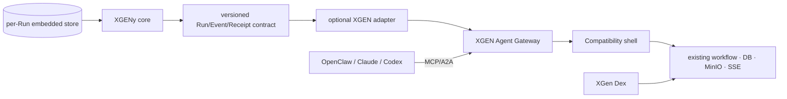

# XGENy 장기 실행 런타임 근거 조사

- 기준일: 2026-08-28 (Asia/Seoul)
- 조사 기준 XGENy: `7b8ce472412c8ea1ff6817ae6d7baecf3282c0dc`
- 상태: 구현 전 연구 메모
- 범위: 장기 작업 연속성, WorkGraph, RunJournal, 외부 효과 복구, 메모리, 하네스 효과, XGEN 호환
- 비범위: 이 문서는 구현 승인이 아니며 제품 성능을 보장하지 않는다.

## 1. 요약 결론

XGENy는 단순한 대화 저장 CLI가 아니라 **증거로 통제되는 로컬 Capability 런타임**으로 설계해야 한다. 모델이 계획과 도구 호출을 제안하되, 장기 상태·권한·실행 사실·완료 판정은 모델 밖의 런타임이 소유한다.

이번 조사에서 기존 설계의 큰 방향은 유지됐지만, 다음 한 가지는 구현 전에 수정해야 한다.

> `RunJournal`의 논리적 정본은 커밋된 `RunEvent` 이력이다. 그 정본을 반드시 `journal.jsonl` 파일로 구현해야 하는 것은 아니다.

원시 JSONL을 물리 정본으로 사용하면 event, WorkGraph projection, effect intent, receipt index를 하나의 원자적 변경으로 묶기 어렵고 Linux·macOS·Windows 파일시스템의 rename/fsync/directory-sync 차이를 직접 처리해야 한다. MVP 후보는 사용자에게 별도 DB 설치를 요구하지 않는 **프로세스 내장 SQLite 트랜잭션 저장소**다. JSONL은 결정론적 export, 디버깅, 호환 fixture로 유지한다. 이 선택은 3개 OS 장애 주입 spike를 통과한 뒤 확정한다.

또한 `idempotencyKey` 하나만으로 중복 외부 효과를 막을 수 없다. 런타임은 다음을 구분해야 한다.

1. 실행 전에 durable intent와 authorization-consumption 상태를 커밋한다.
2. 외부 효과를 수행한다.
3. 결과와 검증 receipt를 커밋한다.
4. 2와 3 사이에서 죽으면 `effect_unknown`으로 복구한다.
5. 대상 시스템 조회, 동일 key 재호출, postcondition 검사 중 계약이 보장하는 방법으로만 reconcile한다.
6. 결과를 알 수 없는 non-idempotent 효과는 자동 재시도하지 않는다.

메모리도 RunJournal과 같은 사실 원장이 아니다. 추출·요약·workflow memory는 잘못되거나 낡을 수 있는 **근거 연결형 advisory projection**이어야 한다. 모델 context는 WorkGraph, 최근 event, 선택된 evidence, 승인된 memory로 매 턴 생성하는 view다.

## 2. 질문과 판정 기준

### RQ1. 모델 길이를 넘는 작업의 연속성을 무엇이 보장하는가?

- 성공 기준: 프로세스와 모델 context를 비운 뒤에도 현재 목표, 완료된 일, 미해결 의존성, 검증 근거, 불확실한 외부 효과를 재구성한다.
- 실패 기준: 대화 요약이나 모델의 자기 보고가 없으면 작업을 이어갈 수 없다.

### RQ2. crash 뒤 외부 효과를 안전하게 복구할 수 있는가?

- 성공 기준: 각 장애 지점에서 committed/not-committed/unknown을 구분하고, 동일 사용자의 승인과 동일 효과가 허용 budget을 넘지 않는다.
- 실패 기준: timeout, acknowledgement loss, process kill 뒤 다른 placement 또는 새 invocation ID로 자동 재실행한다.

### RQ3. 메모리가 실제 작업 성능을 높이는가?

- 성공 기준: 동일 모델·도구·예산에서 task success, verified completion, token/cost Pareto가 개선되고 staleness와 negative transfer가 통제된다.
- 실패 기준: LoCoMo류 factual recall 상승만으로 코딩·파일·도구 실행의 연속성을 주장한다.

### RQ4. Qwen3.6-27B 같은 로컬 모델에 하네스가 유효한가?

- 성공 기준: Qwen3.6-27B를 policy model로 고정한 holdout에서 XGENy 구성요소의 ablation이 반복 가능한 상승을 만든다.
- 현재 상태: **UNKNOWN**. 직접적인 policy-model 실험은 아직 없다.

### RQ5. XGEN 비의존성과 XGEN 호환을 동시에 보장할 수 있는가?

- 성공 기준: standalone core는 XGEN 패키지·외부 DB service·MinIO 없이 통과하고, 같은 wire fixture와 receipt 의미가 XGEN compatibility shell에서도 통과한다.
- 실패 기준: 로컬 SQLite schema 또는 XGEN 내부 ID가 공개 프로토콜 계약이 된다.

## 3. 근거 표기

- `VERIFIED`: 논문 본문, 공식 문서 또는 고정 commit 코드에서 직접 확인
- `RECALCULATED`: 공개 artifact 또는 로컬 실험으로 다시 계산
- `AUTHOR_CLAIM`: 저자 결과를 확인했으나 독립 재현하지 않음
- `INFERENCE`: 여러 근거를 XGENy에 적용한 설계 추론
- `UNKNOWN`: 현재 근거로 결론을 낼 수 없음

논문 주장, 공개 코드의 실제 구현, XGENy에 대한 채택 판단은 서로 같은 근거로 취급하지 않는다.

## 4. 핵심 근거 매트릭스

| 근거 | 확인 내용 | 한계 | XGENy 판단 |
|---|---|---|---|
| Durable Functions semantics, OOPSLA 2021 | 약한 환경의 at-least-once trigger 위에서 state와 outgoing message를 atomic commit하고, deterministic history replay 동안 effect를 억제한다. | 논문도 orchestration 밖의 external call duplication을 완전히 해결하지 않는다. | `ADOPT_WITH_GATES`: pure projection replay와 effect 실행을 분리한다. |
| Netherite, PVLDB 2022 + 공개 코드 | persisted outbox, durability 이후 send, recovery resend, receiver dedup cursor, replay effect suppression을 실제 구현한다. | 분산 서버 워크플로 런타임이며 로컬 CLI와 비용 구조가 다르다. | `ADOPT`: intent/outbox/dedup/replay-suppression 의미를 축소 이식한다. |
| Sagas, SIGMOD 1987 | long-lived transaction을 작은 transaction과 semantic compensation으로 구성한다. | compensation은 물리 rollback이나 exactly-once가 아니다. | `ADOPT`: `compensatable`에는 명시적 보상 계약·권한·receipt가 필요하다. |
| Boki, SOSP 2021 / Beldi | serverless workflow가 log와 idempotence/transaction protocol로 fault tolerance를 구성한다. | XGENy의 로컬 UX와 다른 배포 모델이다. | `ADOPT_WITH_GATES`: protocol 원칙만 사용한다. |
| CapLease preprint, 2026 | 동일 승인으로 fresh token을 다시 발급하는 semantic replay를 정의하고 durable `(canonical action, confirmation, budget)` ledger와 Issue→Prepare→Commit을 제안한다. | v1 preprint이며 trusted canonicalization, non-rollback ledger, idempotent sink를 가정한다. | `ADOPT_WITH_GATES`: critical action 승인도 durable consumption budget을 가져야 한다. |
| All File Systems Are Not Created Equal, OSDI 2014 | application update protocol의 atomicity·ordering·durability 가정이 파일시스템별로 다르고 recovery code가 취약하다는 것을 보인다. | 2014년 파일시스템 대상이며 최신 OS 전부를 직접 측정하지 않는다. | `ADOPT`: custom multi-file crash protocol을 최소화하고 OS별 fault test를 둔다. |
| SQLite 공식 WAL/transaction 문서 | embedded WAL transaction을 제공한다. WAL `NORMAL`은 일관성은 유지해도 전원 장애에서 최근 commit durability를 잃을 수 있고 `FULL`이 더 강하다. | 설정, filesystem, hardware에 따라 성능과 durability가 달라진다. | `ADOPT_WITH_GATES`: critical state는 `FULL` 후보, 3개 OS 실험 후 확정한다. |
| Codex `6be2a6c` | embedded SQLite WAL/NORMAL을 여러 state DB에 사용하고 DB별 corruption backup을 둔다. conversation rollout은 별도 JSONL이며 torn tail 복구가 있다. | Codex JSONL은 transactional external-effect journal이라는 근거가 아니다. `NORMAL` 선택도 XGENy critical-effect durability에 그대로 적용할 수 없다. | `ADOPT_WITH_GATES`: embedded DB, corruption blast-radius와 backup 방식을 참고한다. |
| Qwen Code `1482739` | JSONL session에 writer lease, file/directory sync, identity check, bounded recovery, degraded-history 분류, dangling tool result 합성, 대규모 compaction/recovery test가 있다. | 견고한 JSONL도 상당한 복잡성을 요구하며 transcript recovery와 external effect recovery는 다르다. | `ADOPT`: recovery 분류·bounded context·untrusted persisted input 원칙. `DO_NOT_ADOPT`: transcript를 effect 원장으로 간주. |
| Goose `caf5951` | persisted conversation state를 매 loop 다시 읽는 ordered re-entrant pipeline과 effect handler 분리가 있다. | transactional exactly-once external effect 근거는 없다. | `ADOPT_WITH_GATES`: re-entrant step/effect 구조만 참고한다. |
| AgentRewind preprint, 2026 | context와 workspace 상태의 aligned checkpoint를 복원하고 실패 경험을 유지해 장기 engineering task 성능을 높인다. prefix tool 결과는 replay하되 실행하지 않는다. | workspace 밖 network/service effect는 되돌리지 못한다고 명시한다. 검증 실패가 rewind trigger다. | `ADOPT_LATER`: MVP 복구와 분리한 semantic rewind 기능으로 둔다. |
| MemGPT, 2023 | working context와 recall/archival memory를 분리하고 paging과 recursive summarization을 사용한다. | 대화·문서 평가이며 durable effects나 장기 코딩 성공을 증명하지 않는다. | `ADOPT_WITH_GATES`: context pager와 memory tier 개념만 사용한다. |
| Agent Workflow Memory, 2024 | 성공 trajectory에서 재사용 가능한 workflow를 추출해 WebArena/Mind2Web 일부 성능을 높인다. | 잘못된 online workflow, stale guidance, 동적 상태 부적합, 낮은 호출률을 저자가 보고한다. | `ADOPT_WITH_GATES`: procedure memory는 versioned advisory이며 자동 권위가 아니다. |
| LoCoMo, ACL 2024 | 매우 긴 대화에서 long context와 RAG 모두 인간 대비 큰 격차를 보이고, 너무 많은 retrieval이 성능을 낮춘다. | 합성 대화 10개 중심이며 action/effect benchmark가 아니다. | `ADOPT`: retrieval precision과 temporal/adversarial test 참고. |
| LoCoMo-Plus, ACL 2026 | 표면 factual recall과 latent constraint/cognitive memory 성능이 크게 분리된다. | 합성·진단형 benchmark이며 실제 작업 실행을 직접 측정하지 않는다. | `ADOPT`: conflict, stale belief, implicit constraint test를 추가한다. |
| HiGMem, ACL Findings 2026 + `f275072` | event summary를 semantic anchor로 쓰고 관련 raw turn을 좁혀 A-Mem보다 훨씬 적은 evidence를 전달한다. | memory construction·filter에 추가 LLM 비용이 들고 multi-party DialSim에서는 A-Mem보다 F1이 낮다. 공개 repo의 전용 unit test도 제한적이다. | `ADOPT_WITH_GATES`: event→evidence 2단 retrieval, evidence link 보존. |
| APEX-MEM, ACL 2026 | append-only event와 retrieval-time temporal resolution, evidence-linked fact, graph/SQL/search 도구 조합을 평가한다. | graph construction 비용, ontology/error propagation, base model의 SQL/tool 능력 의존이 크다. | `ADOPT_WITH_GATES`: fact를 overwrite하지 않고 supersession과 evidence를 보존한다. Graph 전체는 MVP 제외. |
| EvoMemBench preprint, 2026 + `aa4cea8` | memory를 in/cross-episode × knowledge/execution으로 나눠 15개 방식을 비교한다. long context가 강하고, memory는 constrained context·어려운 task·맞는 procedure에서 유리하며 mismatch면 해친다. | 단일 통합 backbone 중심이고 반복/분산 보고가 명확하지 않다. | `ADOPT`: memory를 하나의 backend 점수로 평가하지 않고 4분면과 negative transfer를 측정한다. |
| SWE-agent, 2024 | agent-computer interface가 같은 모델의 repository task 성능을 크게 바꾸며, 전체 history보다 제한된 최근 observation이 나은 ablation도 있다. | SWE-bench 코딩 작업에 한정된다. | `ADOPT`: typed interface, feedback, compact context가 모델 크기만큼 중요하다. |
| Evo-Bench preprint, 2026 + `e1dc938` | executable harness 개선을 validation/holdout과 고정 policy로 분리한다. Qwen3.6-27B가 evolver일 때 고정 policy의 overall을 29.7→39.4로 개선했다. | harness-sensitive task를 선택했고 main run은 모델당 1회다. 27B가 policy일 때의 직접 결과가 아니다. | `ADOPT`: harness A/B 방법론. `UNKNOWN`: XGENy가 Qwen3.6-27B policy를 얼마나 높이는지. |
| AI Agents That Matter, 2024 | accuracy와 cost를 같이 보고 Pareto와 holdout/reproducibility를 강조한다. | 특정 runtime 설계를 제공하지 않는다. | `ADOPT`: quality/cost/latency/tool count를 함께 보고한다. |
| AgentS4D preprint, 2026 | 20 harness-model 조합 6,560 run에서 unsafe signal과 task completion이 함께 발생할 수 있음을 보여준다. | 각 case를 한 번 실행했고 현재 arXiv판에는 code/data가 없다. | `ADOPT_WITH_GATES`: 완료와 안전을 별도 verdict로 평가하고 lifecycle evidence를 남긴다. |
| Failing Tools, 2026 | stale, silent no-op, corrupt output, schema mismatch 상황에서 최종 답이 아니라 postcondition 추적과 recovery trajectory를 평가한다. | 공개된 결과는 저자 benchmark 주장이고 XGENy에서 재현하지 않았다. | `ADOPT`: tool failure injection과 required/forbidden recovery action을 test에 추가한다. |
| CRDTs, SSS 2011 | strong eventual consistency 조건과 concurrent graph update의 application-specific semantics를 정리한다. | 협업 data type 이론이며 effect orchestration 해법이 아니다. | `DO_NOT_ADOPT`: effectful WorkGraph를 multi-master CRDT로 만들지 않는다. |

## 5. Qwen3.6-27B에 대한 정확한 답

`AUTHOR_CLAIM`: Evo-Bench에서 Qwen3.6-27B는 **하네스를 개선하는 evolver**로 사용됐고, 고정 DeepSeek-V4-Flash policy의 overall score를 29.7에서 39.4로 높였다. 이는 중형 open-weight 모델도 failure log를 분석하고 도구·router·verification 구조를 개선할 수 있다는 근거다.

`VERIFIED`: 같은 논문의 Qwen3.6 계열 policy transfer는 **Qwen3.6-35B-A3B**를 대상으로 했으며 baseline 13.9가 두 evolved harness에서 27.9와 29.2가 됐다.

`UNKNOWN`: Qwen3.6-27B를 실제 XGENy policy model로 고정했을 때의 상승 폭은 측정되지 않았다. 그러므로 다음 주장은 아직 하면 안 된다.

- “XGENy를 붙이면 Qwen3.6-27B가 Claude/Codex와 동급이다.”
- “WorkGraph와 memory가 있으면 어떤 장기 작업도 성공한다.”
- “큰 context가 없어도 품질 손실이 없다.”

논문 근거가 지지하는 더 정확한 가설은 다음과 같다.

> typed capability, progressive disclosure, compact evidence, feedback, deterministic verification, recovery를 갖춘 하네스는 같은 모델의 성공률과 비용 효율을 유의미하게 개선할 수 있다. 효과 크기와 작업별 편차는 XGENy holdout에서 측정해야 한다.

## 6. 연속성을 구성하는 네 상태면



### 6.1 사실면

- committed event, effect intent, outcome, policy consumption, receipt, artifact digest
- 모델 summary가 수정하거나 삭제할 수 없음
- replay는 저장된 model/tool output을 재실행하지 않고 projection만 다시 계산

### 6.2 제어면

- WorkGraph는 현재 목표와 실행 가능한 frontier를 보여 주는 deterministic projection
- 모델의 계획은 제안이며 event로 채택된 뒤에만 상태가 됨
- plan은 환경 feedback에 따라 수정 가능하며 과거 evidence는 보존

### 6.3 지식면

- evidence memory: fact + valid time + source refs + confidence + supersession
- procedure memory: 적용 조건, tool/schema version, 성공/실패 통계, provenance
- user/project memory: 사용자 승인 또는 명시적 편집이 권위의 근거
- embedding, summary, graph index는 손실 가능하고 재구축 가능

### 6.4 context view

- model length에 맞춰 매 턴 생성
- active WorkGraph frontier, 최근 event, unresolved uncertainty, 필요한 raw evidence를 우선
- summary만 넣지 않고 원 evidence로 내려갈 수 있는 링크를 유지
- context overflow와 Run 종료/재시작을 같은 문제로 처리하지 않음

이 구조는 모델 길이를 넘는 작업을 “한 번의 무한한 모델 turn”으로 만드는 것이 아니다. 여러 실행 episode를 같은 Run의 상태와 증거 위에서 이어 가게 한다.

## 7. durable effect protocol

### 7.1 최소 상태 기계



`EffectStarted`를 기록했다는 사실은 외부 효과가 적용됐다는 뜻이 아니다. 반대로 receipt가 없다는 사실도 미적용을 뜻하지 않는다. 이 사이를 `effect_unknown`으로 표현하지 않으면 재시작 코드가 위험한 추측을 하게 된다.

### 7.2 effect class별 복구

| class | crash 뒤 기본 동작 | 자동 retry 조건 |
|---|---|---|
| `read_only` | 다시 읽을 수 있음 | policy와 data-boundary가 여전히 유효 |
| `idempotent` | 동일 semantic key로 상태 조회 또는 재호출 | sink가 key idempotency를 계약·검증 |
| `compensatable` | 먼저 적용 여부를 reconcile | 보상은 별도 승인·effect·receipt; 원 호출의 blind retry 금지 |
| `non_idempotent` | `manual_required` 또는 provider-specific query | 미실행이 증명된 경우에만 새 실행 |
| `unknown` | `non_idempotent`와 동일 | 자동 retry 없음 |

현재 v0.1 schema는 모든 effectful invocation에 `idempotencyKey`를 요구하지만, 문자열이 존재한다고 sink idempotency가 생기지는 않는다. 다음 구현 전 protocol revision에서 최소한 아래를 분리해야 한다.

- stable `effectId` 또는 semantic action digest
- authorization/confirmation identity와 consumption budget
- provider가 key 조회·dedup을 실제 지원하는지
- reconciliation strategy
- compensation descriptor와 compensation receipt
- `effect_unknown`, `reconciling`, `manual_required`, `compensating` 상태

### 7.3 권한도 durable state다

사용자가 “한 번 허용”을 눌렀는데 agent가 timeout 뒤 새 invocation ID를 만들면, token 하나를 single-use로 처리하는 것만으로는 중복 승인을 막지 못한다. critical action은 다음 tuple을 기준으로 소비돼야 한다.

```text
canonical action + authenticated confirmation event + execution budget
```

동일 action을 replan, delegation, crash recovery가 다시 제안해도 같은 budget record로 수렴해야 한다. XGEN `PolicyLease`와 로컬 grant도 이 의미를 공유하되 저장 구현은 공유하지 않는다.

## 8. 물리 저장소 후보

| 기준 | raw JSONL 정본 | per-Run embedded SQLite 후보 |
|---|---|---|
| 별도 설치 | 필요 없음 | 필요 없음; library를 단일 binary에 포함 |
| 단일 event append | 단순 | 단순 |
| event + projection + effect intent 원자 commit | 별도 protocol 필요 | 한 transaction 가능 |
| torn tail | parser/repair 필요 | commit 경계에서 rollback/recovery |
| cross-process writer | lease/identity/lock 직접 구현 | single-writer lock + DB transaction; fencing은 별도 필요 |
| schema migration/query | 수동 scan/rewrite | migration, index, constraints 가능 |
| 사람이 읽기 | 좋음 | export 필요 |
| corruption blast radius | segment 설계에 따라 작음 | per-Run DB로 제한 가능 |
| OS별 durability | fsync/rename/directory sync 직접 검증 | SQLite도 검증 필요하지만 update protocol surface가 작음 |

권장 후보 layout은 다음과 같다.

```text
~/.xgeny/projects/<project-id>/runs/<run-id>/
  run.db            # events, projection, effects, receipts, schema metadata
  artifacts/        # immutable content-addressed files
  export/           # optional deterministic JSONL export

~/.xgeny/projects/<project-id>/memory/
  MEMORY.md         # user-reviewed project knowledge
  topics/
  index.sqlite3     # optional derived search index; rebuildable
```

`INFERENCE`: per-Run DB는 모든 Run을 한 DB에 넣는 것보다 corruption과 migration 실패의 blast radius를 줄이고, 기존 Run directory와 export UX를 유지한다. 전체 Run 목록을 위한 project index는 scan으로 재구축할 수 있어야 한다. 이 layout은 spike 결과에 따라 바뀔 수 있다.

SQLite 후보 설정은 무심코 복사하지 않는다.

- `WAL`
- critical transition은 `synchronous=FULL` 후보
- `foreign_keys=ON`
- 명시적 `user_version`, migration ledger, `application_id`
- busy timeout과 단일 writer
- startup integrity check, backup/restore, WAL/SHM 동시 취급
- secret 원문 금지와 OS file permission

SQLite 자체는 암호화 저장소가 아니다. credential은 기존 원칙대로 OS credential store의 reference만 저장한다.

## 9. 로컬 장애 주입 예비 실험

`RECALCULATED`: Ubuntu kernel `6.8.0-117-generic`, ext4, Python SQLite `3.45.1`에서 작은 process-kill probe를 실행했다.

| 실험 | 관찰 |
|---|---|
| JSONL에서 한 record fsync 후 다음 record 절반만 fsync하고 종료 | 첫 줄은 valid, 둘째 줄은 invalid JSON으로 남음 |
| SQLite `BEGIN IMMEDIATE` + insert 후 commit 전에 process 종료 | 재오픈 후 row 수 0 |
| intent commit → 외부 파일 write/fsync → receipt 전에 종료 | DB에는 intent만 있고 외부 파일은 존재함 |

마지막 결과가 가장 중요하다. SQLite transaction은 로컬 상태의 원자성을 제공하지만 외부 시스템과 하나의 transaction을 공유하지 않으므로 effect uncertainty를 없애지 않는다.

동일 환경에서 10개 개별 commit의 참고 시간은 JSONL fsync 1.11초, SQLite WAL/FULL 4.06초, SQLite WAL/NORMAL 1.01초였다. 표본이 너무 작고 가상화·storage latency 영향을 크게 받으므로 성능 결론에는 사용하지 않는다. group commit, batch 크기, OS/디스크별 p50/p95/p99를 별도 측정해야 한다.

이 실험은 process crash만 다루며 power loss, kernel panic, disk cache lie를 검증하지 않는다.

## 10. 메모리 채택 원칙

### 10.1 하나의 범용 memory backend를 만들지 않는다

EvoMemBench 결과는 task에 따라 유리한 memory 형태가 다르고, 잘못 맞춘 memory가 쉬운 task와 큰 context에서 성능을 낮출 수 있음을 보여 준다. 따라서 retrieval, evidence, procedure, policy memory를 같은 추상 “기억”으로 합치지 않는다.

### 10.2 append-only는 fact overwrite 금지에 사용한다

새 정보가 과거 정보를 바꿀 때 과거 evidence를 삭제하지 않는다.

```text
fact A --supported_by--> event/artifact digest
fact B --supersedes--> fact A
fact B --valid_from--> timestamp/event sequence
```

현재 상태 query는 최신 valid fact를 선택하지만, temporal reasoning과 audit은 과거 version을 볼 수 있어야 한다.

### 10.3 procedure memory는 실행 권한이 아니다

workflow/skill memory에는 다음을 둔다.

- 생성 source trajectory와 성공/실패 receipt
- capability/schema/tool version
- 적용 가능한 platform·project·precondition
- confidence와 검증 횟수
- 마지막 성공/실패 시각
- deprecated/superseded 상태

procedure를 검색했다는 이유만으로 critical action, shell, external write를 허용하지 않는다. policy broker가 현재 concrete resource를 다시 평가한다.

### 10.4 retrieval은 summary에서 evidence로 내려간다

HiGMem의 event-turn hierarchy를 참고해 먼저 작은 event/episode summary를 찾고, 선택된 event의 raw evidence로 내려간다. 최종 context에는 가능한 한 source ref와 digest를 함께 넣는다. summary만 인용해 사실을 확정하지 않는다.

## 11. WorkGraph 의미 수정

WorkGraph는 모델이 만든 고정 계획이 아니라 현재까지 커밋된 사실에서 계산한 **revisable control projection**이다.

권장 step 상태 후보:

```text
proposed
pending
ready
running
waiting_input
waiting_effect
effect_unknown
reconciling
validating
completed
failed
blocked
manual_required
compensating
compensated
cancelled
```

모든 상태를 v0.1 wire에 즉시 추가하지 않는다. 먼저 transition table과 crash/reconcile invariant를 정의하고 schema fixture를 바꾼다. `running` 하나로 process 실행 중, remote task 대기, effect 불확실성을 합치지 않는 것이 핵심이다.

장기 history는 무한 replay하지 않는다. immutable event는 보존하되 verified checkpoint/epoch를 만들고 active projection이 특정 head digest에서 시작하도록 한다. Durable Functions의 continue-as-new와 AgentRewind의 aligned checkpoint는 서로 다른 목적이다.

- epoch/checkpoint: replay 비용 제한과 정상 재개
- semantic rewind: 잘못된 branch를 controlled workspace에서 되돌리고 새 suffix 생성

semantic rewind는 workspace 밖 효과를 되돌리지 못하므로 MVP crash recovery와 분리한다.

## 12. XGEN·Connector 연결성

로컬 저장소가 SQLite가 되어도 XGEN 의존성은 생기지 않는다.



- XGEN과 Connector는 로컬 `run.db`를 열지 않는다.
- XGENy는 XGEN DB와 MinIO를 알지 못한다.
- wire event의 의미와 conformance fixture만 공유한다.
- local Run은 local authority이며 XGEN mirror가 될 수 있다.
- XGEN Run은 XGEN authority이고 XGENy는 leased edge executor다.
- authority handoff에는 fencing epoch와 expected revision이 필요하다.
- 외부 agent가 XGEN을 도구처럼 사용해도 XGEN policy와 receipt path를 우회하지 않는다.

따라서 “의존성 없이 호환”은 가능하다. 호환의 단위는 저장 기술이 아니라 versioned semantics다.

## 13. 논문 후보 연구 프레임

### 연구 주장 후보

> Evidence-governed durable harness가 open-weight model의 장기 작업 성공률을 높이면서 crash, semantic replay, stale memory, unsafe completion을 통제할 수 있는가?

### 후보 기여

1. Run truth, WorkGraph, memory, model context를 분리한 four-plane runtime
2. effect uncertainty와 durable authorization consumption을 포함한 recovery protocol
3. model length를 강제로 제한하고 process crash와 tool fault를 주입하는 long-run benchmark
4. Qwen3.6-27B 중심 harness ablation과 frontier reference 비교
5. standalone local과 XGEN compatibility shell의 동일 contract 검증

### 반드시 필요한 비교군

- raw conversation + tool loop
- conversation compaction만 적용
- WorkGraph만 적용
- WorkGraph + evidence retrieval
- WorkGraph + evidence + procedure memory
- full XGENy + effect/receipt verifier
- 같은 XGENy에 다른 model을 사용한 model/harness interaction

### 주요 metric

| 축 | metric |
|---|---|
| 완수 | executable task success, ordered-checklist progress |
| 연속성 | restart recovery rate, stale-plan rate, frontier reconstruction accuracy |
| 효과 안전 | duplicate effect count, unresolved unknown count, unsafe fallback count |
| 검증 | required postcondition pass, false-complete rate, receipt coverage |
| 메모리 | evidence recall/precision, stale-memory use, negative transfer |
| 효율 | input/output token, tool call, latency, storage, human intervention, cost |
| 호환 | local/XGEN conformance, legacy regression, authority conflict rejection |

task completion과 runtime safety는 별도 verdict로 보고한다. 한 번의 score만으로 결론을 내리지 않고 model/configuration별 반복 실행, confidence interval, cost Pareto를 제공한다.

## 14. XGENy 현 상태와 채택 분류

### ALREADY_PRESENT

- XGEN-independent core 원칙
- Run당 단일 authority
- WorkGraph/Journal/Artifact/Memory와 model context 분리
- hash-chained event/receipt wire type
- effect 시작 후 자동 placement fallback 금지
- deterministic router와 required verification
- protocol fixture와 Rust round-trip test 기반

### ADOPT

- logical event truth와 physical store 분리
- replay 중 external effect suppression
- durable intent/outbox, dedup cursor, effect reconciliation
- completion과 safety의 별도 verdict
- evidence-linked temporal memory와 negative-transfer test
- context/evidence의 bounded hierarchical retrieval

### ADOPT_WITH_GATES

- per-Run embedded SQLite WAL/FULL
- durable authorization consumption budget
- procedure/workflow memory
- checkpoint/epoch compaction
- AgentRewind식 workspace rollback
- 자동 harness evolution

### DO_NOT_ADOPT

- transcript 또는 summary를 WorkGraph/실행 사실의 정본으로 사용
- raw JSONL + snapshot + receipt 파일의 동기 dual-write를 원자 transaction처럼 취급
- idempotency key 문자열만으로 exactly-once 주장
- receipt 부재를 미실행 증거로 간주
- effectful WorkGraph multi-master/CRDT
- memory retrieval 결과를 권한 또는 현재 사실로 자동 승격
- 한 benchmark 또는 한 model run의 상승을 일반 성능 보장으로 사용

## 15. 현재 protocol에서 구현 전 해결할 gap

| gap | 현재 | 필요한 연구/계약 |
|---|---|---|
| effect identity | effectful call에 `idempotencyKey` 요구 | semantic action digest, sink support, authorization identity 분리 |
| uncertain outcome | Receipt에 `unknown`은 있으나 WorkGraph step에는 없음 | reconcile transition과 operator-visible 상태 |
| compensation | effect class만 존재 | compensation capability, scope, approval, receipt |
| event taxonomy | payload가 임의 object | core transition별 typed payload fixture |
| durability | JSON wire 계약만 있음 | transaction boundary와 commit acknowledgment 정의 |
| replay | journal replay 문구만 있음 | pure projection replay와 tool/model output 재실행 금지 |
| hash chain | tamper evidence | authenticity 아님을 명시; 서명은 별도 |
| context checkpoint | 없음 | head digest, epoch, retained evidence invariant |
| permission replay | decision/lease digest | confirmation identity와 durable consumption budget |

이 gap을 해결하기 전에 `RunJournal` CRUD나 executor happy path부터 구현하면 저장 형식과 상태 기계를 다시 깨야 한다.

## 16. 다음 구현 단위 제안

첫 구현은 journal만 따로 만드는 horizontal layer가 아니라 다음 vertical slice다.

1. per-Run store spike와 crash injector
2. pure event reducer로 1-step WorkGraph 재구성
3. `filesystem.read` read-only capability
4. compare-and-swap 기반 `filesystem.write_atomic` idempotent capability
5. intent-before-effect, receipt-after-effect, `effect_unknown` reconcile
6. process kill을 모든 transition 경계에 주입
7. Linux/macOS/Windows에서 packaged binary로 같은 test 실행
8. JSONL deterministic export와 import 검증

이 slice가 통과해야 Registry/Router/모델 loop를 durable execution 위에 올린다.

## 17. 중단 조건

다음 중 하나라도 해결되지 않으면 effectful Persistent Run 구현을 진행하지 않는다.

- transaction boundary를 schema/state machine으로 설명할 수 없음
- crash 뒤 effect 적용 여부를 구분하거나 안전하게 보류할 수 없음
- critical authorization이 fresh invocation으로 다시 소비될 수 있음
- replay가 model/tool/external effect를 다시 실행할 수 있음
- 3개 OS 중 하나에서 corruption/torn-write test가 불안정함
- XGEN adapter가 local store type을 wire contract로 노출함
- benchmark가 model 변화와 harness 변화를 분리하지 못함

## 18. 조사 snapshot

### 공개 코드

| 프로젝트 | 확인 commit |
|---|---|
| OpenAI Codex | `6be2a6ca952ac9f70676ce4dd07fda27175aa9dd` |
| Qwen Code | `148273956b5c3dc44862cd90bde8151dfe890987` |
| Goose | `caf59517cc280dd3523a80131f388024eaaede9d` |
| Netherite VLDB artifact | `021139fa2cc0f50b7ee131bf888ffb0a47abcc84` |
| Letta/MemGPT paper-time code | `a0139b5fdc203f827168cb741c9f4fea3cec09bf` |
| Agent Workflow Memory paper-time code | `53b55d04129a96f8dbd89b77114d180cd2c6c8a3` |
| HiGMem | `f275072f25323a01a8bff3680edbb34ed97d33be` |
| EvoMemBench | `aa4cea8fd936b76b2d3591d3ef897030617dc43a` |
| Evo-Bench | `e1dc9386a193cab1ee8630824c085e5e26d0c730` |

### 주요 원문

- Durable Functions semantics: <https://doi.org/10.1145/3485510>
- Netherite: <https://www.vldb.org/pvldb/vol15/p1591-burckhardt.pdf>
- Boki: <https://doi.org/10.1145/3477132.3483541>
- Sagas: <https://doi.org/10.1145/38713.38742>
- All File Systems Are Not Created Equal: <https://www.usenix.org/conference/osdi14/technical-sessions/presentation/pillai>
- SQLite WAL: <https://www.sqlite.org/wal.html>
- SQLite atomic commit: <https://www.sqlite.org/atomiccommit.html>
- CapLease: <https://arxiv.org/abs/2608.01710>
- AgentRewind: <https://arxiv.org/abs/2608.14380>
- MemGPT: <https://arxiv.org/abs/2310.08560>
- Agent Workflow Memory: <https://arxiv.org/abs/2409.07429>
- LoCoMo: <https://aclanthology.org/2024.acl-long.747/>
- LoCoMo-Plus: <https://aclanthology.org/2026.acl-long.1150/>
- HiGMem: <https://aclanthology.org/2026.findings-acl.1690/>
- APEX-MEM: <https://aclanthology.org/2026.acl-long.749/>
- EvoMemBench: <https://arxiv.org/abs/2605.18421>
- SWE-agent: <https://arxiv.org/abs/2405.15793>
- Evo-Bench: <https://arxiv.org/abs/2608.09096>
- AI Agents That Matter: <https://arxiv.org/abs/2407.01502>
- AgentS4D: <https://arxiv.org/abs/2607.27294>
- CRDTs: <https://hal.science/inria-00609399>

## 19. 최종 판정

`INFERENCE`: XGENy가 지향하는 차별점은 “또 하나의 ReAct loop”가 아니다.

> 모델과 실행 위치가 바뀌어도 장기 작업의 권위, 외부 효과의 불확실성, 사용자 승인 budget, 검증 증거, 메모리 provenance를 유지하는 local-first durable capability runtime.

이 방향은 Qwen3.6-27B 같은 로컬 모델의 약점을 하네스로 보완할 합리적 근거가 있고, XGEN·Connector·외부 agent가 같은 의미 계약에 연결될 수 있다. 그러나 실제 성능과 안전성은 `2026-08-28-runtime-evaluation-protocol.md`를 통과하기 전까지 연구 가설이다.
